# Introduction

This paper delves into various aspects of Big Data as taught and developed in the module "Deciphering Big Data" at the University of Essex. Alongside content crucial for data scientists, it also encompasses topics that enable comprehensive subject integration.

The chapter "Cross-cutting concerns" explores essential generic concerns applicable to Big Data. In contrast, the chapter "Big Data and Data Science" examines Big Data from the perspective of a Data Scientist, demonstrating how it is embedded in the broader data/IT landscape. The paper concludes with a reflective analysis of the module.

Table 1 presents a comprehensive listing of the essential e-portfolio activities, accompanied by embedded links that facilitate effortless navigation within the document.

Table 1: Required E-Portfolio Activities with Navigation Links

Component                                                | Chapter
---------------------------------------------------------|-----------------------------------------------------------------------------------------------------------------------------------------
Collaborative Discussion 1 - The Data Collection Process | [Internet of Things](#internet-of-things)
Data Cleaning (activities in Lecturecast in Unit 4)      | [Data Cleaning](#data-cleaning)<br/> [Data Cleaning with Pandas](#data-cleaning-with-pandas)<br/>[sklearn Pipelines](#sklearn-pipelines)
Normalisation Task                                       | [Normalisation using the DBD_PCOM7E dataset](#normalisation-using-the-dbd_pcom7e-dataset)
Data Build Task                                          | [Database Implementation](#database-implementation)
Collaborative Discussion 2 - Comparing Compliance Laws   | [Data Protection](#data-protection)
API Security Requirements                                | [API Security Requirements](#api-security-requirements)
Reflection                                               | [Reflection](#reflection)<br/>[Individual Group Project Contributions](#individual-group-project-contributions)

# Cross-cutting concerns
This chapter addresses critical considerations applicable to all data projects and, to some extent, IT projects, with a particular focus on their significance in Big Data projects.

## Data Strategy

Analytics and Big Data projects have been observed to exhibit a high failure rate, as indicated by Reggio and Astesiano (2020). Furthermore, White (2019) has predicted that by 2022, only 20% of analytic insights will successfully translate into tangible business outcomes. Among the crucial factors contributing to project success is the alignment of a data strategy with the overall business strategy and objectives, as highlighted by Miller (2019). A well-defined and purposeful data strategy is foundational in driving an organisation's effective management and utilisation of data assets. According to DAMA International (2017), a comprehensive data management strategy should encompass a compelling vision, a summary business case, guiding principles, mission and goals, success measures, short-term objectives, descriptions of roles and responsibilities, program components and initiatives, a prioritised program of work, and an implementation roadmap.

Marr (2017) offers valuable insights into crafting a compelling data strategy, providing practical guidance on its definition and implementation.

## Data Security

Data is vital in business operations, making its protection an essential task. This responsibility lies within the realm of Information Security (or Data Security), a domain tasked with ensuring data confidentiality (restricted to authorized personnel), integrity (preventing unauthorized modifications or destruction), and availability (accessible to authorized individuals when required). Information Security encompasses all forms of data and is often reinforced through certifications like ISO/IEC 27001. According to DAMA International (2017), Data Security is the systematic formulation, establishment, and implementation of comprehensive security policies and protocols to ensure adequate authentication, authorization, access control, and auditing for data and information assets. In this sense, Data Security serves to safeguard corporate interests. 

In contrast, [Data Protection](#data-protection) (or Data Privacy) is concerned with protecting the interests of natural persons. Broadly defined as the "protection of personal data," [Data Protection](#data-protection) is governed by legislative policies. Data protection entails associated costs, which may create conflicts with the cost-efficiency goals of companies and administrations. However, recognizing the significance of safeguarding individuals from privacy breaches, such as the disclosure of private email addresses, intimate personal details like medical histories, private conversations shared through publicly accessible chat logs, and the dissemination of sensitive financial information, underscores the utmost importance of data protection regulations and therefore the integration of compliance and data security measures.

Please note that [Data Security](#data-security) and [Metadata Management](#metadata-management) are integral parts of data governance; however, these areas are beyond the scope of this paper and, thus, will not be covered in detail here.

### Data Protection

The General Data Protection Regulation (GDPR) has been widely acknowledged as a revolutionary step in data protection (Albrecht, 2016). It provides explicit guidance on the definition of personal data, affording enhanced protection and control over such information while prioritising transparency and privacy rights (Beckett, 2017). As per the GDPR's definition, personal data encompasses 
>"any information relating to an identified or identifiable natural person ('data subject'); an identifiable natural person is one who can be identified, directly or indirectly, in particular by reference to an identifier such as a name, an identification number, location data, an online identifier or to one or more factors specific to the physical, physiological, genetic, mental, economic, cultural or social identity of that natural person." 

(General Data Protection Regulation, 2016).

Notably, the scope of the GDPR ceases to apply if data is permanently deleted or irreversibly anonymised. Anonymisation refers to the irreversible prevention of identifying the subject to whom the information belongs, while pseudonymisation involves a masking technique that allows reversible processing (Bolognini & Bistolfi, 2017). Notably, pseudonymised data still qualifies as personal data under the GDPR, subjecting it to the regulation's provisions. However, if properly applied, pseudonymisation can justify a relaxation, to a certain extent, of data controllers' legal obligations (Jensen et al., 2019). In this context, pseudonymisation is pivotal in GDPR as a security measure (ibid.).

Table 2 presents a comprehensive summary of the principles outlined in the GDPR, enabling a comparison with the corresponding principles delineated in the Swiss Data Protection Law (FADP).

Table 2: Principles of GDPR as presented by DAMA International (2017)

GDPR Principle                     | Description
-----------------------------------|----------------------------------------------------------------------------------------------------------------------------------------------------------------------------------------------------------------------------------------------------------------
Fairness, Lawfulness, Transparency | Personal data shall be processed lawfully, fairly, and transparently in relation to the data subject.
Purpose Limitation                 | Personal data must be collected for specified, explicit, and legitimate purposes and not processed in an incompatible manner.
Data Minimisation                  | Personal data must be adequate, relevant, and limited to what is necessary concerning the purposes for which they are processed.
Accuracy                           | Personal data must be accurate and, where necessary, kept up-to-date. Every reasonable step must be taken to ensure that inaccurate personal data (regarding the purpose for which they are processed) are erased or rectified without delay.
Storage Limitation                 | Data must be kept in a form that permits identification of data subjects [individuals] for no longer than is necessary for the purposes for which the personal data are processed.
Integrity and Confidentiality      | Data must be processed in a manner that ensures appropriate security of the personal data, including protection against unauthorized or unlawful processing and accidental loss, destruction or damage, using appropriate technical or organizational measures.
Accountability                     | Data Controllers shall be responsible for and be able to demonstrate compliance with [these principles].

Switzerland has its own Data Protection Law, the Federal Act on Data Protection (FDAP). The forthcoming implementation (new FADP or nFADP) on September 1, 2023, is a significant step for Switzerland to achieve recognition as a third country with adequate data protection standards aligning with the GDPR requirements. According to Meier (2023), Switzerland's nFADP closely mirrors the scope of the GDPR, applying to the processing of individuals' personal data but excluding legal entities' data. Both laws share the definition of sensitive data, requiring explicit consent for processing genetic and biometric data. GDPR and nFADP grant individuals certain rights over their personal data, but GDPR offers additional rights such as data portability and the right to object to automated decision-making.

One of the key differences between GDPR and nFADP lies in the legal bases for data processing. GDPR provides a broader range of legal grounds, while nFADP mainly relies on consent, contract, or the predominant legitimate interest of the data controller. Moreover, GDPR mandates the appointment of a Data Protection Officer (DPO) for specific organizations, while nFADP does not have a mandatory DPO requirement. Enforcement mechanisms also differ; GDPR empowers EU supervisory authorities to enforce the regulation with substantial fines, whereas nFADP is enforced by the Federal Data Protection and Information Commissioner (FDPIC) with typically lower fines. Notably, nFADP imposes fines against individual employees, while GDPR primarily fines corporations. Additionally, GDPR requires prompt reporting of data breaches within 72 hours, while nFADP does not specify a time constraint for reporting breaches. Understanding these distinctions is essential for navigating data protection in Swiss and EU contexts.

### API Security Requirements

This chapter explores essential Cyber Security measures for a common client-server application, a prevalent set up in the IT industry.

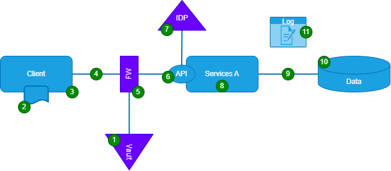

Figure 1: Possible Cyber Security measures

1. Employ reputable solutions for Secrets Management, Encryption Services, and Key Management, such as HashiCorp Vault, to ensure secure management of sensitive information.
2. Apply data-at-rest encryption to safeguard inactive data stored on hard disks, preserving its confidentiality and integrity.
3. Digitally sign application executable files or code using cryptographic signatures as evidence of the application's authenticity and integrity.
4. Utilize Transport Layer Security (TLS), a cryptographic protocol, to encrypt communications and protect sensitive data during transit.
5. Implement firewalls to actively filter and block malicious network traffic, enhancing network security.
6. Delegate the authentication (and potentially authorization) processes to trusted systems by adopting established standards and frameworks like SAML and OAuth.
7. Rely on trusted Identity Providers (IdPs) to create, store, and manage digital identities, ensuring the integrity and confidentiality of user (and machine) identities.
8. Select software vendors who demonstrate their commitment to security by providing evidence, such as certifications, indicating adherence to appropriate security measures and quality controls.
9. Secure machine-to-machine communication using TLS, safeguarding the confidentiality and integrity of data transmitted between systems.
10. Reiterate the importance of data-at-rest encryption, reinforcing the protection of inactive database data.
11. Conduct regular audits of system access, effectively mitigating unauthorized access to log files and strengthening overall system security.

## Data Quality

Insufficient data quality can lead to inaccurate or unreliable insights and decisions, impacting various aspects such as business operations, customer satisfaction, regulatory compliance, and overall performance (Hildebrand et al., 2018). Therefore, different quality aspects must be considered depending on the specific domain and application. Hildebrand et al. (2018) define data quality based on 15 dimensions and four categories (see Figure 2).

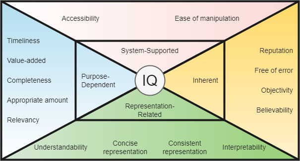

Figure 2: Information Quality according to Hildebrand et al. (2018)

The four categories relate to the following subjects of investigation:

* System-Supported: About the system's accessibility
* Inherent: About the content itself
* Representation-Related: About the visualization aspect
* Purpose Dependent: About the utilization of the data

These categories demonstrate that data quality encompasses more than just the commonly discussed practices like [Data Cleaning](#data-cleaning), which primarily focuses on content and partially on usability. In greater detail, the following dimensions are present:

1. **Accessibility**: Information is accessible when the user can retrieve it through simple procedures and direct means.
2. **Appropriate amount**: Information has an appropriate amount when the quantity of available information meets the specified requirements.
3. **Believability**: Information is believable when certificates demonstrate a high-quality standard or when information acquisition and dissemination require significant effort.
4. **Completeness**: Information is complete when not missing and available at the specified time points in the respective process steps.
5. **Concise representation**: Information is presented concisely when it precisely contains the required information in a suitable and easily comprehensible format.
6. **Consistent representation**: Information is consistently represented when it is continuously depicted in the same manner.
7. **Ease of manipulation**: Information is easily manipulable when it is easily changeable and can be used for different purposes.
8. **Free of error**: Information is error-free when it aligns with reality.
9. **Interpretability**: Information is interpretable when it is understood in the same, technically correct way.
10. **Objectivity**: Information is objective when strictly factual and value-free.
11. **Relevancy**: Information is relevant when it provides necessary information for the user.
12. **Reputation**: Information is highly regarded when the information source, transport medium, and processing system are known for high reliability and competence.
13. **Timeliness**: Information is timely when it reflects the actual property of the described object in a timely manner.
14. **Understandability**: Information is understandable when it can be immediately comprehended and used for the users' purposes.
15. **Value-Added**: Information is value-added when its utilization leads to a quantifiable increase in a monetary objective function.

Quality, much like security, involves a trade-off between cost and benefit. Appropriate quality assurance measures must be implemented at every stage of the data flow process to attain the desired level of quality.

# Big Data and Data Science

As an interdisciplinary field, data science encompasses various facets of data, including analysis, legal considerations, skills, and management (Dehmer & Emmert-Streib, 2017). Hey (2009) has postulated Data Science as the fourth paradigm, highlighting its significance in scientific inquiry. 

<iframe width="560" height="315" src="https://www.youtube.com/embed/5lnchFABBeI" title="YouTube video player" frameborder="0" allow="accelerometer; autoplay; clipboard-write; encrypted-media; gyroscope; picture-in-picture; web-share" allowfullscreen></iframe>

With the evolving landscape, the application of data has transcended scientific domains and made substantial inroads into the business realm. Data is now recognized as a pivotal business asset, playing a central role in the success of companies across industries. Marr (2017) emphasizes that data enables organizations to improve decision-making processes, enhance operational efficiency, and leverage opportunities for data monetization.

The collection and analysis of vast and diverse datasets, commonly called Big Data, serve as a foundation for deriving meaningful insights and answers to questions that may not be known at the outset of analysis (DAMA International, 2017). Big Data encompasses various data types, including structured and unstructured formats like documents, files, audio, video, and streaming data. Data Science and analytics, and visualization techniques provide the tools and methodologies for extracting valuable information from Big Data.

To comprehend the distinctive characteristics of Big Data, DAMA International (2017) used the concept of the 4Vs and expanded:

* Volume: Signifies the scale of data, often characterized by many entities or elements within billions of records.
* Velocity: Refers to the speed at which data is captured, generated, and shared. Big Data is often produced in real-time or near real-time, requiring rapid processing and analysis.
* Variety/Variability: Encompasses the diverse forms and formats in which data is captured and delivered. Big Data necessitates storing and integrating multiple data formats, often exhibiting inconsistencies in structure across different datasets.
* Viscosity: Reflects the challenges of utilizing and integrating data due to complexity, heterogeneity, or compatibility issues.
* Volatility: Represents the frequency and rate of data changes, influencing the lifespan and relevance of the data.
* Veracity: Addresses the trustworthiness and reliability of the data, considering factors such as accuracy, integrity, and source credibility.
Beyond the aspects encapsulated by the 4Vs, the field of Big Data also entails the development of predictive, machine learning, and prescriptive models, as well as advanced analytics techniques. These models and methodologies enable organizations to extract meaningful insights and make informed decisions based on the analysis of Big Data.

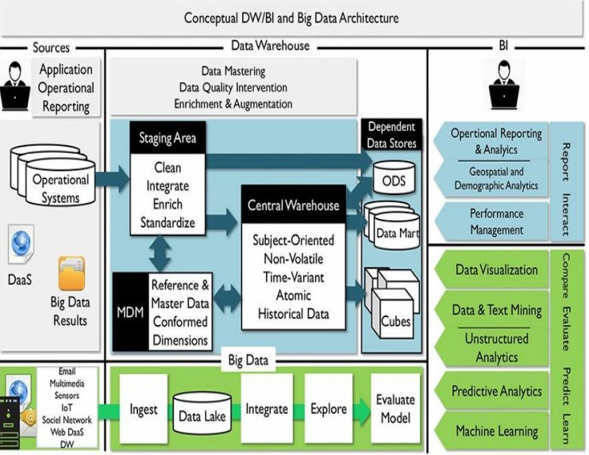

Figure 3: Conceptual DW/BI and Big Data Architecture. Image from Gandhi (2020).

Figure 3 illustrates the distinctions between Business Intelligence/Data Warehousing (BI/DW) and Data Science regarding their respective focuses and typical applications.

BI/DW primarily revolves around standard and ad hoc reporting, dashboards, alerts, queries, and details-on-demand. It deals with structured data, traditional sources, and manageable datasets. Typical questions addressed in BI/DW include inquiries about historical events, sales figures, problem identification, and situational analysis.

On the other hand, Data Science employs techniques to process big data, emphasizing optimization, predictive modelling, forecasting, and statistical analysis. Data Science tackles more complex questions, such as "What if...?" scenarios, determining optimal business strategies, predicting future outcomes, understanding trends, and uncovering the reasons behind observed patterns.

## Internet of Things

Big data enables the analysis of data sources such as the Internet of Things (IoT) (Yaqoob, 2016). IoT finds application in various domains, including smart cities, industry, transportation, agriculture, healthcare, power management, smart homes (buildings), and wearable gadgets (Nižetić et al., 2020). Atzori et al. (2017) define the term IoT as:
>"a conceptual framework that leverages on the availability of heterogeneous devices and interconnection solutions, as well as augmented physical objects providing a shared information base on a global scale, to support the design of applications involving at the same virtual level both people and representations of objects."

The authors discerned three distinct generations in the evolution of the IoT, wherein the transition from one generation to the succeeding is delineated not only by the introduction of novel technologies and architectures that complement those of the preceding generation but also by a discernible shift in the approach to IoT design.

Table 3: Summary of IoT Generations according to Atzori et al. (2017)

Generation | Name                                                          | Description
-----------|---------------------------------------------------------------|-----------------------------------------------------------------------------------------------------------------------------------------------------------------------------------------------------------------------------------------------------------------------
1          | The tagged things                                             | Focus on using Radio-Frequency IDentification (RFID) technology to provide unique identifiers for objects through RFID tags. However, integrating RFID and other technologies like Wireless Sensor Networks (WSN) proved challenging and hindered widespread adoption.
2          | Full interconnection of things and the (social) web of things | Focus on connecting simple objects directly to the Internet, leveraging the IP protocol and web standards to integrate everyday objects into the Web of Things while exploring social networking concepts in IoT solutions.
3          | Age of social objects, cloud computing, and future internet   | Integration of cloud computing for efficient and encrypted data storage, exploring novel social networking concepts, adopting Information-Centric Networking, and relying on knowledge representation solutions like ontology.


Considering the evolution of IoT, it becomes evident that its progress leads to the emergence of innovative technologies, which, consequently, require Data Science-derived methodologies for the efficient processing and analysis of the generated Big Data.

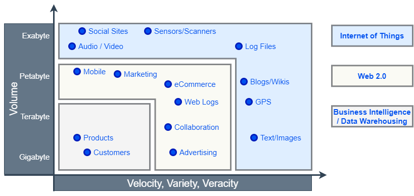

Figure 4: Data storage challenges as visualised by DAMA International (2017)

The primary concerns associated with this analysis include [Data Protection](#data-protection), [Data Quality](#data-quality), and the capabilities of Data Scientists (Apel, 2015).
According to Karkouch et al. (2016), the [Data Quality](#data-quality) categories "Inherent" and "Purpose-Dependent" are of great importance for IoT systems. Due to the highly distributed nature of the system and environmental influences (e.g. vandalism, heat, dirt, moisture, connection stability), [Data Quality](#data-quality) problems in IoT systems primarily manifest in the following classes:

* Dropped readings: The ratio of successfully delivered readings is typically low due to resource scarcity and intermittent communication, resulting in decreased reporting efficiency.
* Unreliable readings: Imprecision, calibration failure, and the presence of fail-dirty nodes, among other reasons, contribute to the unreliability of data from IoT devices.
* Multi-source data inconsistencies: Dealing with various formats, non-uniformity, and inconsistencies poses significant challenges for ensuring data consistency.
* Data duplication: Many sensors may provide similar or nearly identical data, leading to substantial costs in transmission, processing, and storage.
* Data leakage: Storing more data than necessary poses a privacy risk to users.
* Multi-source data time alignment: Due to the numerous data sources, issues arise in aligning the timing of these sources to gain meaningful insights.

These aspects contribute to the tendency of unreliable IoT system data (Nižetić et al., 2020). To mitigate the costly consequences of low [Data Quality](#data-quality), techniques for data preprocessing and quality improvement are required. IoT exemplifies the versatility of [Data Pipelines](#data-pipeline), highlighting the importance of Data Science methods in finding customized project solutions. These methodologies are crucial in effectively handling IoT-generated data and extracting valuable insights, ultimately enhancing IoT applications' efficiency and innovation.

## Architectures and Blueprints

Over time, technological advancements have led to the evolution of various architectural patterns. Priebe et al. (2022) have offered a comprehensive overview of these patterns, utilising the ArchiMate enterprise architecture modelling language. Each architectural pattern has advantages and disadvantages, and its suitability heavily relies on the organisation's specific [Data Strategy](#data-strategy). Careful evaluation and consideration of these architectural patterns are essential to ensure that the chosen approach aligns seamlessly with the organisation's goals and requirements.

Due to the complexity and depth of each architectural pattern, this discussion will not delve further into the specific details of individual patterns.

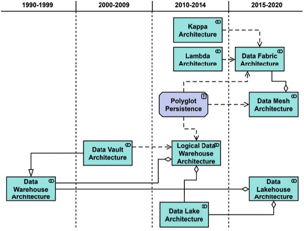

Figure 5: Architectural paradigms and their emergence over time as visualised by Priebe et al. (2022)

Wardley Maps (Wardley, 2016) provide a highly compelling visualisation of technology evolution. As postulated by Wardley, a prominent illustration of this evolution is the progression of computing power, which ultimately leads to the inevitable adoption of cloud computing. In light of this perspective, products designed for Big Data analysis are bound to be offered as cloud-based solutions. These products are built upon or influenced by the architectural patterns proposed by Priebe et al. (2022), but they can now be accessed through pay-as-you-go models. An excellent compilation and analysis of such products have been curated by Bornstein et al. (2020). Please refer to Figure 6 for further details.


Figure 6: Unified Data Infrastructure 2.0 as visualised by Bornstein et al. (2020). [Click here to enlarge.](https://i1.wp.com/a16z.com/wp-content/uploads/2022/11/Unified-Data-Infrastructure-2.0-1.png)


## Data Management

Data management is the process of efficiently and securely handling, organising and utilising data throughout its lifecycle.

The e-portfolio extensively elaborates on the subject matter due to a misalignment between the author's background and the module's scope. The module appropriately focuses on the Data Scientist's perspective and emphasises Big Data aspects related to Variety and Viscosity. However, it omits certain IT-related aspects, like volume, velocity, and volatility, which are not covered in the course content.

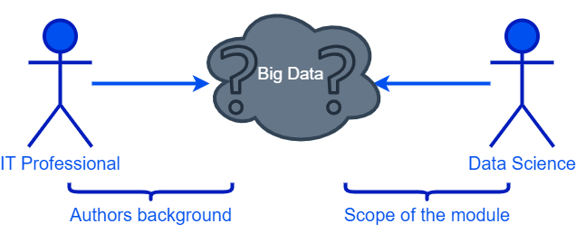

Figure 7: The subjective scope of the "Deciphering Big Data" module

Moreover, compounding the issue, specific terms are redundantly used. This e-portfolio aims to provide a holistic overview to achieve a concise comprehension.

### Data Wrangling

Data Wrangling, or Data Munging, Janitorial Work or Data Preparation is the process of profiling and transforming datasets to ensure they are actionable for analysis tasks (Schintler & McNeely, 2022). The goal is to make data usable by putting data in a form that can be processed by analysis tools and contains the necessary information. Data Wrangling refers to cleaning, transforming, and enriching raw and messy data into a structured and usable format for analysis or other tasks. It is a crucial step in the data lifecycle and is often considered one of data analysis's most time-consuming and challenging aspects.

Data Wrangling is typically a manual task performed by data scientists, analysts, or data engineers, and it is often driven by the specific question or analysis they want to perform. Data Wrangling requires human intervention and domain expertise to understand the data, identify issues, and decide how to clean, transform, and prepare the data appropriately for the intended analysis or task.

When working with big data and having to wrangle large amounts of data, traditional Data Wrangling methods that work well with smaller datasets may not be sufficient due to the sheer volume and complexity of the data. Handling such massive datasets requires specialized techniques and tools to achieve scalability and efficiency. This includes tools like Apache Spark and Apache Hadoop.

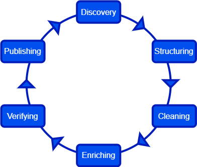

Figure 8: Data Wrangling Process (Stobierski, 2021)

Figure 8 shows that Data Wrangling is an iterative and exploratory process, as Stobierski (2021) shows. The process includes the following stages:

1. **Data Discovery**: The initial step involves data familiarization, trend identification, and issue recognition, influencing all subsequent data-related activities. This process may involve traditional techniques like Data Profiling, aimed at analyzing data sources to assess their utility and determine the best approach to handling them, as well as Data Mining, which enables the identification of patterns and relationships within the data.
2. **Data Structuring**: Raw data is not directly usable due to its incompleteness or misformatting. Data structuring becomes essential as it involves transforming raw data into a more suitable format that aligns with the analytical model used for interpretation, thus enabling its effective leverage in analysis and decision-making processes. This process may include [Data Modelling](# data-modelling).
3. **Data Cleaning**: Data cleaning plays a pivotal role in the Data Wrangling process as it is essential for eliminating inaccurate and inconsistent data, ensuring the reliability and quality of the dataset. For further insights, refer to the details provided in the dedicated chapter on [Data Cleaning](#data-cleaning).
4. **Data Enriching**: After transforming existing data into a usable format, assessing its sufficiency for the project is crucial, and if needed, enriching it with values from other datasets is essential, requiring a thorough understanding of available data sources and repeating the process for any new data.
5. **Data Verifying**: Data validation is critical to ensure data consistency and high-quality standards, wherein potential issues are identified and resolved, or data is deemed analysis-ready. Data Profiling techniques might be used again.
6. **Data Publishing**: The last step within the iteration involves publishing the data, making it accessible for analysis. The choice of information-sharing format, whether a written report or electronic file, depends on the nature of the data and the specific goals.

Please note that terms such as Data Wrangling, Data Cleaning, Data Cleansing, Data Pre-Processing, or Data Tidying are often used interchangeably. However, in the context of traditional Data Warehousing and Business Intelligence, Data Cleaning (including its synonyms) is often associated explicitly with certain Data Wrangling activities within Extract, Transform, and Load (ETL) integration processes. In contrast, in Data Wrangling, Data Cleaning is a critical step. It is worth noting that most Data Cleansing tasks in ETL are commonly executed using SQL, primarily because the data's reduced variety enables more straightforward processing and standardization (Apel, 2015; Dwyer, 2016; DAMA International, 2017; Hildebrand et al., 2018; Köppen et al., 2014; Miller, 2019; Schintler & McNeely, 2022).

Furthermore, existing literature on Data Wrangling, including references to DAMA International (2017), Schintler & McNeely (2022), and Stobierski (2021), does not encompass Data Capturing. However, when examining Bornstein et al.'s (2020) Unified Data Infrastructure, it becomes evident that IT Engineers (such as Software Engineers, Platform Engineers, or IT Operations personnel) and Data Engineers play a significant role in integrating data sources within medium and large enterprises (see [Data Pipeline](#data-pipeline)).

### Data Pipeline

The term "Data Pipeline" lacks a singular definition, leading to varying interpretations in different sources. Munappy et al. (2020) provide an abstract definition, characterizing Data Pipelines as complex chains of interconnected activities starting from data sources and concluding at data sinks.

Densmore (2021) presents a user-friendly book explaining Data Pipelines, advantages, and risks. In essence, Data Pipelines automate and scale aspects of [Data Wrangling](#data-wrangling) performed by Data Scientists but with a different focus. Data Engineers typically oversee the provisioning, operation, and maintenance of Data Pipelines, often adopting software development practices like version control with Git, automation through CI/CD pipelines, and observability tools, commonly seen in modern data architectures.

Notable Data Pipeline patterns include ETL, ELT, EtLT, ELT for Data Analysis, ELT for Data Science, and ELT for Data Products and Machine Learning.

Data Extraction constitutes a key component of Data Pipelines, drawing from diverse source systems like MySQL, Postgres, MongoDB, REST APIs, Kafka, or Debezium, originating from operational systems, historical databases, or third-party data providers.

Programming languages such as SQL, Python, or R are commonly employed for Data Pipeline development. However, no-code and low-code products are also available. Orchestration and scaling are frequently facilitated using tools like Apache Airflow, Kubeflow, or Dagster.

Apart from Data Pipelines, pipelines also serve as software design patterns in various programming languages, including Java and Python, allowing the abstraction of specific parts of the code and enabling the creation of problem-specific pipelines, following the Lego principle. For an example of a pipeline pattern implementation using Python and the sklearn library, refer to chapter [sklearn Pipelines](#sklearn-pipelines).


### Data Cleaning

Data Cleaning, also known as Data Cleansing or Data Scrubbing, is the process of fixing or removing incorrect, corrupted, incorrectly formatted, duplicate, or incomplete data within a dataset (Ilyas & Chu, 2019).

Depending on the perspective, contents, and tools used, data cleaning is carried out at various stages within the data architecture:
* Data Engineers execute Data Cleaning in [Data Pipelines](#data-pipeline).
* Data Scientists perform Data Cleaning as a crucial step in the [Data Wrangling](#data-wrangling) process.
* Researchers employ Data Cleaning to evaluate empirical experiments.

Osborne (2012) has extensively examined the latter approach, highlighting that Data Cleaning is not a simple, linear process. Therefore, ensuring [Data Quality](#data-quality) involves iterative and repetitive execution, often with automation.

Data Cleaning was practised using Python based on the literature provided in this module. The results are in the appendix under [Data Cleaning with Pandas](#data-cleaning-with-pandas). Moreover, to explore more advanced concepts in data cleaning, [sklearn Pipelines](#sklearn-pipelines) were employed.

### Data Modelling

Data Modelling is an iterative process involving discovering, analysing, and scoping data requirements, followed by their representation in a precise form known as the data model. This encompasses conceptual, logical, and physical models. In conceptual Data Modeling, the steps involve selecting a scheme (e.g., relational, dimensional, NoSQL), choosing an appropriate notation, creating an initial model capturing user viewpoints with high-level concepts and relationships, incorporating enterprise terminology, and obtaining sign-off after review for accuracy and compliance with requirements.

Table 4: Possible Notations based on the Database Scheme

Scheme          | Sample Notations
----------------|------------------------------------------------------------------------------------------------------------------------
Relational      | Information Engineering (IE)<br/>Integration Definition for Information Modeling (IDEFIX) <br/>Barker Notation<br/>Chen
Dimensional     | Dimensional
Object-Oriented | Unified Modeling Language (UML)
Fact-Based      | Object Role Modeling (ORM or ORM2) <br/>Fully Communication Oriented Modeling (FCO-IM)
Time-Based      | Data Vault<br/>Anchor Modeling
NoSQL           | Document<br/>Column<br/>Graph<br/>Key-Value

The logical data model goes one step further by translating the conceptual model into a more detailed representation, free from any specific technology or database constraints. It defines the data entities, attributes, relationships, and rules in a standardised and technology-independent manner. The logical data model bridges the business requirements and the physical implementation, enabling a clear and consistent blueprint for database design and development.

The physical data model is the final stage, where the logical model is transformed into a specific database implementation tailored to a particular database management system (DBMS). It addresses storage optimisation, indexing strategies, data types, and other DBMS-specific considerations. The physical data model provides detailed specifications for database administrators and developers to construct the database tables, indexes, and constraints supporting the application's data storage needs.

An integral aspect of handling Relational DBMS involves normalisation, extensively explained [in the appendix](# relational-model-and-normalisation). 
However, it is essential to note that, for analysis purposes, it is often less desirable to go beyond the first normal form because they lead to more complex data structures that are less conducive to efficient analysis and querying.

### Storage

A well-informed decision-making process for selecting the appropriate storage solution relies on the following requirements (DAMA International, 2017):
* Define Storage Capacity and Data Retention Needs
* Identify Usage Patterns, including Transaction-based, Large Data Set Write or Retrieval, Location, and Priority
* Specify Access Requirements for Data Storage, Retrieval, and Handling within the Database

ACID (Atomicity, Consistency, Isolation, and Durability) and BASE (Basically Available, Soft state, Eventually consistent) are two essential principles used for evaluating and selecting a DBMS based on the specific requirements and characteristics of the application.

Table 5: Comparison of ACID and BASE principles

Item                     | ACID                                                                | BASE
-------------------------|---------------------------------------------------------------------|--------------------------------------------------------
Casting (data structure) | Schema must exist<br/>Table structure exists<br/>Columns data typed | Dynamic<br/>Adjust on the fly<br/>Store dissimilar data
Consistency              | Strong Consistency Available                                        | Strong, Eventual, or None
Processing Focus         | Transactional                                                       | Key-value stores
Processing Focus         | Row/Column                                                          | Wide-column stores
History                  | 1970s application storage                                           | 2000s unstructured storage
Scaling                  | Product Dependent                                                   | Automatically spreads data across commodity servers
Origin                   | Mixture                                                             | Open-source
Transaction              | Yes                                                                 | Possible

In addition, the CAP theorem, also known as Brewer's theorem, is an essential concept in distributed systems and database design that addresses the trade-offs between three fundamental properties: Consistency, Availability, and Partition tolerance. According to the CAP theorem, a distributed system can simultaneously achieve at most two properties.

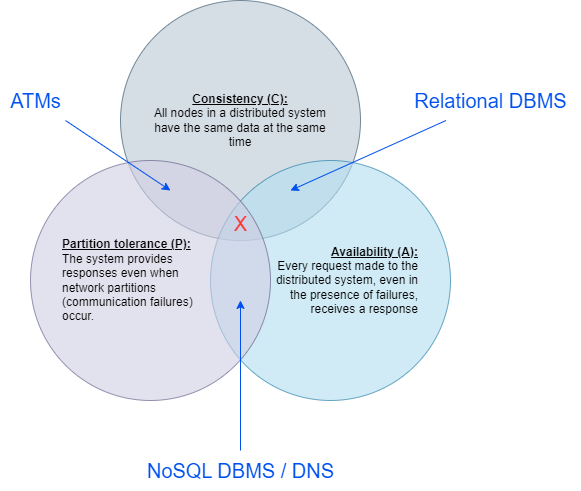

Figure 9: CAP Theorem including examples

When building/configuring the storage system, the following aspects should be considered:

1. Business Continuity: Ensuring that the storage setup supports high availability and disaster recovery measures to minimize disruptions and data loss in case of unexpected incidents.
2. Resilience against Hardware Failures: Addressing the potential risks of losing the physical database server or disk storage devices to maintain data integrity and accessibility.
3. Data Recovery: Preparing for the possibility of database loss, including the Master Database, temporary storage database, transaction log segment, and having appropriate recovery mechanisms in place.
4. Data Integrity: Guarding against the corruption of database indexes or data pages to maintain data accuracy and consistency.
5. Backup and Recovery Strategy: Implementing a robust backup plan to safeguard against the loss of database or log segment filesystems and ensuring the availability of database and transaction log backup files for recovery purposes.

### Metadata Management

As described in detail by the architectural proposals of Bornstein et al. (2020), [Data Wrangling](#data-wrangling) and [Data Pipelines](#data-pipeline) show that data flows through a variety of systems and hands. The risk of losing traceability of data usage and changes increases as more individuals gain the ability to make modifications to the data. Two key components are utilised to ensure data becomes increasingly discoverable and changes are rigorously documented: Data Catalogs, which serve as centralised repositories providing descriptive information about the organisation's data assets, facilitating data discovery and understanding, and Data Lineage solutions, which track and document the origin, transformations, and movement of data throughout its lifecycle, with examples like [Open Metadata](https://open-metadata.org/) for Data Catalogs and [Apache Atlas](https://atlas.apache.org/#/) for Data Lineage.

# Reflection

Throughout this module, I have gained a solid understanding of the theories covered in the module and have successfully applied them to various aspects of the group project and other assessments, enabling me to develop a comprehensive knowledge base. In addition to the module content, I utilised the available time to conduct independent research, focusing on essential definitions and deepening my understanding of the subject matter. The results have been embedded in the e-portfolio. Notably, one novel concept that captured my attention was "[Data Wrangling](#data-wrangling)," as my prior knowledge primarily revolved around terms like "Data Cleansing" and "Data Profiling." So, I wanted to learn the commonalities and differences and documented the results in chapter [Data Wrangling](#data-wrangling).

The group project focused on developing a [Data Pipeline](#data-pipeline) and evaluating a [storage](#storage) solution for a recruitment company. Given my background in computer science, I predominantly contributed as a developer in the team (see [Individual Group Project Contributions](#individual-group-project-contributions)). Building such a pipeline entails overcoming various challenges and addressing specific requirements. For instance, acquiring data from diverse sources, such as job portals, social media platforms, and internal databases, is crucial to gather comprehensive candidate information. Scraping and processing this data involves cleaning and normalising candidate profiles, extracting relevant information, and integrating it with existing systems.

To be trustworthy for applicants and customers, ensuring [Data Security](#data-security) and compliance is vital to protect sensitive personal data, such as resumes and contact details, following [Data Protection](#data-protection) laws like GDPR. If this had been an actual project, I would have gone so far as to have a review carried out by an external company with security expertise.
A robust [storage](#storage) infrastructure is required once the data is in the desired format. This infrastructure, such as a cloud-based data warehouse or a scalable database system, enables efficient data [storage](#storage) and retrieval. 

At the outset of the module and until working on the group project, I encountered challenges in fully grasping the module's content. The emphasis was on Big Data; however, the seminar discussions predominantly revolved around creating a (relational) database for a company, learning schema normalisation and [Data Cleaning](#data-cleaning) with Python. When considering big data, I think of architectures that cannot be realised with a relational database and a few scripts. I expected systems like Hadoop, Spark or Big Query and Redshift and learn how to work with them. This expectation, coupled with the demands of the group work assessment, led to extended deliberations within our group as we sought to define the project's specific objectives. We deliberated whether to build an Online Transaction Processing (OLTP) database for operational data or construct an Online Analytical Processing (OLAP) database to deliver a traditional Business Intelligence (BI) system. This ambiguity created a sense of uncertainty and difficulty for me, as the group work had little to do with Big Data and lacked the desired depth. 

Ultimately, we realised that the module did not require us to delve into advanced topics such as streaming systems and in-depth Big Data architectures. So we decided to develop the entire high-level data architecture for the recruitment company, encompassing operational and reporting components. This involved designing the OLTP model for operational processes and implementing a Snowflake Schema for the Business Intelligence systems.

Our approach was well-received by the instructor, as it demonstrated a comprehensive understanding of the subject matter and garnered positive feedback. Consequently, in the project's second phase, we focused primarily on documenting and presenting our work. Having established a high-level overview of the overall system, we allocated more time to delve into a specific area. We concentrated on the OLAP system, as its database schema was relatively smaller and more straightforward. This allowed us to dedicate more time to the in-depth exploration of different database systems. We successfully implemented and compared the Rational (MySQL) and NoSQL (MongoDB) models.

The evaluation phase, particularly the development of schema validation in MongoDB, was a highly instructive experience that introduced me to the possibilities MongoDB offers as a DBMS. 

The initially mentioned feeling of uncertainty and confusion impacted my motivation and engagement. However, thanks to my teammates, I was able to overcome this. Collaborating with the team proved to be an extremely successful endeavour. Each team member contributed their unique background and expertise, allowing us to bring diverse experiences and perspectives. This is something I did not expect. Based on experiences in other training with group projects, I assumed there would be at least one free rider in the team. Therefore, I am very grateful to the two colleagues from my group for their outstanding commitment!

A significant "aha" moment occurred shortly after submitting the second part of the project when I began reorganising and enriching my e-portfolio. During this time, I came across the extensive 700-page book DMBOK2 (DAMA International, 2017), which proved to be a valuable resource. This discovery prompted me to revise significant portions of my e-portfolio, incorporating the insights gained from the book. I also realised that the group project's second part could have been structured differently. Instead of creating conceptual and logical models followed by the physical model, including the database system evaluation, I now understand the benefits of thoroughly evaluating the requirements and selecting a suitable DBMS before proceeding with the data modelling process. This approach allows the logical model to be captured using a modelling language that aligns with the chosen DBMS, such as UML for object-oriented schemas or IE for relational systems.

In conclusion, this module has provided valuable opportunities for growth and learning. It has allowed me to delve into various aspects of [Data Management](#data-management), collaborate effectively within a team, and critically reflect on my contributions. The knowledge and skills I have acquired through this module have practical applications in real-world scenarios. Furthermore, I have developed essential teamwork, communication, and project management skills with non-IT team members by actively participating in group activities and fulfilling my responsibilities. In my 15 years of IT experience, I have never implemented a project with people not in IT. Moving forward, I will leverage the insights gained from this module to enhance my professional development and contribute effectively to future endeavours.

# References

Albrecht, J.P. (2016) How the GDPR will change the world. Eur. Data Prot. L. Rev., 2, p.287.

Apel, D., Behme, W., Eberlein, R. and Merighi, C. (2015) Datenqualität erfolgreich steuern: Praxislösungen für Business-intelligence-projekte. dpunkt. verlag.

Atzori, L., Iera, A. and Morabito, G. (2017) Understanding the Internet of Things: definition, potentials, and societal role of a fast evolving paradigm. Ad Hoc Networks, 56, pp.122-140.

Beckett, P. (2017) GDPR compliance: your tech department's next big opportunity.Computer Fraud & Security,2017(5), pp.9-13.

Bolognini, L., & Bistolfi, C. (2017) Pseudonymization and impacts of Big (personal/anonymous) Data processing in the transition from the Directive 95/46/EC to the new EU General Data Protection Regulation. Computer Law & Security Review, 33(2), 171-181.

Bornstein, M., Li, J., and Casado, M. (2020) Emerging Architectures for Modern Data Infrastructure. Available from: https://a16z.com/2020/10/15/emerging-architectures-for-modern-data-infrastructure/ [Accessed 20 July 2023]

Chen, D. and Zhao, H., (2012) Data security and privacy protection issues in cloud computing. In 2012 international conference on computer science and electronics engineering (Vol. 1, pp. 647-651). IEEE.

Codd, E.F. (1970) A relational model of data for large shared data banks. Communications of the ACM, 13(6), pp.377-387.

Codd, E.F. (1972) Further normalization of the data base relational model. Data base systems, 6, pp.33-64.

Dehmer, M. and Emmert-Streib, F. (2017) Frontiers in data science. CRC Press.

Densmore, J. (2021) Data pipelines pocket reference. O'Reilly Media.

Dwyer, B. (2016) Systems analysis and synthesis : bridging computer science and information technology. 1st edition. Amsterdam, Netherlands: Morgan Kaufmann.

DAMA International (2017) DAMA-DMBOK: data management body of knowledge. Technics Publications, LLC.

Gandhi, N. (2020) CDMP Study Group Session 15, DAMA New England. Available from: https://damanewengland.org/images/downloads/CDMP_Study_Group/big_data_and_data_science.pdf [Accessed 20 July 2023]

Harrington, J. L. (2016). Normalization. Relational Database Design and Implementation, 141-161

Hey, T. (2009) The fourth paradigm. United States of America

Hildebrand, K., Gebauer, M., Hinrichs, H., Mielke, M. (2018) Daten- und Informationsqualität: Auf dem Weg zur Information Excellence. Springer Link

Ilyas, I.F. and Chu, X. (2019) Data cleaning. Morgan & Claypool.

Jensen, M., Lauradoux, C. & Limniotis, K. (2019) Pseudonymisation techniques and best practices. Recommendations on shaping technology according to data protection and privacy provisions. European Union Agency for Cybersecurity (ENISA).

Karkouch, A., Mousannif, H., Al Moatassime, H. and Noel, T. (2016) Data quality in internet of things: A state-of-the-art survey. Journal of Network and Computer Applications, 73, pp.57-81.

Köppen, V., Saake, G. and Sattler, K.U. (2014). Data Warehouse Technologien. 2nd ed. mitp.

Marr, B. (2017) Data strategy: How to profit from a world of big data, analytics and the internet of things. Kogan Page Publishers.

Meier, K. (2023). Marc what changes with the revision of the Swiss Federal Act on Data Protection. Available from: https://www.ey.com/en_ch/cybersecurity/marc-what-changes-with-the-revision-of-the-swiss-federal-act-on-data-protection [Accessed 20 July 2023].

Miller, G. J. (2019). Quantitative Comparison of Big Data Analytics and Business Intelligence Project Success Factors. Handbook of Experimental Pharmacology, 53-72.

Munappy, A.R., Bosch, J. and Olsson, H.H. (2020) Data pipeline management in practice: Challenges and opportunities. In Product-Focused Software Process Improvement: 21st International Conference, PROFES 2020, Turin, Italy, November 25-27, 2020, Proceedings 21 (pp. 168-184). Springer International Publishing.

Nižetić, S., Šolić, P., Gonzalez-De, D.L.D.I. and Patrono, L. (2020) Internet of Things (IoT): Opportunities, issues and challenges towards a smart and sustainable future. Journal of cleaner production, 274, p.122877.

Osborne, J.W., 2012. Best practices in data cleaning: A complete guide to everything you need to do before and after collecting your data. Sage publications.

Priebe, T., Neumaier, S. and Markus, S. (2022) Von Data Warehouse bis Data Mesh: Ein Wegweiser durch den Dschungel analytischer Datenarchitekturen. arXiv preprint arXiv:2212.03612.

Raj, A., Bosch, J., Olsson, H.H. and Wang, T.J. (2020) Modelling data pipelines. In 2020 46th Euromicro conference on software engineering and advanced applications (SEAA) (pp. 13-20). IEEE.

Reggio, G. & Astesiano, E. (2020) Big-data/analytics projects failure: a literature review. In 2020 46th Euromicro Conference on Software Engineering and Advanced Applications (SEAA) (pp. 246-255). IEEE.

Regulation (EU) 2016/679 of the European Parliament and the Council of 27 April 2016 on the protection of natural persons with regard to the processing of personal data and the on the free movement of such data, and repealing Directive 95/46/EC' (2016), Official Journal of the European Union L 119, pp. 1-88

Rosenthal, D. and Studer, S. (2022). Swiss revDPA: Comparison with the GDPR. Available from: https://www.rosenthal.ch/downloads/VISCHER-revDPA-GDPR-Comparison.pdf [Accessed 20 July 2023]

Schintler, L.A. and McNeely, C.L. (2022) Encyclopedia of big data. Springer International Publishing.

State Secretariat for Economic Affairs (SECO) (2023) New federal act on Data Protection (nfadp), SME Portal for small and medium-sized enterprises. Available at: https://www.kmu.admin.ch/kmu/en/home/facts-and-trends/digitization/data-protection/new-federal-act-on-data-protection-nfadp.html [Accessed: 16 July 2023].

Stobierski, T. (2021) Data Wrangling: What it is & why it's important. Available from: https://online.hbs.edu/blog/post/data-wrangling [Accessed 19 July 2023]

Wardley, S. (2016) Wardley Maps. Available from: https://learnwardleymapping.com/book/ [Accessed 20 July 2023]

White, A. (2019) Gartner Blog Post: Our Top Data and Analytics Predicts for 2019. Available from: https://blogs.gartner.com/andrew_white/2019/01/03/our-top-data-and-analytics-predicts-for-2019/ [Accessed 18 July 2023]

Yaqoob, I., Hashem, I.A.T., Gani, A., Mokhtar, S., Ahmed, E., Anuar, N.B. and Vasilakos, A.V. (2016) Big data: From beginning to future. International Journal of Information Management, 36(6), pp.1231-1247


# Appendix

## Relational Model and Normalisation

According to Dwyer (2016), a well-designed database should fulfil several critical criteria:

1. Efficient Query and Update Processing: The database should be capable of handling queries and updates in a timely manner, providing fast response times to ensure efficient data retrieval and modification operations.

2. Storage Space Optimisation: The database should be designed to minimise storage requirements, effectively utilising disk space and minimising the overall storage footprint.

3. Data Integrity and Anomaly Prevention: The database should enforce data integrity constraints to prevent inconsistencies and anomalies. The database ensures that data remains accurate, reliable, and consistent by enforcing rules and constraints, such as referential integrity and entity integrity.

4. Programming Simplicity: The database should be designed to minimise the programming effort required to interact with and utilise the stored data. This includes providing user-friendly query languages, intuitive APIs, and efficient data access mechanisms that simplify development and reduce programming complexity.

### Mathematical foundation
One way to fulfil these criteria is to use the relational model, which forms the foundation of modern DBMS and is built upon the concept of a relation. This model, introduced by Codd (1970), brought about a significant revolution in database management. Codd's pioneering work in this area was recognised with the prestigious ACM Turing Award.
At its core, the relational model is rooted in mathematical principles, particularly the concept of sets. A relation, within this model, is a mathematical abstraction that embodies a set of tuples. Each tuple represents a row or record in a table and contains a collection of related attribute values. The relational approach derives its strength from the formal foundation of the relations theory, ensuring consistency and rigour in data representation and manipulation.
The relational model is commonly implemented using the Structured Query Language (SQL), which has become a standard for relational DBMS.


In mathematics, a set is a distinct, unordered collection of objects forming a group,

$$
A = \lbrace 1,2,3,4,5,6\rbrace
$$

where a tuple is an ordered sequence of elements, where each element can be of any type, and the position or order of the elements is significant.

$$
T = (a,b,c)
$$

A relation $r(R)$ is a set of tuples on the relation schema $R(A_1, A_2,..., A_n)$, where $R$ is the name of the relation and $A_1, A_2,..., A_n$ are attributes. The set of allowed values for each attribute $A_n$ is called the domain $D$ of the attribute, defining the attributes data type. For example:

$$
D_1 = StudentNumber = \lbrace 1001, 1002, 1003, ...\rbrace \\
D_2 = StudentName = \lbrace Bob, Sally, Mark, ...\rbrace \\
D_3 = StudentCity = \lbrace Bern, New York, Warsaw, ...\rbrace \\
r = \lbrace (1001, Bob, Bern), (1002, Sally, New York), (1003, Mark, Warsaw) ...\rbrace
$$


Figure 10: Example of a relation schema, including descriptions.

Codd (1970) proposed relational algebra as a basis for database query languages, which later became SQL.

Table 6: Relational algebra as a basis for database query languages (Codd, 1970)

Operation         | Symbol   | Description                                                                        | Example SQL Query
------------------|----------|------------------------------------------------------------------------------------|---------------------------------------------------------------------------
Selection         | $\sigma$ | Retrieves rows from a relation that satisfy a condition (horizontal partitioning). | `SELECT * FROM table WHERE condition;`
Projection        | $\pi$    | Selects specific columns (attributes) from a relation (vertical partitioning).     | `SELECT column1, column2 FROM table;`
Union             | $\cup$   | Combines two relations, removing duplicates.                                       | `SELECT * FROM table1 UNION SELECT * FROM table2;`
Set difference    | $-$      | Retrieves rows from the first relation that do not exist in the second relation.   | `SELECT * FROM table1 EXCEPT SELECT * FROM table2;`
Cartesian product | $\times$ | Combines all rows from the first relation with all rows from the second.           | `SELECT * FROM table1, table2;`
Rename            | $\rho$   | Renames the attributes (columns) or the relation itself.                           | `SELECT column AS new_column FROM table;`
Set intersection  | $\cap$   | Retrieves rows in the first and second relation.                                   | `SELECT * FROM table1 INTERSECT SELECT * FROM table2;`
Join              | $\Join$  | Combines rows from two or more relations based on a related attribute.             | `SELECT * FROM table1 INNER JOIN table2 ON table1.column = table2.column;`
Assignment        | $\larr$  | Assigns a value or expression to an attribute or variable.                         | `UPDATE table SET column = value WHERE condition;`

### Normalisation using the DBD_PCOM7E dataset

After defining the relational model, Codd (1972) introduced the normalisation concept to organise data in a database effectively. Normalisation has two main goals: eliminating redundant data (such as storing the same information in multiple tables) and ensuring that data dependencies are logical (storing only related data in a table). By achieving these goals, normalisation enhances data efficiency, minimises data duplication, and improves the overall integrity and consistency of the database.

By the theoretical framework outlined by Harrington (2016) and following the [Normalisation Task presented in Unit 7](https://www.my-course.co.uk/mod/page/view.php?id=809099), the provided dataset will now be transformed into the third normal form (3NF) as an illustrative example. 

Table 7: Input Data for normalisation

&nbsp;<ins>Student Number</ins> | Student Name | Exam Score | Support | Date of Birth | Course Name      | Exam Boards | Teacher Name
--------------------------------|--------------|------------|---------|---------------|------------------|-------------|-------------
1001                            | Bob Baker    | 78         | No      | 25/08/2001    | Computer Science | BCS         | Mr Jones
&nbsp;                          |              |            |         |               | Maths            | EdExcel     | Ms Parker
&nbsp;                          |              |            |         |               | Physics          | OCR         | Mr Peters
1002                            | Sally Davies | 55         | Yes     | 02/10/1999    | Maths            | AQA         | Ms Parker
&nbsp;                          |              |            |         |               | Biology          | WJEC        | Mrs Patel
&nbsp;                          |              |            |         |               | Music            | AQA         | Ms Daniels
1003                            | Mark Hanmill | 90         | No      | 05/06/1995    | Computer Science | BCS         | Mr Jones
&nbsp;                          |              |            |         |               | Maths            | EdExcel     | Ms Parker
&nbsp;                          |              |            |         |               | Physics          | OCR         | Mr Peters
1004                            | Anas Ali     | 70         | No      | 03/08/1980    | Maths            | AQA         | Ms Parker
&nbsp;                          |              |            |         |               | Physics          | OCR         | Mr Peters
&nbsp;                          |              |            |         |               | Biology          | WJEC        | Mrs Patel
1005                            | Cheuk Yin    | 45         | Yes     | 01/05/2002    | Computer Science | BCS         | Mr Jones
&nbsp;                          |              |            |         |               | Maths            | EdExcel     | Ms Parker
&nbsp;                          |              |            |         |               | Music            | AQA         | Ms Daniels

Please note the following assumptions made in the analysis of the provided data:

Firstly, the attribute "Support" is assumed to represent whether or not the student received assistance during the exam, indicating the presence or absence of support. Secondly, the attribute "Exam Boards" refers to examination boards responsible for establishing the curriculum, creating examination materials, and evaluating students' performance in their respective subjects. Lastly, due to the presence of repeating groups in the table, it needs to be clarified to which specific course a given exam score corresponds. As a result, the assumption is made that the exam score pertains to the first occurrence of the corresponding course listed in the table.


#### First Normal Form (1NF)

In order to achieve the first normal form (1NF), the data must be organised in tables where a primary key uniquely identifies each row, and all attribute values are atomic, meaning they cannot be further decomposed. Additionally, there should be no repeating groups within a table.

In the provided table, the presence of repeating groups in the "Course Name," "Exam Boards," and "Teacher Name" columns is evident, as multiple values are associated with the same student number and student name. A composite key consisting of the "Student Number" and "Course Name" attributes is introduced to address this issue and achieve the first normal form. This composite key ensures the creation of a distinct row for each student and course combination, eliminating repeating groups and promoting the use of atomic values. Furthermore, the attributes "Student Name" and "Teacher Name" are decomposed into more granular components, specifically "First Name" and "Last Name" for student names and "Title" and "Teacher Name" for teacher names. These modifications convert the table into the first normal form.

Table 8: Data organized in the first normal form

&nbsp;<ins>Student Number</ins> | First Name | Last Name | Exam Score | Support | Date of Birth | &nbsp;<ins>Course Name</ins> | Exam Boards | Title | Teacher Name
--------------------------------|------------|-----------|------------|---------|---------------|------------------------------|-------------|-------|-------------
1001                            | Bob        | Baker     | 78         | No      | 25/08/2001    | Computer Science             | BCS         | Mr    | Jones
1001                            | Bob        | Baker     | NULL       | NULL    | 25/08/2001    | Maths                        | EdExcel     | Ms    | Parker
1001                            | Bob        | Baker     | NULL       | NULL    | 25/08/2001    | Physics                      | OCR         | Mr    | Peters
1002                            | Sally      | Davies    | 55         | Yes     | 02/10/1999    | Maths                        | AQA         | Ms    | Parker
1002                            | Sally      | Davies    | NULL       | NULL    | 02/10/1999    | Biology                      | WJEC        | Mrs   | Patel
1002                            | Sally      | Davies    | NULL       | NULL    | 02/10/1999    | Music                        | AQA         | Ms    | Daniels
1003                            | Mark       | Hanmill   | 90         | No      | 05/06/1995    | Computer Science             | BCS         | Mr    | Jones
1003                            | Mark       | Hanmill   | NULL       | NULL    | 05/06/1995    | Maths                        | EdExcel     | Ms    | Parker
1003                            | Mark       | Hanmill   | NULL       | NULL    | 05/06/1995    | Physics                      | OCR         | Mr    | Peters
1004                            | Anas       | Ali       | 70         | No      | 03/08/1980    | Maths                        | AQA         | Ms    | Parker
1004                            | Anas       | Ali       | NULL       | NULL    | 03/08/1980    | Physics                      | OCR         | Mr    | Peters
1004                            | Anas       | Ali       | NULL       | NULL    | 03/08/1980    | Biology                      | WJEC        | Mrs   | Patel
1005                            | Cheuk      | Yin       | 45         | Yes     | 01/05/2002    | Computer Science             | BCS         | Mr    | Jones
1005                            | Cheuk      | Yin       | NULL       | NULL    | 01/05/2002    | Maths                        | EdExcel     | Ms    | Parker
1005                            | Cheuk      | Yin       | NULL       | NULL    | 01/05/2002    | Music                        | AQA         | Ms    | Daniels


#### Second Normal Form (2NF)
The second normal form (2NF) extends the requirements of the first normal form (1NF) by ensuring that non-key attributes in a table are fully functionally dependent on the primary key, eliminating partial dependencies. A functional dependency (FD), $f: X \rightarrow Y$, signifies that the values of $X$ determine the values of $Y$. This implies that any two tuples sharing identical values of $X$ will inevitably have the same corresponding values of $Y$. A fully functional dependency occurs when attribute $Y$ is functionally dependent on a composite key $X$, indicating that $Y$ depends on all attributes of $X$.

In the provided example, where the primary key comprises the Student Number and Course Name, it is evident that the table violates the 2NF as the Teacher Name attribute exhibits a partial dependency on the Course Name attribute. Similarly, attributes such as "First Name" and "Last Name" for students also exhibit partial dependencies on the composite key. The table should be decomposed into three separate tables to achieve the second normal form:

Table 9: Students table as created during the conversion to 2NF

&nbsp;<ins>Student Number</ins> | First Name | Last Name | Date of Birth
--------------------------------|------------|-----------|--------------
1001                            | Bob        | Baker     | 25/08/2001
1002                            | Sally      | Davies    | 02/10/1999
1003                            | Mark       | Hanmill   | 05/06/1995
1004                            | Anas       | Ali       | 03/08/1980
1005                            | Cheuk      | Yin       | 01/05/2002

Table 10: Courses table as created during the conversion to 2NF

&nbsp;<ins>Course Name</ins> | Title | Teacher Name
-----------------------------|-------|-------------
Computer Science             | Mr    | Jones
Maths                        | Ms    | Parker
Physics                      | Mr    | Peters
Biology                      | Mrs   | Patel
Music                        | Ms    | Daniels

Table 11: Exams table as created during the conversion to 2NF

&nbsp;<ins style="text-decoration:overline underline;">Student Number</ins> | Exam Score | Support | Exam Boards | &nbsp;<ins style="text-decoration:overline underline;">Course Name</ins>
----------------------------------------------------------------------------|------------|---------|-------------|-------------------------------------------------------------------------
1001                                                                        | 78         | No      | BCS         | Computer Science
1001                                                                        | NULL       | NULL    | EdExcel     | Maths
1001                                                                        | NULL       | NULL    | OCR         | Physics
1002                                                                        | 55         | Yes     | AQA         | Maths
1002                                                                        | NULL       | NULL    | WJEC        | Biology
1002                                                                        | NULL       | NULL    | AQA         | Music
1003                                                                        | 90         | No      | BCS         | Computer Science
1003                                                                        | NULL       | NULL    | EdExcel     | Maths
1003                                                                        | NULL       | NULL    | OCR         | Physics
1004                                                                        | 70         | No      | AQA         | Maths
1004                                                                        | NULL       | NULL    | OCR         | Physics
1004                                                                        | NULL       | NULL    | WJEC        | Biology
1005                                                                        | 45         | Yes     | BCS         | Computer Science
1005                                                                        | NULL       | NULL    | EdExcel     | Maths
1005                                                                        | NULL       | NULL    | AQA         | Music

Please note:
* An overlined attribute refers to being a foreign key.
* An additional assumption has been considered in this context: It is assumed that a student is not permitted to participate in the same exam multiple times under different examination boards. Therefore, the "Exam Boards" attribute is not included as part of the compound key.

#### Third Normal Form (3NF)
In addition to satisfying the requirements of the second normal form (2NF), the third normal form (3NF) ensures no in-table dependencies between the columns within each table. Non-prime attributes must have a direct (non-transitive) dependency on candidate keys.

If a relation schema, denoted as $R(\underline{X}, Y, Z)$, contains a functional dependency $f: Y \rightarrow Z$, where $Y$ and $Z$ are non-prime attributes, it implies the presence of a transitive dependency from $X$ to $Z$. The table should be decomposed into two separate tables to resolve this: $T_1(\underline{X}, Y)$ and $T_2(\underline{Y}, Z)$. This decomposition ensures that the dependencies are preserved and eliminates the transitive dependency issue, eliminating redundancies and improving data integrity.

In the given example, the relation schema $Courses(\underline{Course Name}, Title, Teacher Name)$ exhibits a transitive dependency, where the non-prime attribute "Teacher Name" is functionally dependent on the attribute "Title". It is recommended to decompose the relation into two separate tables to resolve this: one containing the attributes "Course Name" and "Title" and another with the attributes "Title" and "Teacher Name". This decomposition eliminates the transitive dependency and ensures that each attribute directly depends on the key attribute.

Furthermore, the relation schema $Exams(\underline{Student Number}, Exam Score, Support, Exam Boards, \underline{Course Name})$ is susceptible to a transitive dependency if additional attributes dependent on "Exam Boards" are introduced. Creating a separate table specifically for the attribute "Exam Boards" is advisable to prevent this, ensuring that the relation schema remains free from transitive dependencies and adheres to normalization principles.

#### Boyce-Codd Normal Form (BCNF)
Boyce-Codd Normal Form (BCNF) introduces additional rules to ensure further data integrity by avoiding redundancies and the resulting anomalies. BCNF states that the table must already satisfy the requirements of the 3NF and stipulates that for every functional dependency $X \rightarrow Y$ in a given relation, $X$ must function as a superkey. In other words, $X$ should uniquely determine the values of $Y$, ensuring no partial dependencies or redundant information within the table.

Considering the given relation schema $Exams(\underline{Student Number}, Exam Score, Support, Exam Boards, \underline{Course Name})$, it is observed that the logic behind the inclusion of both student number and course name as attributes to identify the exam board is unclear. If it were possible to identify the exam boards solely based on the course (which aligns with the author's viewpoint), it would result in a violation of the BCNF.

The table must be split into two separate tables to rectify this issue and achieve BCNF: $Exams(\underline{Student Number}, Exam Score, Support, \underline{Course Name})$ and $Exam Boards(\underline{Course Name}, Exam Boards)$. The first table retains the relevant information related to student exams, while the second table specifically associates each course with its corresponding exam board.

### Database Implementation

The following presents a logical model of the database in the BCNF. As is common practice today, surrogate keys are used where the natural key is of type string. This is to improve storage consumption and because natural keys are often not unique, contrary to previous assumptions.


Figure 11: Logical Database Model based on the DBD_PCOM7E dataset.

Download:
* MySQL Workbench file: [DBD_PCOM7E.mwb](DBD_PCOM7E.mwb)
* Data Definition Language File: [DBD_PCOM7E_DDL.sql](DBD_PCOM7E_DDL.sql)
* Data Manipulation Language File: [DBD_PCOM7E_DML.sql](DBD_PCOM7E_DML.sql)

### Referential integrity verification

All reference keys in the schema have been set to `ON DELETE CASCADE` and `ON UPDATE CASCADE`. This ensures that when an entry is deleted or updated in a parent table, the corresponding changes are automatically applied to the child tables, maintaining referential integrity. The following queries can be used to delete an entry in a parent table and verify if the child tables maintain valid integrity. Additionally, the courses table has a unique key index that prevents the insertion of duplicate courses with the same name and teacher. This constraint can be verified using the final query.

1. Verify if all students in the "Exams" table exist in the "Students" table:
    ```sql
    DELETE FROM `dbd_pcom7e`.`students`
    WHERE `Student_ID` = 1001;

    SELECT *
    FROM DBD_PCOM7E.Exams e
    LEFT JOIN DBD_PCOM7E.Students s ON e.Student_ID = s.Student_ID
    WHERE s.Student_ID IS NULL;
    ```
    Expected Output: `1 row(s) affected` and `0 row(s) returned`

2. Check if all courses in the "Courses" table have a valid teacher:
    ```sql
    DELETE FROM `dbd_pcom7e`.`teachers`
    WHERE `Teacher_ID` = 5;
    
    SELECT *
    FROM DBD_PCOM7E.Courses c
    LEFT JOIN DBD_PCOM7E.Teachers t ON c.Teacher_ID = t.Teacher_ID
    WHERE t.Teacher_ID IS NULL;
    ```
    Expected Output: `1 row(s) affected` and `0 row(s) returned`

3. Ensure that all exam boards in the "Exams" table exist in the "Exam_Boards" table:
    ```sql
    DELETE FROM `dbd_pcom7e`.`exam_boards`
    WHERE `Exam_Board_ID` = 2;

    SELECT *
    FROM DBD_PCOM7E.Exams e
    LEFT JOIN DBD_PCOM7E.Exam_Boards eb ON e.Exam_Board_ID = eb.Exam_Board_ID
    WHERE eb.Exam_Board_ID IS NULL;
    ```
    Expected Output: `1 row(s) affected` and `0 row(s) returned`

4. Ensure that all courses in the "Exams" table exist in the "Courses" table:
    ```sql
    DELETE FROM `dbd_pcom7e`.`courses`
    WHERE `Course_ID` = 2;

    SELECT *
    FROM DBD_PCOM7E.Exams e
    LEFT JOIN DBD_PCOM7E.Courses c ON e.Course_ID = c.Course_ID
    WHERE c.Course_ID IS NULL;
    ```
    Expected Output: `1 row(s) affected` and `0 row(s) returned`

5. Adding the same course name with the same teacher returns an error:
    ```sql
    INSERT INTO `dbd_pcom7e`.`courses`
    (`Course_ID`,
    `Teacher_ID`,
    `Name`)
    VALUES
    (5, 4, 'Biology');
    ```
    Expected Output: `Error Code: 1062. Duplicate entry '4-Biology' for key 'courses.Teacher_ID_Name_UNIQUE'`

## Data Cleaning with Pandas

Download the files:
* Header file: [mn_headers.csv](mn_headers.csv)
* Data file: [mn.csv](mn.csv)

Import the required modules and load the dataset:

```python
import pandas as pd
import numpy as np

# Read the headers file
headers_df = pd.read_csv('mn_headers.csv', encoding='utf8')

# Read the data file
data_df = pd.read_csv('mn.csv', encoding='utf8', dtype={110: str, 111: str, 112: str, 120: str})

# drop the first column which is just an index
data_df = data_df.drop('Unnamed: 0', axis=1)
```

Compare the headers and print the difference:
```python
# Extract the labels from the headers file
old_headers = data_df.columns.tolist()
new_headers = headers_df['Name'].tolist()

# check which headers do exist in the data df, but not in the header df
# an elegant way would be to use sets:
# diff = list(set(old_headers) - set(new_headers))
# but this does not check for duplicates, therefore use numpys setdiff
diff = np.setdiff1d(old_headers, new_headers, assume_unique=False)
diff
```
Output:
```python
array(['MDV1F', 'MTA8E', 'mnweight', 'mwelevel', 'windex5r', 'windex5u',
       'wscorer', 'wscoreu'], dtype='<U8')
```
The missing data can be found here: [https://microdata.worldbank.org/](https://microdata.worldbank.org/), it is:
* MDV1F     = If she argues with parent-in-law: wife beating justified
* MTA8E     = Pipe tobacco
* mnweight  = Man sample weight
* mwelevel  = Education
* windex5r  = Rural wealth index quintile
* windex5u  = Urban wealth index quintile
* wscorer   = Rural wealth score
* wscoreu   = Urban wealth score

Make use of the new headers and describe the dataframe:
```python
# Extract the names and labels from the headers file
labels = headers_df['Label'].tolist()

# Replace the headers in the data df, using labels for matching names
replaced_headers = []

# Loop through the old headers
for old_header in data_df.columns.tolist():
    # and check if the header is present in the headers df
    for i, name in enumerate(new_headers):

        # only use if both strings match (in lowercase) and there is a label available
        if old_header.lower() == name.lower() and labels[i] not in [None, '']:
            replaced_headers.append(labels[i])
            break
    else:
        replaced_headers.append(old_header)

# copy because we don't want to effect the original DF (and break the code above when executing twice)
df = data_df.copy()

df.columns = replaced_headers
df.rename(columns={
    "MDV1F"     : "If she commits infidelity: wife beating justified", 
    "MTA8E"     : "Type of smoked tomacco product: Rolled tobacco",
    "mnweight"  : "Man sample weight",
    "mwelevel"  : "Education",
    "windex5r"  : "Rural wealth index quintile",
    "windex5u"  : "Urban wealth index quintile",
    "wscorer"   : "Rural wealth score",
    "wscoreu"   : "Urban wealth score"
}, inplace=True)

pd.options.display.max_columns = df.shape[1]
pd.options.display.max_rows = df.shape[0]
# Print the updated dataframe
df.describe(include='all')
```
The describe method calculates statistical data like percentile, mean and std of the numerical values. The parameter `all` includes categorical values as well:

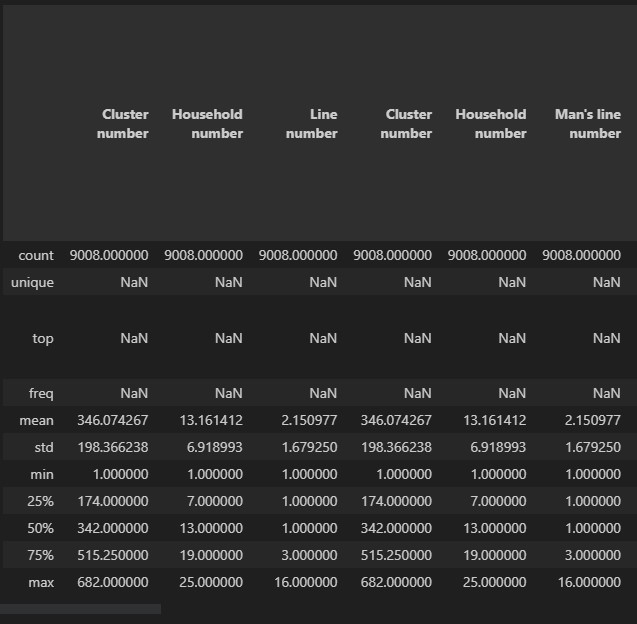

Figure 12: Pandas describe output showing the new header names.

Count all null values:
```python
df.isnull().sum()
```
The output shows 139 variables containing null values:
```python
...
Highest grade completed at that level                                             1164
Can read part of the sentence                                                     6923
Frequency of reading newspaper or magazine                                        1731
Frequency of listening to the radio                                               1094
Frequency of watching TV                                                          1094
Ever used a computer                                                              1094
Computer usage in the last 12 months                                              6763
Frequency of computer usage in the last month                                     7217
Ever used internet                                                                1094
...
```

Check the types of the variables:
```python
df.dtypes
```
Categorical variables are of type `object`, numerical of type `int64` and `float64`. Please note: Integer columns containing `NaN`-Values get parsed to `float64`:
```python
...
Day of interview                                                                    int64
Month of interview                                                                  int64
Year of interview                                                                   int64
Result of man's interview                                                          object
Field editor                                                                        int64
Data entry clerk                                                                    int64
Start of interview - Hour                                                         float64
Start of interview - Minutes                                                      float64
End of interview - Hour                                                           float64
...
```
Split into numerical and categorical variables.
```python
categorical_cols = df.select_dtypes(include=['object', 'category']).columns
numeric_cols = df.select_dtypes(include=['int', 'float']).columns
```
Print the distinct values per column of all categorical variables:
```python
for col in categorical_cols:
    unique_values = df[col].unique()
    print(f"Unique values in column '{col}':")
    print(unique_values)
    print()
```

```python
...
Unique values in column 'Ever attended school':
['Yes' nan 'No']

Unique values in column 'Highest level of school attended':
['Higher' 'Primary' nan 'Secondary' 'Preschool']

Unique values in column 'Can read part of the sentence':
[nan 'Able to read whole sentence' 'Cannot read at all'
 'Able to read only parts of sentence' 'Missing'
 'Blind / mute, visually / speech impaired'
 'No sentence in required language']
...
```
Check if there are duplicate rows in the dataset:

```python
# Find duplicate rows in the DataFrame
duplicate_rows = df.duplicated()

# Select the duplicate rows from the DataFrame
duplicate_data = df[duplicate_rows]

# Print the duplicate rows
print(duplicate_data)
```
Output:
```
Index: []
```

Cast the `Start of interview - Hour` cariable to type `datetime`, if possible

```python
problematic_values = []

# Convert the column to datetime format, and catch any unconverted data error
try:
    df['Start of interview - Hour'] = pd.to_datetime(df['Start of interview - Hour'], format='%H').dt.time
except ValueError as e:
    problematic_values = df['Start of interview - Hour'][pd.to_datetime(df['Start of interview - Hour'], format='%H', errors='coerce').isnull()]

# Print the problematic values
print("Problematic values:")
print(problematic_values)
```
The column contains
```python
Problematic values:
1129    99.0
1191    99.0
1617    99.0
...
```
Create three new columns marking the start and end time and date as well as the duration of the interview:
```python
# Assuming you have a DataFrame called 'df' and the provided column labels

# Combine date, hour, and minute columns and create a new column for the start of the interview as datetime
df['Start of interview'] = pd.to_datetime(
    df['Year of interview'].astype(str) + '-' + 
    df['Month of interview'].astype(str) + '-' + 
    df['Day of interview'].astype(str) + ' ' + 
    df['Start of interview - Hour'].astype(str) + ':' + 
    df['Start of interview - Minutes'].astype(str), errors='coerce'
)

# Combine date, hour, and minute columns and create a new column for the end of the interview as datetime
df['End of interview'] = pd.to_datetime(
    df['Year of interview'].astype(str) + '-' + 
    df['Month of interview'].astype(str) + '-' + 
    df['Day of interview'].astype(str) + ' ' + 
    df['End of interview - Hour'].astype(str) + ':' + 
    df['End of interview - Minutes'].astype(str), errors='coerce'
)

# Calculate the duration between the start and end of the interview
df['Duration of interview'] = df['End of interview'] - df['Start of interview']
```

Print the first ten values of each new variable:

```python
# Print the updated DataFrame
df['Start of interview'].head(10)
```
Output:
```python
0   2014-04-07 17:59:00
1   2014-04-07 17:32:00
2   2014-04-08 10:37:00
3                   NaT
4   2014-04-08 10:53:00
5                   NaT
6   2014-04-12 15:42:00
7   2014-04-12 12:37:00
8   2014-04-07 10:19:00
9   2014-04-07 18:13:00
Name: Start of interview, dtype: datetime64[ns]
```
```python
# Print the updated DataFrame
df['End of interview'].head(10)
```
Output:
```python
0   2014-04-07 18:07:00
1   2014-04-07 17:42:00
2   2014-04-08 10:52:00
3                   NaT
4   2014-04-08 11:10:00
5                   NaT
6   2014-04-12 16:00:00
7   2014-04-12 12:54:00
8   2014-04-07 10:32:00
9   2014-04-07 18:20:00
Name: End of interview, dtype: datetime64[ns]
```
```python
# Print the updated DataFrame
df['Duration of interview'].head(10)
```
Output:
```python
0   0 days 00:08:00
1   0 days 00:10:00
2   0 days 00:15:00
3               NaT
4   0 days 00:17:00
5               NaT
6   0 days 00:18:00
7   0 days 00:17:00
8   0 days 00:13:00
9   0 days 00:07:00
Name: Duration of interview, dtype: timedelta64[ns]
```

## sklearn Pipelines

Scikit-learn pipelines are a way to combine multiple data processing steps and machine learning models into a cohesive unit, allowing for streamlined and consistent data transformation and model training. The code example is taken from [here](https://www.youtube.com/watch?v=h1BnRBzYjYY&ab_channel=NeuralNine).

First, create some data:

```python
import pandas as pd
from sklearn.base import BaseEstimator, TransformerMixin
from sklearn.impute import SimpleImputer
from sklearn.preprocessing import OneHotEncoder
from sklearn.pipeline import Pipeline

data = {
    'Name': ['Anna', 'Bob', 'Charlie', 'Diana', 'Eric'],
    'Age': [20, 34, 23, None, 33],
    'Gender': ['f', 'm', 'm', 'f', 'm'],
    'Job': ['Programmer', 'Writer', 'Cook', 'Programmer', 'Teacher']
}

df = pd.DataFrame(data)
df
```

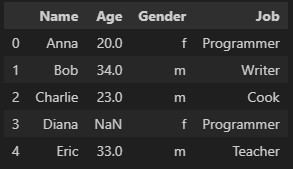

Figure 13: Pandas describe output showing the initial data

Second, define transformer classes which implement the [Data Wrangling](#data-wrangling) logic:

```python
class NameDropper (BaseEstimator, TransformerMixin):
    '''
    Transformer Class to drop the Name Column of the DataFrame.
    '''
    def fit(self, X, y=None):
        return self
    
    def transform(self, X):
        return X.drop(['Name'], axis=1)
    
class AgeImputer(BaseEstimator, TransformerMixin):
    '''
    Transformer Class to replace all None values in the Age Column with the mean value.
    '''
    def fit(self, X, y=None):
        return self
    
    def transform(self, X):
        imputer = SimpleImputer(strategy='mean')
        X['Age'] = imputer.fit_transform(X[['Age']])
        return X
    
class FeatureEncoder(BaseEstimator, TransformerMixin):
    '''
    Transformer Class to transform the gender column into numerical values
    and apply OneHot Encoding to the Jobs column.
    '''
    def fit(self, X, y=None):
        return self
    
    def transform(self, X):
        # Numeric Gender
        gender_dct = {'m': 0, 'f': 1}
        X['Gender'] = [gender_dct[g] for g in X['Gender']]

        # OneHotEncoder Jobs
        encoder = OneHotEncoder()
        matrix = encoder.fit_transform(X[['Job']]).toarray()

        column_names = ['Programmer', 'Writer', 'Cook', 'Teacher']

        for i in range(len(matrix.T)):
            X[column_names[i]] = matrix.T[i]

        X = X.drop(['Job'], axis=1)
        return X
```

Finally, construct a comprehensive [Data Wrangling](#data-wrangling) pipeline that encapsulates all necessary tasks, thereby promoting reusability and streamlining the data preparation process:

```python
from sklearn.pipeline import Pipeline

pipe = Pipeline([
    ("dropper", NameDropper()),
    ('imputer', AgeImputer()),
    ('encoder', FeatureEncoder())
])

pipe.fit_transform(df)
df
```

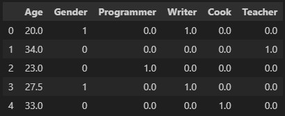

Figure 14: Pandas describe output showing the final data

## Individual Group Project Contributions
The following two chapters document my contributions to the group project. During project execution, the team usually met twice per week to discuss progress and synchronize.

### Development Team Project: Project Report

While discussion business entities and requirements, I created a conceptual data model:

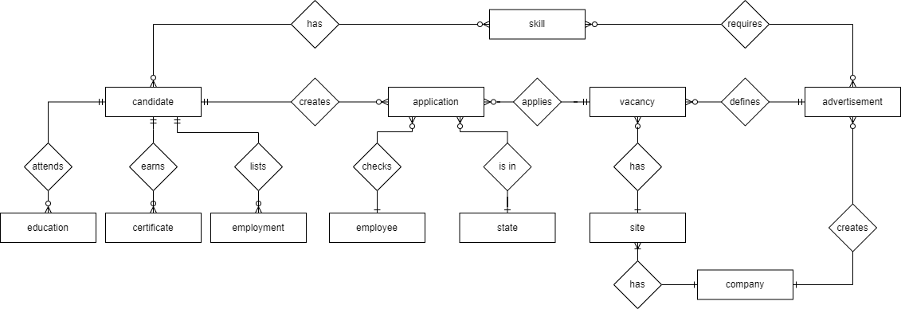

Figure 15: Group Project; Conceptual Data Model

I contributed to interactions on the logical data models for the OLTP data model and created the final model:
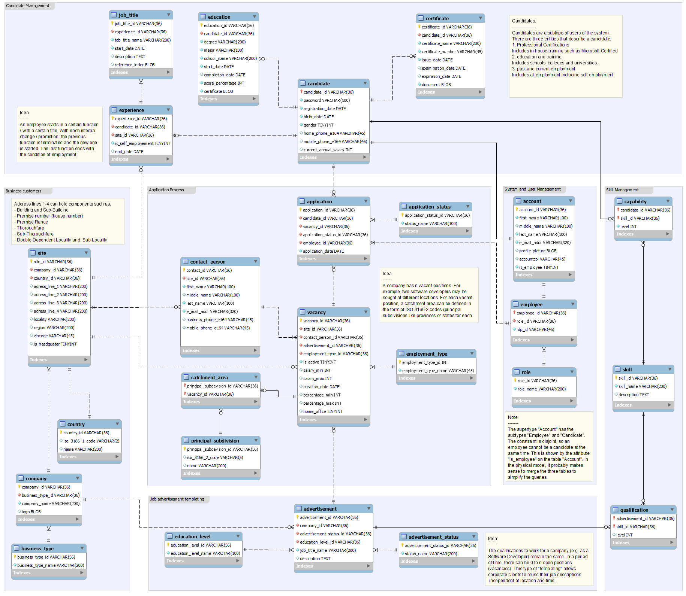

Figure 16: Group Project; Logical Data Model (OLTP) ([Click here to enlarge](/files/7d37e1d263ef9d37190bfb23a3687b87/PR1_ERM.png))


Besides working on the data models, I provided the architectural blueprint:

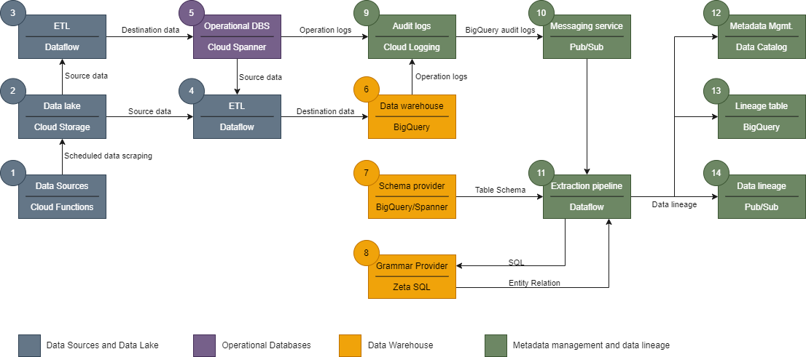

Figure 17: Group Project; Data Architecture using Google Cloud Services

### Development Team Project: Executive Summary

I enhanced the conceptual data model:

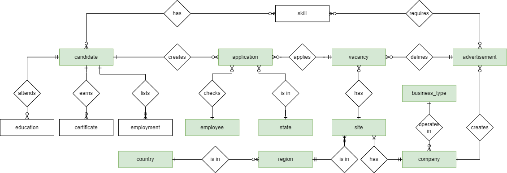

Figure 18: Group Project; Updated Conceptual Data Model 

I created the logical data model for the OLAP data model:

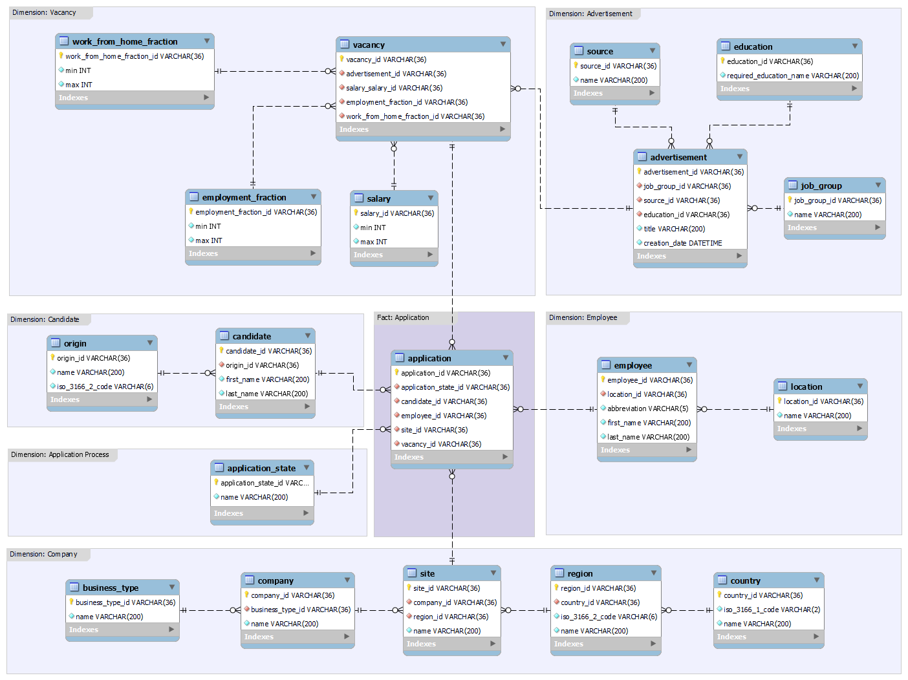

Figure 19: Group Project; Logical Database Model (OLAP) ([Click here to enlarge](/files/e7a39135ac1470f09aa9614d2edb8c48/PR2_ERM.png))

I implemented the physical model in MySQL:
* Download the [Data Definition Language (DDL) File](PR2_DDL.sql)
* Download the [Data Manipulation Language (DDL) File](PR2_DML.sql)

I implemented the physical model in MongoDB (including MongoDB Schema Validation, which was new for me):
* Download the [Python Notebook containing the relevant code](PR2_mongodb_plain.ipynb)

I implemented the Notebook containing the queries demonstrating how to work with MySQL
* Download the [Python Notebook containing the relevant code](PR2_mysql_plain.ipynb)

## Glossary


Table 12: Glossary
 
Term                                    | Definition
----------------------------------------|------------------------------------------------------------------------------------------------------------------------------------------------------------------------------
Application Programming Interface (API) | Possibilities for computer programs to communicate with each other
Cyber Security                          | Same as [Data Security](#data-security) / Information Security, but exclusively for digital assets.
Database                                | The collection of data objects a computer application needs
Primary Key                             | Single column value used to identify a database record uniquely
Surrogate Key                           | Unique identifier, which is not derived from application data, also called synthetic key or pseudo key.
Natural Key                             | Key that is derived from the data itself, as opposed to a surrogate Key.
Structured Query Language (SQL)         | Standard database creation and manipulation language.
Compound Key                            | Two or more primary keys from different tables are presented as foreign keys and form a superkey.
Composite key                           | A superkey that contains the minimal attributes required to identify every tuple.
Candidate Key                           | One or more attributes that uniquely identify a tuple.
Data Manipulation Language (DML)        | Subset of SQL dedicated to manipulating data (create, read, update and delete).
Data Definition Language (DDL)          | Subset of SQL dedicated to altering schemas.
Superkey                                | A primary tuple identifier that consists of two or more attributes.
Business Intelligence                   | Type of data analysis and set of technologies (evolution of decisions support tools) aimed at understanding organizational activities and opportunities
Data Warehouse                          | Integrated decision support database and the related software programs used to collect, cleanse, transform, and store data from a variety of operational and external sources
Data Warehousing                        | Operational extract, cleansing, transformation, control, and load processes that maintain the data in a data warehouse
Data Integration                        | Covers Extract, Transform, and Load (ETL), data virtualization, and other techniques of getting data into a common form and location.
Online Analytical Processing (OLAP)     | Databases containing business data from different points of view.
Online Transaction Processing (OLTP)    | Database containing operational transactions.
Data Lake                               | Centralized repository that allows storing structured and unstructured data
Low-code                                | Development environment used to create application software through a graphical user interface, where additional coding may be required.
No-code                                 | Development environment used to create application software through a graphical user interface.

