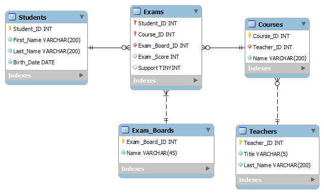

# Introduction

IMRAD,

## Definitions


 
Term                            | Definition                                                                                            | Reference
--------------------------------|-------------------------------------------------------------------------------------------------------|------------
Data Wrangling                  | aaaa                                                                                                  | ad1
Database                        | The collection of data objects a computer application needs                                           | Dwyer, 2016
Primary Key                     | Single column value used to identify a database record uniquely                                       | Dwyer, 2016
Composite Key                   |                                                                                                       |
Surrogate Key                   | Unique identifier which is not derived from application data. Also called synthetic key or pseudokey. |
Natural Key                     |                                                                                                       |
Set                             |                                                                                                       |
Structured Query Language (SQL) |                                                                                                       |
Compound Key                    | Two or more primary keys from different tables are presented as foreign keys.                         |
Composite key                   | Two or more attributes are needed to create a primary tuple identifier.                               |
Candidate Key                   | On or more attribute that uniquely identify a tuple.                                                  |
DML                             |                                                                                                       |
DDL                             |                                                                                                       |


# Methods

## Data Strategy

## Big Data

### Internet of Things

## Architectures and Blueprints

### Streaming

### Batch

## Data Wrangling / Cleaning / Profiling

### Storage

   

## Regularization
### GDPR

### FADP

# Results


# Discussion

- Wardley Maps and Evolution

# References

Codd, E.F. (1970) A relational model of data for large shared data banks. Communications of the ACM, 13(6), pp.377-387.

Codd, E.F. (1972) Further normalization of the data base relational model. Data base systems, 6, pp.33-64.

Dwyer, B. (2016) Systems analysis and synthesis : bridging computer science and information technology. 1st edition. Amsterdam, Netherlands: Morgan Kaufmann.

Harrington, J. L. (2016). Normalization. Relational Database Design and Implementation, 141-161

# Appendix

## Relational Model and Normalisation

According to Dwyer (2016), a well-designed database should fulfill several key criteria:

1. Efficient Query and Update Processing: The database should be capable of handling queries and updates in a timely manner, providing fast response times to ensure efficient data retrieval and modification operations.

2. Storage Space Optimization: The database should be designed in a way that minimizes storage requirements, effectively utilizing disk space and minimizing the overall storage footprint.

3. Data Integrity and Anomaly Prevention: The database should enforce data integrity constraints to prevent inconsistencies and anomalies. By enforcing rules and constraints, such as referential integrity and entity integrity, the database ensures that data remains accurate, reliable, and consistent.

4. Programming Simplicity: The database should be designed to minimize the programming effort required to interact with and utilize the stored data. This includes providing user-friendly query languages, intuitive APIs, and efficient data access mechanisms that simplify the development process and reduce programming complexity.

### Mathematical foundation
One way to fulfill these criteria is to use the relational model, which forms the foundation of modern database management systems, and is built upon the concept of a relation. This model, introduced by Codd (1970), brought about a significant revolution in database management. Codd's pioneering work in this area was recognized with the prestigious ACM Turing Award.
At its core, the relational model is rooted in mathematical principles, particularly the concept of sets. A relation, within this model, is a mathematical abstraction that embodies a set of tuples. Each tuple represents a row or record in a table and contains a collection of related attribute values. The relational approach derives its strength from the formal foundation of the relations theory, ensuring consistency and rigour in data representation and manipulation.
The relational model is commonly implemented using the Structured Query Language (SQL), which has become a standard for relational database management systems.


In mathematics a set is a distinct, unordered collection of objects, forming a group,

$$
A = \lbrace 1,2,3,4,5,6\rbrace
$$

where a tuple is an ordered sequence of elements, where each element can be of any type, and the position or order of the elements is significant.

$$
T = (a,b,c)
$$

A relation $r(R)$ is a set of tuples on the relation schema $R(A_1, A_2,..., A_n)$, where $R$ is the name of the relation and $A_1, A_2,..., A_n$ are attributes. The set of allowed values for each attribute $A_n$ is called the domain $D$ of the attribute, defining the attributes data type. For example:

$$
D_1 = StudentNumber = \lbrace 1001, 1002, 1003, ...\rbrace \\
D_2 = StudentName = \lbrace Bob, Sally, Mark, ...\rbrace \\
D_3 = StudentCity = \lbrace Bern, New York, Warsaw, ...\rbrace \\
r = \lbrace (1001, Bob, Bern), (1002, Sally, New York), (1003, Mark, Warsaw) ...\rbrace
$$


Codd (1970) proposed relational algebra as a basis for database query languages, which later became SQL

Operation         | Symbol   | Description                                                                        | Example SQL Query
------------------|----------|------------------------------------------------------------------------------------|---------------------------------------------------------------------------
Selection         | $\sigma$ | Retrieves rows from a relation that satisfy a condition (horizontal partitioning). | `SELECT * FROM table WHERE condition;`
Projection        | $\pi$    | Selects specific columns (attributes) from a relation (vertical partitioning).     | `SELECT column1, column2 FROM table;`
Union             | $\cup$   | Combines two relations, removing duplicates.                                       | `SELECT * FROM table1 UNION SELECT * FROM table2;`
Set difference    | $-$      | Retrieves rows from the first relation that do not exist in the second relation.   | `SELECT * FROM table1 EXCEPT SELECT * FROM table2;`
Cartesian product | $\times$ | Combines all rows from the first relation with all rows from the second relation.  | `SELECT * FROM table1, table2;`
Rename            | $\rho$   | Renames the attributes (columns) or the relation itself.                           | `SELECT column AS new_column FROM table;`
Set intersection  | $\cap$   | Retrieves rows that exist in both the first and second relation.                   | `SELECT * FROM table1 INTERSECT SELECT * FROM table2;`
Join              | $\Join$  | Combines rows from two or more relations based on a related attribute.             | `SELECT * FROM table1 INNER JOIN table2 ON table1.column = table2.column;`
Assignment        | $\larr$  | Assigns a value or expression to an attribute or variable.                         | `UPDATE table SET column = value WHERE condition;`

### Normalisation using the DBD_PCOM7E dataset

After defining the relational model, Codd (1972) introduced the concept of normalization to effectively organizing data in a database. Normalization has two main goals: eliminating redundant data (such as storing the same information in multiple tables) and ensuring that data dependencies are logical (storing only related data in a table). By achieving these goals, normalization enhances data efficiency, minimizes data duplication, and improves the overall integrity and consistency of the database.

In accordance with the theoretical framework outlined by Harrington (2016) and following the [Normalisation Task presented in Unit 7](https://www.my-course.co.uk/mod/page/view.php?id=809099), the provided dataset will now be transformed into the third normal form (3NF) as an illustrative example. 

&nbsp;<ins>Student Number</ins> | Student Name | Exam Score | Support | Date of Birth | Course Name      | Exam Boards | Teacher Name
--------------------------------|--------------|------------|---------|---------------|------------------|-------------|-------------
1001                            | Bob Baker    | 78         | No      | 25/08/2001    | Computer Science | BCS         | Mr Jones
&nbsp;                          |              |            |         |               | Maths            | EdExcel     | Ms Parker
&nbsp;                          |              |            |         |               | Physics          | OCR         | Mr Peters
1002                            | Sally Davies | 55         | Yes     | 02/10/1999    | Maths            | AQA         | Ms Parker
&nbsp;                          |              |            |         |               | Biology          | WJEC        | Mrs Patel
&nbsp;                          |              |            |         |               | Music            | AQA         | Ms Daniels
1003                            | Mark Hanmill | 90         | No      | 05/06/1995    | Computer Science | BCS         | Mr Jones
&nbsp;                          |              |            |         |               | Maths            | EdExcel     | Ms Parker
&nbsp;                          |              |            |         |               | Physics          | OCR         | Mr Peters
1004                            | Anas Ali     | 70         | No      | 03/08/1980    | Maths            | AQA         | Ms Parker
&nbsp;                          |              |            |         |               | Physics          | OCR         | Mr Peters
&nbsp;                          |              |            |         |               | Biology          | WJEC        | Mrs Patel
1005                            | Cheuk Yin    | 45         | Yes     | 01/05/2002    | Computer Science | BCS         | Mr Jones
&nbsp;                          |              |            |         |               | Maths            | EdExcel     | Ms Parker
&nbsp;                          |              |            |         |               | Music            | AQA         | Ms Daniels

Please note the following assumptions made in the analysis of the provided data:

Firstly, the attribute "Support" is assumed to represent whether or not the student received assistance during the exam, indicating the presence or absence of support. Secondly, the attribute "Exam Boards" is interpreted as referring to examination boards, which are responsible for establishing the curriculum, creating examination materials, and evaluating students' performance in their respective subjects. Lastly, due to the presence of repeating groups in the table, it is unclear to which specific course a given exam score corresponds. As a result, the assumption is made that the exam score pertains to the first occurrence of the corresponding course listed in the table.


#### First Normal Form (1NF)

In order to achieve the first normal form (1NF), the data must be organized in tables where each row is uniquely identified by a primary key and all attribute values are atomic, meaning they cannot be further decomposed. Additionally, there should be no repeating groups within a table.

In the provided table, the presence of repeating groups in the "Course Name," "Exam Boards," and "Teacher Name" columns is evident, as multiple values are associated with the same student number and student name. To address this issue and achieve the first normal form, a composite key consisting of the "Student Number" and "Course Name" attributes is introduced. This composite key ensures the creation of a distinct row for each student and course combination, eliminating the occurrence of repeating groups and promoting the use of atomic values. Furthermore, the attributes "Student Name" and "Teacher Name" are decomposed into more granular components, specifically "First Name" and "Last Name" for student names, and "Title" and "Teacher Name" for teacher names. These modifications convert the table into the first normal form.

&nbsp;<ins>Student Number</ins> | First Name | Last Name | Exam Score | Support | Date of Birth | &nbsp;<ins>Course Name</ins> | Exam Boards | Title | Teacher Name
--------------------------------|------------|-----------|------------|---------|---------------|------------------------------|-------------|-------|-------------
1001                            | Bob        | Baker     | 78         | No      | 25/08/2001    | Computer Science             | BCS         | Mr    | Jones
1001                            | Bob        | Baker     | NULL       | NULL    | 25/08/2001    | Maths                        | EdExcel     | Ms    | Parker
1001                            | Bob        | Baker     | NULL       | NULL    | 25/08/2001    | Physics                      | OCR         | Mr    | Peters
1002                            | Sally      | Davies    | 55         | Yes     | 02/10/1999    | Maths                        | AQA         | Ms    | Parker
1002                            | Sally      | Davies    | NULL       | NULL    | 02/10/1999    | Biology                      | WJEC        | Mrs   | Patel
1002                            | Sally      | Davies    | NULL       | NULL    | 02/10/1999    | Music                        | AQA         | Ms    | Daniels
1003                            | Mark       | Hanmill   | 90         | No      | 05/06/1995    | Computer Science             | BCS         | Mr    | Jones
1003                            | Mark       | Hanmill   | NULL       | NULL    | 05/06/1995    | Maths                        | EdExcel     | Ms    | Parker
1003                            | Mark       | Hanmill   | NULL       | NULL    | 05/06/1995    | Physics                      | OCR         | Mr    | Peters
1004                            | Anas       | Ali       | 70         | No      | 03/08/1980    | Maths                        | AQA         | Ms    | Parker
1004                            | Anas       | Ali       | NULL       | NULL    | 03/08/1980    | Physics                      | OCR         | Mr    | Peters
1004                            | Anas       | Ali       | NULL       | NULL    | 03/08/1980    | Biology                      | WJEC        | Mrs   | Patel
1005                            | Cheuk      | Yin       | 45         | Yes     | 01/05/2002    | Computer Science             | BCS         | Mr    | Jones
1005                            | Cheuk      | Yin       | NULL       | NULL    | 01/05/2002    | Maths                        | EdExcel     | Ms    | Parker
1005                            | Cheuk      | Yin       | NULL       | NULL    | 01/05/2002    | Music                        | AQA         | Ms    | Daniels


#### Second Normal Form (2NF)
The second normal form (2NF) extends the requirements of the first normal form (1NF) by ensuring that non-key attributes in a table are fully functionally dependent on the entire primary key, eliminating partial dependencies. A functional dependencies (FD), $f: X \rightarrow Y$ signifies that the values of $Y$ are determined by the values of $X$. This implies that any two tuples sharing identical values of $X$ will inevitably have the same corresponding values of $Y$. A fully functional dependency occurs when attribute $Y$ is functionally dependent on a composite key $X$, indicating that $Y$ depends on all attributes of $X$.

In the provided example, where the primary key comprises the Student Number and Course Name, it is evident that the table violates the 2NF as the Teacher Name attribute exhibits a partial dependency on the Course Name attribute. Similarly, attributes such as "First Name" and "Last Name" for students also exhibit partial dependencies on the composite key. To achieve the second normal form, the table should be decomposed into three separate tables:


Table: Students

&nbsp;<ins>Student Number</ins> | First Name | Last Name | Date of Birth
--------------------------------|------------|-----------|--------------
1001                            | Bob        | Baker     | 25/08/2001
1002                            | Sally      | Davies    | 02/10/1999
1003                            | Mark       | Hanmill   | 05/06/1995
1004                            | Anas       | Ali       | 03/08/1980
1005                            | Cheuk      | Yin       | 01/05/2002

Table: Courses

&nbsp;<ins>Course Name</ins> | Title | Teacher Name
-----------------------------|-------|-------------
Computer Science             | Mr    | Jones
Maths                        | Ms    | Parker
Physics                      | Mr    | Peters
Biology                      | Mrs   | Patel
Music                        | Ms    | Daniels

Table: Exams

&nbsp;<ins style="text-decoration:overline underline;">Student Number</ins> | Exam Score | Support | Exam Boards | &nbsp;<ins style="text-decoration:overline underline;">Course Name</ins>
----------------------------------------------------------------------------|------------|---------|-------------|-------------------------------------------------------------------------
1001                                                                        | 78         | No      | BCS         | Computer Science
1001                                                                        | NULL       | NULL    | EdExcel     | Maths
1001                                                                        | NULL       | NULL    | OCR         | Physics
1002                                                                        | 55         | Yes     | AQA         | Maths
1002                                                                        | NULL       | NULL    | WJEC        | Biology
1002                                                                        | NULL       | NULL    | AQA         | Music
1003                                                                        | 90         | No      | BCS         | Computer Science
1003                                                                        | NULL       | NULL    | EdExcel     | Maths
1003                                                                        | NULL       | NULL    | OCR         | Physics
1004                                                                        | 70         | No      | AQA         | Maths
1004                                                                        | NULL       | NULL    | OCR         | Physics
1004                                                                        | NULL       | NULL    | WJEC        | Biology
1005                                                                        | 45         | Yes     | BCS         | Computer Science
1005                                                                        | NULL       | NULL    | EdExcel     | Maths
1005                                                                        | NULL       | NULL    | AQA         | Music

Please note:
* An overlined attribute refers to being a foreign key.
* An additional assumption has been considered in this context: It is assumed that a student is not permitted to participate in the same exam multiple times under different examination boards. Therefore, the attribute "Exam Boards" is not included as part of the compound key.

#### Third Normal Form (3NF)
In addition to satisfying the requirements of the second normal form (2NF), the third normal form (3NF) ensures that there are no in-table dependencies between the columns within each table. Non-prime attributes must have a direct (non-transitive) dependency on candidate keys.

If a relation schema, denoted as $R(\underline{X}, Y, Z)$, contains a functional dependency $f: Y \rightarrow Z$, where $Y$ and $Z$ are non-prime attributes, it implies the presence of a transitive dependency from $X$ to $Z$. To resolve this, the table should be decomposed into two separate tables: $T_1(\underline{X}, Y)$ and $T_2(\underline{Y}, Z)$. This decomposition ensures that the dependencies are preserved and eliminates the transitive dependency issue and hence eliminating redundancies and improving data integrity.

In the given example, the relation schema $Courses(\underline{Course Name}, Title, Teacher Name)$ exhibits a transitive dependency, where the non-prime attribute "Teacher Name" is functionally dependent on the attribute "Title". To resolve this, it is recommended to decompose the relation into two separate tables: one containing the attributes "Course Name" and "Title" and another with the attributes "Title" and "Teacher Name". This decomposition eliminates the transitive dependency and ensures that each attribute is directly dependent on the key attribute.

Furthermore, the relation schema $Exams(\underline{Student Number}, Exam Score, Support, Exam Boards, \underline{Course Name})$ is susceptible to a transitive dependency if additional attributes dependent on "Exam Boards" are introduced. To prevent this, it is advisable to create a separate table specifically for the attribute "Exam Boards", ensuring that the relation schema remains free from transitive dependencies and adheres to normalization principles.

The following presents a logical model of the database in the third normal form. As is common practice today, surrogate keys are used as the primary key. This is because natural keys are often not unique, contrary to previous assumptions.



Download:
* MySQL Workbench file: [DBD_PCOM7E.mwb](DBD_PCOM7E.mwb)
* Data Definition Language File: [DBD_PCOM7E_DDL.sql](DBD_PCOM7E_DDL.sql)
* Data Manipulation Language File: [DBD_PCOM7E_DML.sql](DBD_PCOM7E_DML.sql)

### Verifying referential integrity

All reference keys in the schema have been set to `ON DELETE CASCADE` and `ON UPDATE CASCADE`. This ensures that when an entry is deleted or updated in a parent table, the corresponding changes are automatically applied to the child tables, maintaining referential integrity. The following queries can be utilized to delete an entry in a parent table and verify if the child tables still maintain valid integrity. Additionally, the courses table has a unique key index that prevents the insertion of duplicate courses with the same name and teacher. This constraint can be verified using the final query.

1. Verify if all students in the "Exams" table exist in the "Students" table:
    ```sql
    DELETE FROM `dbd_pcom7e`.`students`
    WHERE `Student_ID` = 1001;

    SELECT *
    FROM DBD_PCOM7E.Exams e
    LEFT JOIN DBD_PCOM7E.Students s ON e.Student_ID = s.Student_ID
    WHERE s.Student_ID IS NULL;
    ```
    Expected Output: `1 row(s) affected` and `0 row(s) returned`

2. Check if all courses in the "Courses" table have a valid teacher:
    ```sql
    DELETE FROM `dbd_pcom7e`.`teachers`
    WHERE `Teacher_ID` = 5;
    
    SELECT *
    FROM DBD_PCOM7E.Courses c
    LEFT JOIN DBD_PCOM7E.Teachers t ON c.Teacher_ID = t.Teacher_ID
    WHERE t.Teacher_ID IS NULL;
    ```
    Expected Output: `1 row(s) affected` and `0 row(s) returned`

3. Ensure that all exam boards in the "Exams" table exist in the "Exam_Boards" table:
    ```sql
    DELETE FROM `dbd_pcom7e`.`exam_boards`
    WHERE `Exam_Board_ID` = 2;

    SELECT *
    FROM DBD_PCOM7E.Exams e
    LEFT JOIN DBD_PCOM7E.Exam_Boards eb ON e.Exam_Board_ID = eb.Exam_Board_ID
    WHERE eb.Exam_Board_ID IS NULL;
    ```
    Expected Output: `1 row(s) affected` and `0 row(s) returned`

4. Ensure that all courses in the "Exams" table exist in the "Courses" table:
    ```sql
    DELETE FROM `dbd_pcom7e`.`courses`
    WHERE `Course_ID` = 2;

    SELECT *
    FROM DBD_PCOM7E.Exams e
    LEFT JOIN DBD_PCOM7E.Courses c ON e.Course_ID = c.Course_ID
    WHERE c.Course_ID IS NULL;
    ```
    Expected Output: `1 row(s) affected` and `0 row(s) returned`

5. Adding the same course name with the same teacher returns an error:
    ```sql
    INSERT INTO `dbd_pcom7e`.`courses`
    (`Course_ID`,
    `Teacher_ID`,
    `Name`)
    VALUES
    (5, 4, 'Biology');
    ```
    Expected Output: `Error Code: 1062. Duplicate entry '4-Biology' for key 'courses.Teacher_ID_Name_UNIQUE'`