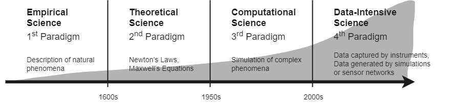
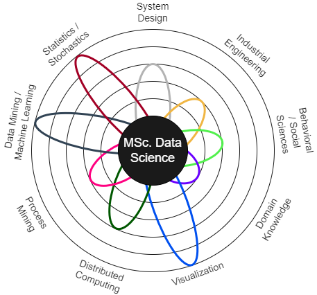

Ten years ago, Davenport and Patil (2012) headlined "Data Scientist: The Sexiest Job of the 21st Century" in the Harvard Business Review. This article has contributed significantly to the term becoming a buzzword. The reasons are manifold. For example, data science deals with abstract concepts without physical form and uses methods such as artificial intelligence, which are often fraught with misunderstandings (Emmert-Streib et al., 2020). Soon after, a gold-rush atmosphere and slogans like "data is the new oil" dominated the press. Some authors began to calculate the value of the data. A calculation from 2012 states that, for example, each Facebook user is worth $116 (Bergstein & Orcutt, 2012). In 2016, the US Bureau of Labor Statistics estimated a 27.4 per cent rise in the demand for data science skills through 2026 (Rieley, 2018). Universities in different countries, in turn, offer courses of study in data science. One is the University of Essex Online, which provides an MSc. Data Science degree program. This essay explores how this course is structured and what benefits are generated.

Scientists from different fields have discussed extracting knowledge from data for a long time (Press, 2013). However, data science did not take off until 2009, when Hey et al. (2009) defined data-intensive science as the fourth scientific paradigm (see Figure 1). Fast forward to 2017, Dehmer and Emmert-Streib (2017) define data science as a highly interdisciplinary field dealing with all aspects of data (e.g., analysis, legal aspects, skills, management etc.). This definition goes beyond data mining, business analytics, or statistical analysis. Hence the diverse offer of higher education—some focus on analytics, others on statistics, and still others on the theoretical underpinnings.

*Figure 1: Visualization of the four scientific paradigms proposed by Hey et al. (2009). The illustration shows the increase in speed, automation, and scale.*

At the University of Essex, undergraduate or customisable postgraduate courses are offered on-site (University of Essex, 2022), whereas a fixed postgraduate study is provided online (University of Essex Online, 2022b). Theoretical basics and practical skills are taught in six modules for a complete duration of two years (see Table 1). The course is aimed at career changers already integrated into the professional world and focuses on providing the missing specialists mentioned at the beginning as quickly as possible.

| Module     |Goal|
|------------|------------|
|The Data Professional	| Explore concepts, critical knowledge, and ethical and professional responsibilities of the data science professional.|
|Numerical Analysis	|Introduce critical aspects of mathematics and statistics.|
|Deciphering Big Data	|Train data acquisition, cleaning, transformation, exploration, analysis, and reporting in a hands-on project.|
|Machine Learning	|A practical introduction to the concepts of machine learning.|
|Research Methods and Professional Practice	|Deepen the principles, methods, and strategies of scientific research.|
|MSc Computing Project	|Dissertation project to earn a master's degree.|

*Table 1: Structure of the online master's course in data science (University of Essex Online, 2022a).*

Van der Aalst (2014) provides a visualisation containing nine subdisciplines representing the profile of a data scientist. Based on the course description, Figure 2 combines the perceived focus areas and Van der Aalst's subdisciplines. The goal is to identify focus areas, not to compare with other universities.
 
 
*Figure 2: Profile of a Data Scientist according to Van der Aalst (2014). The coloured circles represent the subdisciplines; the rings show the perceived focus areas of the online MSc. Data Science course.*

Cross-functional, agile engineering teams are more innovative and successful than others (Serrador & Pinto, 2015; Sethi et al., 2001). Based on the author's experience, few teams leverage data to drive innovation further and improve decision-making. Having a Data Scientist join the team will help climb the analytics maturity ladder, as proclaimed by Kenett and Redman (2019). The result is that attention is paid to information quality. Experimental thinking and the idea that changes are statistically significant are introduced. After completing the course, the expectation is that graduates know the relevant theories and constructs which enable them to exhibit creative thinking in the field of Data Science.

Regardless of the academic discipline, a master's degree offers individual benefits. For example, each additional year of education increases the intelligence quotient (IQ) by 1 to 5 points (Ritchie & Tucker-Drob, 2018). Moreover, in the 25 OECD countries, life expectancy is about six years higher for people with the highest level of education (OECD, 2017). For society in general, the research of Xiao and Mao (2021) suggests that postgraduate study fosters technological innovation. Specifically, the MSc Data Science course will drive innovation because it helps generate meaningful knowledge independent of the industry. In addition, it automatically helps to find meaning in the buzzword "Data Science" mentioned at the beginning because well-trained data scientists are released into the economy and help to correct false expectations. All of this leads to the conclusion that an MSc degree in Data Science is worth it.

### References

Bergstein, B. & Orcutt, M. (2012) Is Facebook Worth it? Available from:
https://www.technologyreview.com/2012/05/21/185356/is-facebook-worth-it [Accessed 12 September 2022].

Davenport, T. & Patil D. (2012). Data scientist. Harvard business review 90.5: 70-76.

Dehmer, M & Emmert-Streib, F. (2017). Frontiers in data science. 1st ed. CRC Press.

Emmert-Streib, F., Yli-Harja O. & Dehmer M. (2020). Artificial intelligence: A clarification of misconceptions, myths and desired status. Frontiers in artificial intelligence 3: 524339.

Hey, A., Tansley S., Tolle, K. (2009). The fourth paradigm: data-intensive scientific discovery.1st ed. Microsoft Research Redmond.

Kenett, R. & Redman, T. (2019). The Real Work of Data Science:
Turning data into information, better decisions, and stronger organizations. 1st ed.
John Wiley & Sons.

OECD (2017). Life expectancy by sex and education level. Health at a Glance 2017: Paris: OECD Indicators, OECD Publishing. DOI: https://doi.org/10.1787/health_glance-2017-7-en.
Press, G. (May 28, 2013). A very short history of data science. Forbes. Available from: https://www.forbes.com/sites/gilpress/2013/05/28/a-very-short-history-of-data-science/?sh=30aa84ee55cf [Accessed 12 September 2022].

Rieley, M. (2018). Big data adds up to opportunities in math careers. Change 2016: 26.

Ritchie, S. & Tucker-Drob, E. (2018). How much does education improve intelligence? A meta-analysis. Psychological science 29.8: 1358-1369.

Serrador, P. & Pinto, J. (2015). Does Agile work? — A quantitative analysis of agile project success. International journal of project
management 33.5: 1040-1051.

Sethi, R., Smith, D. & Park, C. (2001). Cross-functional product development teams, creativity, and the innovativeness of new consumer products. Journal of marketing research 38.1: 73-85.

University of Essex (2022) Course Finder | University of Essex. Available from: https://www.essex.ac.uk/subjects [Accessed 12 September 2022].

University of Essex Online (2022a). MSc Data Science | Online Masters Degree | University of Essex Online. Available from: https://online.essex.ac.uk/courses/msc-data-science [Accessed 12 September 2022].

University of Essex Online (2022b). Subjects | University of Essex Online. Available from: https://online.essex.ac.uk/subjects [Accessed 12 September 2022].

Van der Aalst, W. (2014). Data scientist: The engineer of the future. Enterprise interoperability VI. Springer. 13-26.

Xiao, H. & Mao, J. (2021). Effects of postgraduate education on technological innovation: a study based on the spatial Durbin model. Asia
Pacific Education Review 22.1: 89-99.
