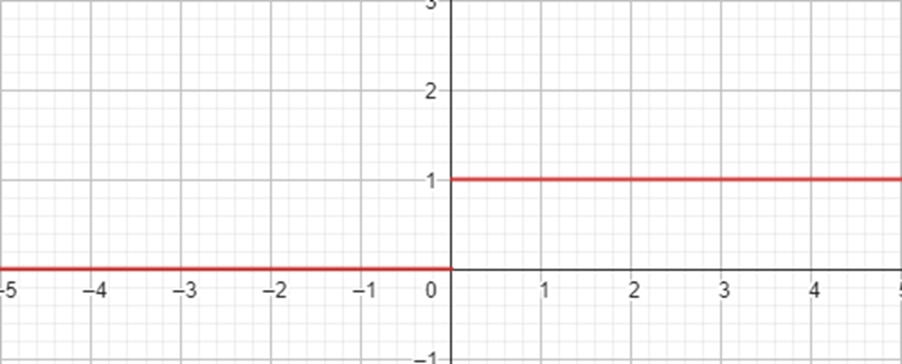
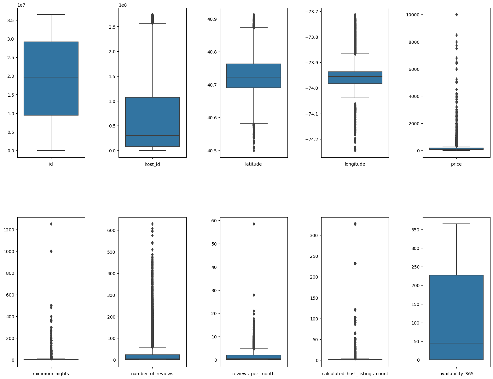

This e-portfolio serves as a comprehensive record of my work and the learning outcomes achieved throughout the Machine Learning module in August 2023 at the University of Essex. To facilitate navigation and provide an overview, the following table presents a list of all the requisite activities:


Component                                                               | Chapter
------------------------------------------------------------------------|--------
Collaborative Discussion 1: The 4th Industrial Revolution               | [Collaborative Discussion 1: The 4th Industrial Revolution](#collaborative-discussion-1-the-4th-industrial-revolution)
e-Portfolio Activity: Correlation and Regression                        | [Correlation and Regression](#correlation-and-regression)
Wiki Activity: Clustering                                               | [Wiki Activity: Clustering](#wiki-activity-clustering)
e-Portfolio Activity: Jaccard Coefficient Calculations                  | [Jaccard Coefficient Calculations](#jaccard-coefficient-calculations)
e-Portfolio Activity: Perceptron Activities                             | [Perceptron Activities](#perceptron-activities)
e-Portfolio Activity: Gradient Cost Function                            | [Gradient Cost Function](#gradient-cost-function)
Collaborative Discussion 2: Legal and Ethical views on ANN applications | [Collaborative Discussion 2: Legal and Ethical views on ANN applications](#collaborative-discussion-2-legal-and-ethical-views-on-ann-applications)
e-Portfolio Activity - CNN Model Activity                               | [CNN Model Activity](#cnn-model-activity)
e-Portfolio Activity: Model Performance Measurement                     | [Model Performance Measurement](#model-performance-measurement)
Individual contributions - Development Team Project: Project Report     | [Development Team Project: Project Report](#development-team-project-project-report)
Individual contributions - Development Team Project: Team Presentation  | [Development Team Project: Team Presentation](#development-team-project-team-presentation)
Reflective piece                                                        | [Reflective Peace](#reflective-peace)


# Collaborative Discussion 1: The 4th Industrial Revolution

This chapter encompasses the introductory post, peer responses written by me, and my summary post for Collaborative Discussion 1 on the topic of the 4th Industrial Revolution.

## Initial Post

Amid escalating environmental concerns, Industry 4.0 is potent in combatting climate change. This transformative shift in industrial processes, characterised by integrating digital technologies, data-driven decisions, and advanced automation, holds significant promise in curbing carbon emissions and fostering sustainability across sectors (Ben Youssef, 2020). Hermann et al. (2016) state that Industry 4.0 rests on principles like interoperability, virtualization, decentralization, real-time capability, service orientation, and modularity.

An essential merit of Industry 4.0 lies in its prowess to amplify resource efficiency. Industries can oversee energy consumption, optimise production, and curtail waste generation through sensor deployment and IoT devices (Bai et al., 2020). Interconnected systems guarantee seamless value chain operations. Analyzing real-time data allows precise operational tuning, culminating in diminished energy use and fewer greenhouse gas emissions. Industry 4.0-enabled predictive maintenance extends equipment lifecycles, minimizing replacements and their carbon footprint.

Furthermore, Industry 4.0 propels smart grid and energy management system advancement. Renewable energy integration, e.g., solar panels and wind turbines, benefits from sophisticated monitoring and control mechanisms. These technologies optimise energy distribution, reducing fossil fuel reliance and traditional energy source emissions.

Additionally, Industry 4.0 champions circular economy models through closed-loop production systems. Heightened traceability ensures products are monitored throughout their lifespan, facilitating efficient recycling and repurposing. Standardised, interchangeable components streamline customization, scalability, and maintenance.

In sum, Industry 4.0 heralds myriad avenues for mitigating climate change repercussions. By refining resource usage, bolstering energy efficiency, and endorsing circular economy principles, this technological shift equips industries to contribute significantly to global sustainability aims. However, realizing these gains necessitates robust collaboration among policymakers, industries, and researchers. The formulation of comprehensive frameworks and regulations, as advocated by Fritzsche et al. (2018), becomes pivotal for the responsible integration of Industry 4.0 in climate-centric endeavours. 

### References

Bai, C., Dallasega, P., Orzes, G. & Sarkis, J. (2020) Industry 4.0 technologies assessment: A sustainability perspective. International journal of production economics, 229, p.107776.

Ben Youssef, A. (2020) How can Industry 4.0 contribute to combatting climate change?. Revue d'économie industrielle, (169), pp.161-193.

Fritzsche, K., Niehoff, S., & Beier, G. (2018). Industry 4.0 and Climate Change—Exploring the Science-Policy Gap. Sustainability, 10(12): 4511. doi:10.3390/su10124511.

Hermann, M., Pentek, T. and Otto, B. (2016) Design principles for industrie 4.0 scenarios. In 2016 49th Hawaii international conference on system sciences (HICSS) (pp. 3928-3937). IEEE.

## Peer Response 1

Thank you Giuseppe, for your comprehensive overview of the impact of Industry 4.0 on trading, highlighting the integration of advanced technologies such as AI, IoT, Blockchain, and Big Data analytics. You discuss the positive transformations these technologies have brought about in trading practices, including algorithmic and high-frequency trading, enhanced decision-making, secure transactions, and personalised customer experiences. Moreover, you outline the challenges associated with these advancements, including concerns about market fairness, privacy violations, legal complexities, regulatory inconsistencies, job displacement, and ethical dilemmas.

The ethical dimensions of Big Data analytics have gained prominence in recent years, particularly concerning their implications for individuals. Someh (2019) identifies privacy as a primary concern in this context, emphasizing the importance of individuals controlling how organizations access, modify, and utilise their data. Furthermore, trust is a pivotal element in ethical data usage, with issues such as unauthorised monitoring and unsolicited intrusions being highlighted as potential trust eroders. Ethical dilemmas arise when individuals lack awareness of the purposes and processes involved in Big Data analytics. Lastly, the impact of Big Data analytics on individual choices is a complex issue, as it may both restrict choices and raise concerns about autonomy. As outlined by Someh (2019), these ethical considerations underscore the evolving landscape of ethical challenges in the era of Big Data analytics, challenging traditional ethical paradigms, as pointed out by Zwitter (2014).

### References
Someh, I., Davern, M., Breidbach, C.F. and Shanks, G. (2019) Ethical issues in big data analytics: A stakeholder perspective. Communications of the Association for Information Systems, 44(1), p.34.

Zwitter, A. (2014). Big Data ethics. Big Data & Society, 1(2).

## Peer Response 2

Thank you for your insightful post on the impact of Industry 4.0 on agriculture. Your use of current literature provides a strong foundation for the discussion and showcases your commitment to staying up-to-date with the latest research in the field.

Your post highlights the convergence of Industry 4.0 and agriculture, particularly Agriculture 4.0. This transformation promises to revolutionise conventional farming practices and address various issues, including farm productivity, environmental sustainability, food security, and crop losses (Rose et al., 2021).
However, it is worth considering whether there are concrete estimates of the savings or efficiency gains that can be achieved with Industry 4.0 in agriculture. Quantifying the potential economic and environmental benefits of these technologies could strengthen your argument and provide a more precise picture of the impact of Agriculture 4.0.

Additionally, you touched on the environmental challenges in agriculture. At least in Switzerland, the sector needs help to meet federal government targets related to biodiversity, nutrient surpluses, emissions, and water quality (Baur & Flückiger, 2018). Are there strategies to ensure that local savings are effectively utilised and do not lead to a simple distribution over a larger area, potentially exacerbating existing environmental issues?

In summary, your post is well-researched and provides an excellent overview of the impact of Industry 4.0 on agriculture. However, incorporating concrete savings estimates and addressing strategies to balance efficiency gains with environmental sustainability would enhance the depth of your analysis.

### References

Baur, P. and Flückiger, S. (2018) Nahrungsmittel aus ökologischer und tiergerechter Produktion–Potential des Standortes Schweiz.

Rose, D.C., Wheeler, R., Winter, M., Lobley, M. and Chivers, C.A. (2021) Agriculture 4.0: Making it work for people, production, and the planet. Land use policy, 100, p.104933.

## Summary Post

The advent of Industry 4.0, characterised by the integration of digital technologies, data-driven decisions, and advanced automation, represents a pivotal advancement in addressing climate change (Bai et al., 2020). This transformative paradigm holds the potential to make substantial contributions to climate change mitigation across several key areas.

First and foremost, Industry 4.0 promises resource efficiency (Ben Youssef, 2020). By deploying sensors and Internet of Things (IoT) devices, industries can meticulously monitor energy consumption, optimise production processes, and significantly reduce waste. The real-time data analysis enables precise operational adjustments, reducing energy consumption and decreasing greenhouse gas emissions (Hermann et al., 2016). Furthermore, predictive maintenance strategies extend the lifespan of equipment, effectively reducing the need for replacements and the carbon footprint associated with them (Ben Youssef, 2020).

Industry 4.0 also plays a crucial role in advancing energy management systems (Bai et al., 2020). It facilitates the integration of renewable energy sources, such as solar panels and wind turbines, into the energy grid. This optimisation of energy distribution ultimately reduces dependence on fossil fuels and a corresponding decrease in traditional energy source emissions.

Moreover, Industry 4.0 actively promotes circular economy models by enabling closed-loop production systems. Enhanced traceability ensures that products are monitored throughout their entire lifecycle, making efficient recycling and repurposing possible. Standardised and interchangeable components streamline customisation, scalability, and maintenance.

However, the journey towards realising the full potential of Industry 4.0 in climate change mitigation has its challenges. Cybersecurity, data privacy, and the socio-economic implications of automation must be addressed (Frey & Osbourne, 2017; Schwab & Zahidi, 2020; Culot et al., 2019; Morrar et al., 2017). Moreover, the critical need for effective change management and public acceptance of these transformative technologies should not be underestimated.

Industry 4.0 could revolutionise how we address climate change. Its multifaceted benefits, ranging from resource efficiency and energy management to circular economy promotion, can be harnessed to create a more sustainable and resilient future. However, to fully unlock these benefits, addressing the challenges and collaborating on the regulatory, educational, and change management fronts is essential (Fritzsche et al., 2018).

### References

Bai, C., Dallasega, P., Orzes, G. & Sarkis, J. (2020) Industry 4.0 technologies assessment: A sustainability perspective. International journal of production economics, 229, p.107776.

Ben Youssef, A. (2020) How can Industry 4.0 contribute to combatting climate change?. Revue d'économie industrielle, (169), pp.161-193.

Culot, G., Fattori, F., Podrecca, M., & Sartor, M. (2019). Addressing industry 4.0 cybersecurity challenges. IEEE Engineering Management Review, 47(3), 79-86.

Fritzsche, K., Niehoff, S., & Beier, G. (2018). Industry 4.0 and Climate Change—Exploring the Science-Policy Gap. Sustainability, 10(12): 4511. doi:10.3390/su10124511.

Frey, C. B., & Osborne, M. A. (2017). The Future of Employment: How Susceptible are Jobs to Computerisation? Technological Forecasting and Social Change 114: 254–280.  DOI: https://doi.org/10.1016/j.techfore.2016.08.019

Hermann, M., Pentek, T. and Otto, B. (2016) Design principles for industrie 4.0 scenarios. In 2016 49th Hawaii international conference on system sciences (HICSS) (pp. 3928-3937). IEEE.

Morrar, R., Arman, H., & Mousa, S. (2017). The fourth industrial revolution (Industry 4.0): A social innovation perspective. Technology innovation management review, 7(11), 12-20.

Schwab, K. & Zahidi, S. (2020) The Future of Jobs Report.  World Economic Forum. Available from: https://www3.weforum.org/docs/WEF_Future_of_Jobs_2020.pdf [Accessed 21 October 2023]

# Correlation and Regression

This chapter includes my contributions to the e-Portfolio Activity focused on Correlation and Regression.

## Pearson Correlation

The Pearson correlation (Freedman et al., 2007) is defined as

$$
r = \frac{\sum{((x_i - \bar{x})(y_i - \bar{y}))}}{\sqrt{\sum{(x_i - \bar{x})}^2\sum{(y_i - \bar{y})}^2}},
$$

where $r$ is the correlation coefficient, $x_i$ is the values of the x-variable in the sample, $\bar{x}$ is the mean of the x-variable. Likewise is $y_i$ and $\bar{y}$ the $y$ variable of the sample respectively its mean values.

The Pearson correlation coefficient is dimensionless, meaning it remains consistent regardless of the scale of the variables involved. Its values fall within the range of -1 to +1. The interpretation of the Pearson correlation coefficient was introduced by Cohen (1992), who established thresholds for effect sizes. He categorised an r-value of 0.1 as indicating a small effect size, 0.3 as medium, and 0.5 as large. Cohen emphasised that a medium effect size is typically discernible to the naked eye of a keen observer.

```python
import numpy as np
from matplotlib import pyplot as plt
import seaborn as sns

from scipy.stats import pearsonr

def print_pearson_cor(data1, data2):
    # calculate covariance matrix
    covariance = np.cov(data1, data2)

    # calculate Pearson's correlation
    corr, _ = pearsonr(data1, data2)

    # plot
    plt.scatter(data1, data2)
    plt.show()

    # summarize
    print('data1: mean=%.3f stdv=%.3f' % (np.mean(data1), np.std(data1)))
    print('data2: mean=%.3f stdv=%.3f' % (np.mean(data2), np.std(data2)))
    print('Covariance: %.3f' % covariance[0][1])
    print('Pearsons correlation: %.3f' % corr)
```

```python
# Positive Correlation
data1 = 20 * np.random.randn(1000) + 100
data2 = data1 + (10 * np.random.randn(1000) + 50)
print_pearson_cor(data1, data2)

# Negative Correlation
data1 = 20 * np.random.randn(1000) + 100
data2 = -data1 + (10 * np.random.randn(1000) + 50)
print_pearson_cor(data1, data2)

# No Correlation (Random Data)
data1 = 20 * np.random.randn(1000) + 100
data2 = np.random.randn(1000)
print_pearson_cor(data1, data2)
```

```python
# Create a nonlinear relationship between two variables
data1 = np.linspace(0, 10, 100)
data2 = data1**2 + 3 * np.sin(data1) + np.random.normal(0, 2, 100)
print_pearson_cor(data1, data2)

# Create a complex nonlinear relationship between two variables
data1 = np.linspace(0, 2 * np.pi, 100)
data2 = 2 * np.sin(data1) + 0.5 * np.cos(3 * data1) + np.random.normal(0, 0.2, 100)
print_pearson_cor(data1, data2)
```


Goodwin and Leech (2007) delineate and illustrate six key factors influencing the magnitude of a Pearson correlation:


Factors                            | Explanation
-----------------------------------|--------------------------------------------------------------------------------------------------------------------------------------------------------------------------------------------
Amount of Variability              | The degree of variation in the data points plays a role in determining the strength of the correlation. Greater variability can reduce the correlation's apparent size.
Differences in Distribution Shapes | When the two datasets being correlated have different distribution shapes (e.g., one is normally distributed, and the other is skewed), this can influence the correlation value.
Lack of Linearity                  | The Pearson correlation measures linear relationships. If the relationship between the variables is not linear, the correlation coefficient may not accurately represent their association.
Presence of Outliers               | Outliers, which are extreme data points that do not conform to the general pattern, can significantly impact the correlation. A single outlier can inflate or deflate the correlation.
Sample Characteristics             | The characteristics of the sample can affect the correlation. For example, a small or unrepresentative sample might lead to less reliable correlation estimates.
Measurement Error                  | Measurement errors in the data introduce noise and can attenuate the strength of the correlation. Accurate measurements are essential for robust correlation analysis.

In conclusion, it's essential to underscore that correlations discovered in correlational research studies should not be construed as indicative of causal relationships between two variables. Pearson correlation is not well-suited for nominal or ordinal data since it assumes that the variables are continuous and normally distributed.

## Linear Regression

Linear regression analysis is employed in empirical research to ascertain and model the interrelatedness between two variables, thereby enabling the estimation of one variable's value predicated on the value of another. The variable subject to prediction is referred to as the "dependent variable," while the variable harnessed to forecast the value of the former is designated as the "independent variable." This statistical technique serves as a fundamental tool for modeling and quantifying the linear associations between variables in quantitative investigations.

Linear Regression Function:
$$
y = ax + b
$$

where $y$ is the dependent variable, $x$ is the independent variable, $a$ is the slope of the line (the coefficient of the independent variable) and $b$ is the intercept (the value of the dependent variable when the independent variable is 0).

Please note: Sometimes the linear regression function is defined as $y = a + bx$, since it is possible to interchange the order of $a$ and $b$ without changing the underlying linear relationship between the variables. The $a$ and $b$ values are simply constants that determine the slope and intercept of the line, and their order in the equation does not affect the linear relationship.

The slope $b$ of the regression line is defines as

$$
b = r \frac{s_y}{s_x},
$$

where $r$ is the pearson correlation coefficient, $s_y$ is the standard deviation of $y$ and $s_x$ the standard deviation $x$.

With the slope $b$ being known, the Y-Intercept $a$ can be calculated as

$$
a = \bar{y} - b\bar{x},
$$

where $\bar{y}$ is the mean of the $y$ sample, and $\bar{x}$ is the mean of the $x$ sample.

In Python, the `scipy` library can be used for linear regression:

```Python
from scipy import stats

x = [5,7,8,7,2,17,2,9,4,11,12,9,6]
y = [99,86,87,88,111,86,103,87,94,78,77,85,86]

slope, intercept, r, p, std_err = stats.linregress(x, y)
```

The variable `slope` contains the result of the calculation of $b$., `intercept` contains the result of the calculation of $a$, `r` is the pearson correlation coefficien and `p` represents the p-value associated with a hypothesis test. In this test, the null hypothesis posits that the slope is equal to zero. The p-value is derived from a Wald Test utilizing a t-distribution to evaluate the significance of the test statistic. `std_err` contains the standard error of the estimated slope (gradient), assuming that residuals are normally distributed.

With the above definitions, implementing the function $y$ for linear regression in python is easy:

```Python
def predict(x):
  return slope * x + intercept
```

## References

Cohen, J., 1992. Methods in psychology. A power primer. Psychological Bulletin, 112(1), pp.155-159.

Freedman, D., Pisani, R. and Purves, R., 2007. Statistics: Fourth international student edition. W.W. Norton & Company

Goodwin, L. D., & Leech, N. L. (2006). Understanding Correlation: Factors That Affect the Size of r. The Journal of Experimental Education, 74(3), 249-266. doi:10.3200/jexe.74.3.249-266

# Wiki Activity: Clustering

As depicted in the animation available on Moodle, there are issues related to initial centroids in K-Means clustering. The choice of initial centroids algorithm can significantly affect the final clustering results (Celebi et al., 2013):

1. Sensitivity to Initialization: K-Means can converge to different solutions depending on the initial centroid locations. Different initial centroids may end up with different clusters. This sensitivity to initialization is one of the limitations of K-Means.

2. Local Optima: K-Means optimization is sensitive to local optima. It can get stuck in a suboptimal solution if the initial centroids are poorly chosen. This is a common problem when dealing with high-dimensional data.

3. Solution Bias: Biased or inappropriate initial centroids can lead to clustering results that do not reflect the actual underlying structure of the data. This is especially problematic if the initialization is influenced by prior knowledge or assumptions.

To mitigate these issues, researchers like Celebi et al. (2013) have proposed various methods to select better initial centroids, such as K-Means++, which selects centroids that are more spread out across the data distribution, or using hierarchical clustering to initialise centroids. It's essential to be aware of the impact of initialization and potentially run K-Means with different initializations to assess the stability of the results.

## References

Celebi, M.E., Kingravi, H.A. and Vela, P.A. (2013) A comparative study of efficient initialization methods for the k-means clustering algorithm. Expert systems with applications, 40(1), pp.200-210.

# Jaccard Coefficient Calculations

The Jaccard coefficient (Jaccard, 1902) is a valuable tool for measuring similarity in data with binary or categorical attributes. It's ideal for set data, binary data, or sparse data. However, it's not suitable for continuous or ordinal data, high-dimensional data, and imbalanced categories. The Jaccard coefficient is defined as

$$
J(s_1, s_2) = \frac{|s_1 \cap s_2|}{|s_1 \cup s_2|},
$$
where $J(s_1, s_2)$ is the Jaccard coefficient ($0 \leq J(s_1, s_2) \leq 1$), $s_1$ is set 1 and $s_2$ is set 2.

Please note, calculation for multisets is slightly different. 

The Jaccard distance, a measure of dissimilarity between sets, is the complement of the Jaccard coefficient,

$$
d_j(s_1, s_2) = 1 - J(s_1, s_2).
$$

The following table


Name | Gender | Fever | Cough | Test-1 | Test-2 | Test-3 | Test-4
-----|--------|-------|-------|--------|--------|--------|-------
Jack | M      | Y     | N     | P      | N      | N      | A
Mary | F      | Y     | N     | P      | A      | P      | N
Jim  | M      | Y     | P     | N      | N      | N      | A

In this dataset, gender is considered a symmetric attribute, meaning it doesn't factor into the analysis. The focus lies on the remaining attributes, which are characterised as asymmetric ternary variables using the values Y (typically representing "Yes"), N ("No"), and A. The interpretation of A can vary and may stand for "Absent," "Not applicable,". Given the pathological context, A might also stand for "Adjusted," or "Abnormal". Therefore Y and P is treated as 1, and N and A as 0.

The following Python code calculculates the Jaccard Coefficient for all combinations:

```python
jack = ['Fever', 'Test-1']
mary = ['Fever', 'Test-1', 'Test-3']
jim = ['Fever', 'Cough']

def jaccard_similarity(l1, l2):
    return len(set(l1).intersection(set(l2))) / len(set(l1).union(set(l2)))

print("Jaccard similarity (Jack, Mary):", jaccard_similarity(jack, mary))
print("Jaccard similarity (Jack, Jim):", jaccard_similarity(jack, jim))
print("Jaccard similarity (Jim, Mary):", jaccard_similarity(jim, mary))
```

Pair         | Jaccard Coefficient | Jaccard Distance
-------------|---------------------|-------------------
(Jack, Mary) | 0.6666666666666666  | 0.3333333333333333
(Jack, Jim)  | 0.3333333333333333  | 0.6666666666666666
(Jim, Mary)  | 0.25                | 0.75

Factors that Influence the Jaccard Coefficient (Fletcher & Islam, 2018):


Factors               | Explanation
----------------------|------------------------------------------------------------------------------------------------------------------------------------------------------------------------------------------
Set Size              | The size of the sets being compared can significantly influence the Jaccard coefficient. Larger sets tend to have more potential for overlap, potentially leading to higher coefficients.
Data Preprocessing    | The way data is prepared can impact the Jaccard coefficient. Data cleaning and normalization are essential to ensure accurate comparisons.
Thresholds            | Setting a similarity threshold is crucial. What level of overlap between sets is considered significant? The choice of threshold affects the interpretation of the coefficient.
Attribute Selection   | Determining which attributes or elements are included in the sets can influence the Jaccard coefficient. Including or excluding specific attributes can lead to different results.
Domain Knowledge      | Understanding the domain and the specific problem is vital. Some attributes might be more relevant than others, and this knowledge can guide attribute selection and preprocessing.
Scaling               | Scaling can impact the Jaccard coefficient. For example, if comparing numeric values, scaling techniques like Min-Max scaling may be necessary to make the comparison meaningful.
Handling Missing Data | How missing data is handled can impact the Jaccard coefficient. Imputation or exclusion of data points should be considered.


## Ethical considerations
The dataset used in this example contains sensitive personal data subject to GDPR regulations. Data Scientists must obtain consent or anonymise such data before use. Notably, attributes like gender can lead to unfair outcomes, necessitating careful consideration of their inclusion.

Additionally, the application of the Jaccard Coefficient in this context lacks clear purpose, diminishing transparency. Overall, using similarity measures like the Jaccard Coefficient for profiling individuals or groups may raise concerns regarding surveillance, discrimination, and unfair targeting, requiring ethical scrutiny.

## References


Fletcher, S. and Islam, M.Z. (2018) Comparing sets of patterns with the Jaccard index. Australasian Journal of Information Systems, 22.

Jaccard, P. (1902) Lois de distribution florale dans la zone alpine. Bull Soc Vaudoise Sci Nat, 38, pp.69-130.


# Perceptron Activities

A perceptron is one of the simplest artificial neural network models, introduced by Rosenblatt (1958). It is a fundamental building block of neural networks. A perceptron takes multiple binary inputs, applies weights to these inputs, sums them, and then passes the result through an activation function to produce an output.


Image from Haykin (1998)

The input to the activation function $v_k$ is defined as

$$
v_k = (\sum\limits_{i=1}^{m} x_i * w_{ki}) + b_k.
$$

where $x_1$ to $x_m$ represent the input signals, $w_{k1}$ to $w_{km}$ the weights and $b_k$ the bias. $v_k$ essentially represents a linear transformation of input signals through the utilization of weights and bias. In the absence of an activation function, the neural network effectively operates as a linear regression model, constraining its ability to grasp intricate patterns within data. Consequently, the introduction of non-linearity into the network is achieved through the incorporation of an activation function.

The activation function is often denoted as $\varphi$. The output of a neuron hence becomes

$$
y_k = \varphi(v_k)
$$

As demonstrated in the supplied Python code, a single perceptron can successfully master logical AND, OR, and NOT operations. However, it was historically revealed by Minsky and Papert (1969) that perceptrons face limitations when tackling the XOR problem, which notably played a role in triggering the initial AI winter, leading to reductions in funding for neural networks. Nevertheless, contemporary understanding has shown that a multilayer perceptron effortlessly overcomes the XOR problem.

## References

Rosenblatt, F. (1958) The perceptron: a probabilistic model for information storage and organization in the brain. Psychological review, 65(6), p.386.

Minsky, M. & Papert, S. (1969) Perceptron: an introduction to computational geometry. The MIT Press, Cambridge, expanded edition, 19(88), p.2.

# Gradient Cost Function

Gradient descent is an optimization algorithm used to minimise a differentiable and typically convex cost function $J(\theta)$, where 
$\theta$ represents the parameters of a model. The goal is to find the set of parameters $\theta$ that minimises $J(\theta)$ (Mitchell, 1997). This is achieved through an iterative process of updating $\theta$ by moving in the direction of the negative gradient of $J$ with respect to $\theta$, denoted as $\nabla J(\theta)$:

$$
\theta = \theta - \alpha \nabla J(\theta),
$$

where $\alpha$ is the learning rate, a hyperparameter that controls the size of the steps taken in the parameter space and $\nabla J(\theta)$ is the gradient vector, which contains partial derivatives of $J$ with respect to each parameter $\theta_i$. $\alpha$ is a small positive value, typically chosen empirically. $\nabla J(\theta)$ points in the direction of the steepest increase in $J$, so the algorithm moves in the opposite direction to minimise $J$.

The update process is repeated until a stopping criterion is met, which could be a maximum number of iterations, a target value of $J(\theta)$, or convergence conditions. The key idea is that by iteratively adjusting the parameters in the direction of steepest descent, we aim to find the local or global minimum of the cost function.

Mathematically, the update equation is equivalent to performing a Taylor series expansion of $J(\theta)$ around the current parameter values and moving in the direction of the steepest decrease, effectively approximating the cost function locally as a linear function.

## References

Mitchell, T.M. (1997) Machine learning.

# Collaborative Discussion 2: Legal and Ethical views on ANN applications

This chapter encompasses the introductory post, peer responses written by me, and my summary post for Collaborative Discussion 2 on the topic of the Legal and Ethical views on ANN applications.

## Initial Post

Generative AI, exemplified by ChatGPT, presents complex challenges in authorship, quality, ethics, and social impact (Hutson, 2021). Currently, AI-generated content is considered public domain under US and EU copyright laws due to the absence of AI's legal authorship (Smits & Borghuis, 2022). However, it is equally unclear if humans can claim authorship of AI-generated works, creating a potential risk of plagiarism due to the uncertain degree of independent intellectual effort (Bisi et al., 2023).

These legal ambiguities require urgent clarification. Beyond copyright concerns, a myriad of ethical and societal risks, encompassing social justice, individual needs, culture, and environmental impacts, must be carefully assessed and, when necessary, legally mitigated (Stahl & Eke, 2023).

Conversely, a broad spectrum of social and ethical benefits exists, spanning collective human identity, well-being, technology's role, beneficence, sustainability, health, autonomy, animal rights, social support, labour market, and financial impact (Stahl & Eke, 2023). 

In concrete terms, AI could enable individually tailored content that can only be presented once and thus take into account the concrete needs of the individual (Smits & Borghuis, 2022).

However, current research highlights AI's shortcomings, particularly in logical argumentation, compared to human authors (Ma et al., 2023; Su et al., 2023).

In conclusion, despite remarkable results, GPT models remain tools rather than authors, needing both the legal basis for authorship claims and the ability to match human quality consistently. Given AI's rapid evolution, policymakers must promptly address the open questions. In addition, low-risk handling of AI should be trained.

### References

Bisi, T., Risser, A., Clavert, P., Migaud, H. and Dartus, J. (2023) What is the rate of text generated by artificial intelligence over a year of publication in Orthopedics & Traumatology: Surgery & Research? Analysis of 425 articles before versus after the launch of ChatGPT in November 2022. Orthopaedics & Traumatology: Surgery & Research, p.103694.

Hutson, M. (2021) Robo-writers: the rise and risks of language-generating AI. Nature, 591(7848), pp.22-25.

Ma, Y., Liu, J., Yi, F., Cheng, Q., Huang, Y., Lu, W. and Liu, X. (2023) AI vs. human-differentiation analysis of scientific content generation. arXiv preprint arXiv, 2301, p.10416.

Smits, J. and Borghuis, T. (2022) Generative AI and Intellectual Property Rights. In Law and Artificial Intelligence: Regulating AI and Applying AI in Legal Practice (pp. 323-344). The Hague: TMC Asser Press.

Stahl, B.C. and Eke, D. (2023) The ethics of ChatGPT-Exploring the ethical issues of an emerging technology. International Journal of Information Management, 74, p.102700.

Su, Y., Lin, Y. and Lai, C. (2023) Collaborating with ChatGPT in argumentative writing classrooms. Assessing Writing, 57, p.100752.

## Peer Response 1

Thank you, Danilo, for your insightful post.

The distinction between weak AI and self-aware AI is crucial, as it highlights the limitations and potentials of AI in academic tasks. The idea that AI can assist in summarizing articles and composing scientific papers is promising. As you mentioned, human oversight for correctness, consistency, and authenticity is essential, ensuring the quality and integrity of the work.

The weak AI hypothesis, as defined by Russell and Norvig (2016), posits that machines can behave in a manner that gives the appearance of intelligence. In contrast, the strong AI hypothesis asserts that machines engage in thinking processes rather than merely simulating them.
Replicating human behaviour in machines may not represent the ideal approach, given the inherent diversity in human performance and that humans do not consistently excel in all tasks. A more suitable objective is to develop machines that emulate the characteristics of an "ideal human" capable of excelling in various tasks, recognizing that no single human possesses mastery in all domains (Emmert-Streib et al., 2020).

Your post would be enhanced by a more in-depth analysis of the challenges associated with using AI in academic writing. Consider incorporating research findings related to authorship and plagiarism, as demonstrated by studies such as those conducted by Smits and Borghuis (2022) and Bisi et al. (2023). This would provide a more comprehensive understanding of the implications and ethical considerations surrounding AI's role in academic writing.

### References

Bisi, T., Risser, A., Clavert, P., Migaud, H. and Dartus, J. (2023) What is the rate of text generated by artificial intelligence over a year of publication in Orthopedics & Traumatology: Surgery & Research? Analysis of 425 articles before versus after the launch of ChatGPT in November 2022. Orthopaedics & Traumatology: Surgery & Research, p.103694.

Emmert-Streib, F., Yli-Harja, O. and Dehmer, M. (2020) Artificial intelligence: A clarification of misconceptions, myths and desired status. Frontiers in artificial intelligence, 3, p.524339.

Russell, S. J., and Norvig, P. (2016) Artificial intelligence: a modern approach. Harlow, England: Pearson, 1136.

Smits, J. and Borghuis, T. (2022) Generative AI and Intellectual Property Rights. In Law and Artificial Intelligence: Regulating AI and Applying AI in Legal Practice (pp. 323-344). The Hague: TMC Asser Press.

## Peer Response 2

Thank you, Lojayne, for your insightful post. Your post is well-structured and adequately references recent studies in the field, enhancing its credibility. 

As elucidated by Ruschemeier (2023), AI's transformative capabilities encompass not only promising advancements but also inherent risks. These risks extend beyond the individual level and encompass broader societal implications. The influence of AI on both personal and collective dimensions of society underscores the necessity of comprehensive and forward-thinking regulation to mitigate its potential adverse effects. Of particular concern is the precarious situation of those who are technologically disadvantaged and underrepresented in this evolving landscape, as they stand to bear the brunt of these challenges (Smith & Neupane, 2018).
Within the European Union, the ramifications of AI's unchecked progression have led to a proactive response in the form of the Artificial Intelligence Act (AI Act) (European Commission, 2021). This legislative proposal seeks to establish a regulatory framework that governs AI development and deployment. By delineating clear guidelines and standards for AI systems, the AI Act aims to balance innovation and safeguard societal well-being.

In conclusion, the unregulated expansion of AI technologies presents a host of challenges, which encompass increased inequality, economic disturbances, social tensions, and political instability. These consequences are particularly pronounced for marginalised and technologically underprivileged individuals and communities (Smuha et al., 2021). Consequently, the need for robust and thoughtful regulatory measures, such as the AI Act, is evident to manage the transformative power of AI for the greater good while mitigating potential risks.

### References
European Commission (2021) Proposal for a regulation of the European Parliament and the Council laying down harmonised rules on Artificial Intelligence (Artificial Intelligence Act) and amending certain Union legislative acts. EUR-Lex-52021PC0206.

Ruschemeier, H. (2023) AI as a challenge for legal regulation-the scope of application of the artificial intelligence act proposal. In ERA Forum (Vol. 23, No. 3, pp. 361-376). Berlin/Heidelberg: Springer Berlin Heidelberg.

Smith, M. and Neupane, S., 2018. Artificial intelligence and human development: toward a research agenda.

Smuha, N.A., Ahmed-Rengers, E., Harkens, A., Li, W., MacLaren, J., Piselli, R. and Yeung, K. (2021) How the EU can achieve legally trustworthy AI: a response to the European Commission's proposal for an artificial intelligence act. Available at SSRN 3899991.

## Summary Post

The development and deployment of artificial intelligence (AI) technologies have raised significant ethical and regulatory concerns on a global scale (Ruschemeier, 2023; Smith & Neupane, 2018). The Organisation for Economic Co-operation and Development (OECD) and the United Nations Educational, Scientific and Cultural Organization (UNESCO) have taken proactive steps in addressing these concerns by formulating Principles and Recommendations on the Ethics of AI (OECD, 2023; UNESCO, 2022). These initiatives seek to provide a framework for responsible AI development and usage.

Many nations have recognised the need for guidelines that promote trustworthy AI (OECD, 2021). To this end, several countries have introduced guidelines and regulations tailored to their contexts. However, the European Commission has emerged as a notable frontrunner in the global effort to regulate AI. In April 2021, the European Commission unveiled its comprehensive proposal for the Artificial Intelligence Act (AI Act), a landmark piece of legislation (European Commission, 2021).

The AI Act is poised to take effect in the late 2025 to early 2026 timeframe and is set to redefine the ethical and regulatory landscape of AI. This legislation primarily aims to bolster rules surrounding data quality, transparency, human oversight, and accountability (Smuha et al., 2021). Moreover, it addresses ethical dilemmas and implementation challenges across various sectors, encompassing healthcare, education, finance, and energy.

One of the notable aspects of the AI Act is that it places accountability on all parties involved in AI, whether in its development, usage, import, distribution, or manufacturing (World Economic Forum, 2023; Sathe & Ruloff, 2023). This all-encompassing approach reflects the global consensus on the importance of ethical AI.

Sathe and Ruloff (2023) shed light on the practical steps companies must take to comply with the AI Act. These steps include conducting a comprehensive model inventory, categorizing models based on risk levels, and preparing for AI system management. This preparation involves assessing risks, raising awareness, designing ethical systems, assigning responsibilities, staying current with best practices, and establishing formal governance structures. These steps are integral to ensuring that AI technologies align with the principles of ethics and accountability, as envisioned by the AI Act and other international guidelines.

### References

European Commission (2021) Proposal for a regulation of the European Parliament and the Council laying down harmonised rules on Artificial Intelligence (Artificial Intelligence Act) and amending certain Union legislative acts. EUR-Lex-52021PC0206.

OECD (2021) "State of implementation of the OECD AI Principles: Insights from national AI policies", OECD Digital Economy Papers, No. 311, OECD Publishing, Paris, https://doi.org/10.1787/1cd40c44-en.

OECD (2023) OECD AI Principles overview. Available from: https://oecd.ai/en/ai-principles [Accessed 28 October 2023]

Ruschemeier, H. (2023) AI as a challenge for legal regulation-the scope of application of the artificial intelligence act proposal. In ERA Forum (Vol. 23, No. 3, pp. 361-376). Berlin/Heidelberg: Springer Berlin Heidelberg.

Sathe, M., Ruloff, K. (2023) The EU AI Act: What it means for your business. Available from: https://www.ey.com/en_ch/forensic-integrity-services/the-eu-ai-act-what-it-means-for-your-business [Accessed 28 October 2023]

Smith, M. and Neupane, S., 2018. Artificial intelligence and human development: toward a research agenda.

Smuha, N.A., Ahmed-Rengers, E., Harkens, A., Li, W., MacLaren, J., Piselli, R. and Yeung, K. (2021) How the EU can achieve legally trustworthy AI: a response to the European Commission's proposal for an artificial intelligence act. Available at SSRN 3899991.

UNESCO (2022) Recommendation on the Ethics of Artificial Intelligence. Available from: https://unesdoc.unesco.org/ark:/48223/pf0000381137 [Accessed 28 October 2023]

World Economic Forum (2023) The European Union's Artificial Intelligence Act - explained. Available from: https://www.weforum.org/agenda/2023/06/european-union-ai-act-explained/ [Accessed 28 October 2023]

# CNN Model Activity

During the course, I worked simultaneously on this task and the team presentation. Consequently, I opted to document my theoretical learning outcomes in this chapter, while all practical results and contributions are outlined in Chapter [Development Team Project: Team Presentation](#development-team-project-team-presentation).

Artificial Neural Networks (ANNs), a constituent of AI, are inspired by the brain, although they do not attempt an exact replication, as noted by Emmert-Streib et al. (2020). ANNs offer several advantages, as elucidated by Haykin (1998), including nonlinearity, versatility, adaptability to dynamic environments, confidence in decision-making, and seamless handling of contextual information.

According to Haykin (1998), a neural network can be defined as follows:

*"A neural network is a massively parallel distributed processor consisting of simple processing units, which possesses a natural inclination for acquiring experiential knowledge and making it accessible for practical use. This design mirrors the brain in two fundamental aspects:*

*1. Knowledge acquisition from the environment occurs through a learning process.*
*2. Acquired knowledge is stored using interneuron connection strengths, referred to as synaptic weights."*

Prominent authors like Krizhevsky & Hinton (2009), Goodfellow (2016), and Thoma (2017) endorse Convolutional Neural Networks (CNNs) as the standard in image processing. Their recommended architecture combines convolutional and pooling layers for feature learning, complemented by feedforward layers for classification.

Convolutional layers specialise in capturing local patterns and features within input images, including edges, textures, and intricate visual elements that enhance the image's structure. In parallel, pooling layers are crucial for reducing the spatial dimensions (width and height) of the feature maps generated by the convolutional layers.

## Validation Set

The validation set is a cornerstone in machine learning, serving multiple crucial roles. It assesses a model's ability to generalise to new data, fine-tunes hyperparameters without training bias, prevents overfitting, and enables early stopping when performance plateaus or degrades.

The Validation Set plays key roles:

- Model Evaluation: Evaluates the model's generalization.
- Hyperparameter Tuning: Guides parameter adjustments without overfitting risks.
- Overfitting Prevention: Detects and mitigates overfitting.
- Early Stopping: Halts training when validation performance stagnates or declines.

Using the test set as a validation set risks data leakage, over-optimistic estimates, and poor generalization. The test set should solely assess the model's generalization performance, maintaining independence from training data and preventing data leakage.

Crucial considerations:

- Independence: Keep the validation set separate from training data.
- Data Leakage Prevention: Safeguard against unintended data leakage.
- Reserved Test Set: Save the test set for final performance assessment.

## Activation Functions

During training, a neural network fine-tunes its neurons by updating their weights and biases. When the network's output significantly deviates from the actual target, it computes the error and proceeds with the essential process of "back-propagation." The main differences between neurons in a Convolutional Neural Network (CNN) and a [perceptron](#perceptron-activities) are:

1. Local Receptive Fields: CNN neurons have localised receptive fields, while perceptrons are fully connected to the previous layer.

2. Weight Sharing: CNN neurons share weights within their receptive fields, enabling them to capture spatial patterns.

Both Convolutional Neural Networks (CNNs) and perceptrons (or artificial neurons) use activation functions to introduce non-linearity into the model. A sample of some common activation functions:

- ReLU (Rectified Linear Unit): Typically used in hidden layers for addressing vanishing gradient problems and accelerating training in deep networks.

$$
f(x) = 
\begin{cases} 
  0, &\text{for $x$ < 0} \\ 
  x, &\text{for $x$ >= 0}
\end{cases}
$$


- Sigmoid: Often employed in binary classification problems to squash output values between 0 and 1, representing probabilities.

$$
f(x) = \frac{1}{1+e^{-x}}
$$


- Binary: Appropriate for binary classification tasks where the network should produce binary output values.

$$
f(x) = 
\begin{cases} 
  0, &\text{for $x$ < 0} \\ 
  1, &\text{for $x$ >= 0}
\end{cases}
$$ 



- Tanh (Hyperbolic Tangent): Useful in cases where data exhibits both positive and negative values, aiding in feature scaling and capturing complex patterns.

$$
f(x) = \frac{2}{1+e^{-2x}}-1
$$


- Softplus: Applied in specific situations for its smooth and differentiable nature, promoting numerical stability during training.
$$
f(x) = ln(1+e^x)
$$


- Softmax: Commonly used in the output layer for multiclass classification, converting network scores into class probabilities.
$$
f(\overrightarrow{x}) = \frac{e^{x_i}}{\sum\limits_{j=1}^{J} e^{x_j}}
$$


### Activation function for CNN

Gradients in neural networks are determined through the process of backpropagation, which essentially computes derivatives for each layer and propagates these derivatives from the final layer to the initial one using the chain rule. However, when there are "n" hidden layers employing an activation function like the sigmoid, the multiplication of "n" small derivatives results in a drastic reduction in the gradient as we move towards the initial layers. This diminished gradient significantly hinders the effective weight and bias updates during training, as depicted by the red and orange functions, where the orange function represents the cumulative derivative of the sigmoid function.


To mitigate this issue, the green functions represent the ReLU function and its derivative. The ReLU function offers a solution to the vanishing gradient problem, making it a favored choice for enhancing training efficiency in neural networks.

Furthermore, the Softmax activation function transforms numerical values or logits into probabilities. The output of Softmax is a vector referred to as "v," which comprises probabilities for each possible outcome.

## Loss, Cost and Error Function

The terms "Loss," "Error," and "Cost" functions, although often used interchangeably, lack strict definitions. In this context, an error function typically represents the disparity between a prediction and the actual value, while "loss" serves to quantify the adverse outcomes stemming from these errors from a decision-theoretic standpoint. For example, models that underestimate predictions related to natural disasters or environmental pollution can be problematic due to potential health implications in the latter case. Specific loss functions are selected to address such situations.

In summary, while "Loss," "Error," and "Cost" functions are frequently used synonymously, they are conceptually distinct, with the "loss" function aiming to assess the negative consequences of prediction errors from a decision-theoretic perspective.

The selection of a loss function hinges predominantly on the nature of the problem being addressed. In general, two main categories of loss functions exist, tailored to either regression or classification tasks, each defined by its specific mathematical framework.

For regression problems, typical loss functions include:

- Mean Squared Error
- Mean Absolute Error
- ...

On the other hand, for classification tasks, common loss functions comprise:

- Binary Cross-Entropy
- Categorical Cross-Entropy
- ...


For the CIFAR-10 image classification task, involving classification into multiple classes, the Categorical Crossentropy loss function is used. This decision aligns with the recommendation from Zhang and Sabuncu (2018) in their recent paper. Categorical Crossentropy effectively penalises inaccurate predictions, particularly those significantly deviating from the correct class, motivating model prediction refinement. Notably, this loss function is sensitive to outliers and imbalanced data.

## Hyperparameter tuning

Hyperparameter tuning, often referred to as hyperparameter optimization, is the process of fine-tuning the hyperparameters of a machine learning model to achieve optimal performance. Hyperparameters are settings or configurations that are not learned from the data but need to be predefined by the user.

### Learning Rate
The learning rate, often denoted as $\eta$, is a hyperparameter that governs the size or step length of adjustments made to the model's weights and biases during the training process. It influences how quickly or slowly a neural network or other machine learning model learns from the data.

Nazir et al. (2018) recommend a learning rate of $0.001$. It's noteworthy that this value aligns with the default learning rate for the Adam optimiser in Keras. Although Keras offers dynamic learning rate scheduling options, these were not explored in this study.

### Batch Size

The batch size refers to the number of data samples used in each iteration. It determines how many examples the model processes before updating its weights and biases. Keskar et al. (2016) and Thoma (2017) recommend a batch size of 32, aiming to balance training efficiency, model quality, and memory utilization, in line with the recommendation of Nazir et al. (2018).

As per Keskar et al. (2016) and Thoma (2017):

- Extremely small or large batch sizes, like 8 or 4096, prolong training convergence.
- Larger batch sizes result in more efficient training per epoch.
- Smaller batch sizes enhance model quality, contributing to improved generalization.
- Selecting batch sizes as powers of two is advantageous for memory efficiency and performance.

## Regularization Techniques
Regularization encompasses adjustments made to a learning algorithm aimed at minimizing its generalization error while keeping its training error relatively unaffected (Goodfellow et al., 2016).

### Dataset Augmentation
Dataset Augmentation, inspired by Perronnin et al. (2012), expands the training dataset and introduces variations to enhance generalization and overall performance.

### Dropout Layers

Dropout Layers, as introduced by Srivastava et al. (2016), are instrumental in preventing overfitting by intermittently disabling connections between neurons, analogous to students occasionally missing class, thereby promoting collective learning.

### Early Stopping

The early stopping strategy halts the training process when the loss exhibits non-decreasing behavior for a predefined number of consecutive iterations, as governed by the patience parameter. In these instances, the strategy reverts to the model's best weights. This approach is underpinned by the probabilistic nature of the values inherent in the loss, a characteristic stemming from the utilization of the Categorical Cross-Entropy loss function. The principal objective is to cultivate a model capable of making confident and accurate predictions for each example, rather than achieving predictions at a mere 51% confidence level.

## Optimization Algorithms

Optimization algorithms in deep learning are used to find the best parameters for a neural network during training, ensuring accurate predictions, faster convergence, and robustness. They also help avoid local minima and allow for hyperparameter tuning.

The 'Adam' optimiser, an abbreviation for Adaptive Moment Estimation, plays a pivotal role in advanced model training, as highlighted by Ogundokun et al. (2022). It stands out for its dynamic learning rate adjustments, leveraging historical gradient information, and combining principles from AdaGrad and RMSProp, as demonstrated by Zou et al. (2019). This adaptability and efficiency, particularly in handling complex datasets, make 'Adam' a cornerstone in modern machine learning practices.

## Ethical and social implications

In Chapter [Ethical and social implications](#ethical-and-social-implications-2) of the Development Team Project: Team Presentation, I delve into the ethical and social implications of image recognition. During my work on [Collaborative Discussion 2](#collaborative-discussion-2-legal-and-ethical-views-on-ann-applications), I came across valuable insights. Notably, both the OECD and UNESCO have furnished recommendations and guidelines for AI governance. In conjunction with the proposed AI Act by the European Commission, this juncture significantly expanded my comprehension of ethics and social risks in AI. Furthermore, as UNESCO recommendations have been accepted by member states, I offer a summarised overview here.

The UNESCO's Recommendation on the Ethics of AI addresses the ethical challenges presented by AI systems, acknowledging their potential to introduce biases, contribute to environmental degradation, pose threats to human rights, and more. The Recommendation establishes a framework comprising four core values: Respect, Protection, and Promotion of Human Rights and Fundamental Freedoms; Living in Peaceful, Just, and Interconnected Societies; Ensuring Diversity and Inclusiveness; and Environment and Ecosystem Flourishing. It further outlines ten core principles that emphasise a human-rights centered approach to AI ethics:

1. Proportionality and Do No Harm: AI usage should align with legitimate aims, with risk assessment to prevent harm.
2. Safety and Security: Avoid unwanted harms and vulnerabilities to attack, with the need for oversight.
3. Right to Privacy and Data Protection: Protect privacy and establish data protection frameworks.
4. Multi-Stakeholder and Adaptive Governance and Collaboration: Respect international law, national sovereignty, and the participation of diverse stakeholders.
5. Responsibility and Accountability: Ensure auditability, oversight, impact assessment, and due diligence to avoid conflicts with human rights and environmental well-being.
6. Transparency and Explainability: AI systems should be transparent and explainable, balancing with principles like privacy and safety.
7. Human Oversight and Determination: AI systems should not displace human responsibility.
8. Sustainability: Assess AI technologies against their impact on sustainability.
9. Awareness and Literacy: Promote public understanding of AI and data through education and digital skills.
10. Fairness and Non-Discrimination: Promote social justice and accessibility in AI benefits.

Additionally, the Recommendation specifies eleven key areas for policy actions, including ethical impact assessment, governance, data policy, development, environment, gender, culture, education, communication, economy, and health, to provide practical strategies for implementing these principles and values.

Hence, it is unsurprising that companies are beginning to make preparations and adapt accordingly:
- Google launched a [competition for machine unlearning](https://kaggle.com/kernels/welcome?src=https://raw.githubusercontent.com/unlearning-challenge/starting-kit/main/unlearning-CIFAR10.ipynb), focusing on the removal of data from models rather than retraining them.
- OpenAI lunches a [preparedness team](https://openai.com/blog/frontier-risk-and-preparedness), to support the safety of highly-capable AI systems.
- For some time now, Google has its own [AI Principles](https://ai.google/static/documents/ai-principles-2022-progress-update.pdf?_gl=1*r2xybv*_up*MQ..*_ga*MTE5NzY5NjU0Mi4xNjk4NDgzMjYz*_ga_KFG60X3H7K*MTY5ODQ4MzI2My4xLjAuMTY5ODQ4MzI2My4wLjAuMA..).


## References

Emmert-Streib, F., Yli-Harja, O. and Dehmer, M. (2020) Artificial intelligence: A clarification of misconceptions, myths and desired status. Frontiers in artificial intelligence, 3, p.524339.

Goodfellow, I., Bengio, Y. and Courville, A. (2016) Deep learning. MIT press.

Haykin, S. (1998) Neural networks: a comprehensive foundation. Prentice Hall PTR.

Keskar, N.S., Mudigere, D., Nocedal, J., Smelyanskiy, M. and Tang, P.T.P. (2016) On large-batch training for deep learning: Generalization gap and sharp minima. arXiv preprint arXiv:1609.04836.

Krizhevsky, A. and Hinton, G. (2009) Learning multiple layers of features from tiny images.

Nazir, S., Patel, S. and Patel, D. (2018). Hyper parameters selection for image classification in convolutional neural networks. In 2018 IEEE 17th International Conference on Cognitive Informatics & Cognitive Computing (ICCI* CC) (pp. 401-407). IEEE.

OECD (2021) "State of implementation of the OECD AI Principles: Insights from national AI policies", OECD Digital Economy Papers, No. 311, OECD Publishing, Paris, https://doi.org/10.1787/1cd40c44-en.

Pal, K.K. and Sudeep, K.S. (2016) Preprocessing for image classification by convolutional neural networks. In 2016 IEEE International Conference on Recent Trends in Electronics, Information & Communication Technology (RTEICT) (pp. 1778-1781). IEEE.

Perronnin, F., Akata, Z., Harchaoui, Z. and Schmid, C. (2012). Towards good practice in large-scale learning for image classification. In 2012 IEEE Conference on Computer Vision and Pattern Recognition (pp. 3482-3489). IEEE.

Srivastava, N., Hinton, G., Krizhevsky, A., Sutskever, I. and Salakhutdinov, R. (2014) Dropout: a simple way to prevent neural networks from overfitting. The journal of machine learning research, 15(1), pp.1929-1958.

Thoma, M. (2017). Analysis and optimization of convolutional neural network architectures. arXiv preprint arXiv:1707.09725.

UNESCO (2022) Recommendation on the Ethics of Artificial Intelligence. Available from: https://unesdoc.unesco.org/ark:/48223/pf0000381137 [Accessed 28 October 2023]


# Model Performance Measurement

In this chapter, I will showcase my learning outcomes in using scikit-learn metrics for model evaluation. Scikit-learn is a powerful Python library for machine learning, and its metrics are crucial for assessing the performance of both classification and regression models. I will cover various metrics, including confusion_matrix, f1_score (macro, micro, weighted, and no average), accuracy_score, precision_score, recall_score, classification_report, roc_auc_score, roc_curve, auc, log_loss, mean_squared_error, mean_absolute_error, and r2_score.

The content of this chapter is based on the scikit-learn documentation (Scikit-learn, 2011) and the book by Hackeling (2017).

## Confusion Matrix

The confusion matrix is a foundational metric for classification tasks. It provides insight into the true positives, true negatives, false positives, and false negatives, offering a clear picture of a model's classification performance. Here's an example of a confusion matrix:

```python
from sklearn.metrics import confusion_matrix

tn, fp, fn, tp = confusion_matrix([0, 1, 0, 1], [1, 1, 1, 0]).ravel()
(tn, fp, fn, tp)
```

    (0, 2, 1, 1)

## F1, Accuracy, Recall, AUC, and Precision Scores
F1, Accuracy, Recall, AUC, and Precision scores are common metrics used to assess the performance of machine learning models.

### F1 Score

The F1 score is a balanced metric that combines precision and recall. It is especially useful when working with imbalanced datasets. We can calculate different forms of F1 scores, including macro, micro, weighted, and no average. Here's an example:

```python
from sklearn.metrics import f1_score

y_true = [0, 1, 2, 0, 1, 2]
y_pred = [0, 2, 1, 0, 0, 1]

print(f"Macro f1 score: {f1_score(y_true, y_pred, average='macro')}")
print(f"Micro F1: {f1_score(y_true, y_pred, average='micro')}")
print(f"Weighted Average F1: {f1_score(y_true, y_pred, average='weighted')}")
print(f"F1 No Average: {f1_score(y_true, y_pred, average=None)}")
```
    Macro f1 score: 0.26666666666666666
    Micro F1: 0.3333333333333333
    Weighted Average F1: 0.26666666666666666
    F1 No Average: [0.8 0.  0. ]

### Accuracy Score
Accuracy score is a simple yet intuitive metric that measures the proportion of correctly classified instances. However, it may not be suitable for imbalanced datasets. Here's an example:

```python
from sklearn.metrics import accuracy_score

y_pred = [0, 2, 1, 3]
y_true = [0, 1, 2, 3]
accuracy_score(y_true, y_pred)
```
    0.5

### Precision Score
Precision quantifies the proportion of true positive predictions among all positive predictions. It is vital in applications where false positives are costly or undesirable. An example:

```python
from sklearn.metrics import precision_score

y_true = [0, 1, 2, 0, 1, 2]
y_pred = [0, 2, 1, 0, 0, 1]
precision_score(y_true, y_pred, average='macro')
```
    0.2222222222222222

### Recall Score
Recall, also known as sensitivity or true positive rate, measures the proportion of actual positive instances that the model correctly identifies. It is particularly valuable when minimizing false negatives is crucial. Here's an example:

```python
from sklearn.metrics import recall_score

y_true = [0, 1, 2, 0, 1, 2]
y_pred = [0, 2, 1, 0, 0, 1]
recall_score(y_true, y_pred, average='macro')
```
    0.3333333333333333

## Classification Report

The classification report provides a comprehensive summary of various classification metrics, including precision, recall, F1 score, and support for each class in the target variable. Here's an example:

```python
from sklearn.metrics import classification_report

y_true = [0, 1, 2, 2, 2]
y_pred = [0, 0, 2, 2, 1]
target_names = ['class 0', 'class 1', 'class 2']
print(classification_report(y_true, y_pred, target_names=target_names))
```
                  precision    recall  f1-score   support

        class 0       0.50      1.00      0.67         1
        class 1       0.00      0.00      0.00         1
        class 2       1.00      0.67      0.80         3

        accuracy                          0.60         5
      macro avg       0.50      0.56      0.49         5
    weighted avg      0.70      0.60      0.61         5

## ROC AUC Score and ROC Curve
The Receiver Operating Characteristic (ROC) and Area Under the Curve (AUC) help evaluate a model's ability to distinguish between different classes. A higher ROC AUC score indicates better discrimination performance. Here's an example of calculating ROC AUC scores and plotting an ROC curve:

```python
from sklearn.datasets import load_breast_cancer
from sklearn.linear_model import LogisticRegression
from sklearn.metrics import roc_auc_score

X, y = load_breast_cancer(return_X_y=True)
clf = LogisticRegression(solver="liblinear", random_state=0).fit(X, y)
roc_auc_score(y, clf.predict_proba(X)[:, 1])
```
    0.9947412927435125

## Log Loss
Logarithmic Loss (Log Loss) is a metric for evaluating classification model performance by quantifying the difference between predicted probabilities and true labels. Here's an example:

```python
from sklearn.metrics import log_loss

log_loss(["spam", "ham", "ham", "spam"], [[0.1, 0.9], [0.9, 0.1], [0.8, 0.2], [0.35, 0.65]])
```
    0.21616187468057912

## Regression Metrics
In addition to classification metrics, scikit-learn provides essential metrics for regression tasks.

### RMSE (Root Mean Squared Error)
RMSE quantifies the average squared difference between predicted and actual values, providing insights into a model's predictive accuracy. Here's an example:

```python
from sklearn.metrics import mean_squared_error

y_true = [3, -0.5, 2, 7]
y_pred = [2.5, 0.0, 2, 8]
mean_squared_error(y_true, y_pred)
```
    0.375

### MAE (Mean Absolute Error)
MAE measures the average absolute difference between predicted and actual values. It is less sensitive to outliers compared to RMSE and offers insights into the model's overall predictive accuracy. Here's an example:

```python
from sklearn.metrics import mean_absolute_error

y_true = [3, -0.5, 2, 7]
y_pred = [2.5, 0.0, 2, 8]
mean_absolute_error(y_true, y_pred)
```
    0.5

### R-squared (R2) Score
The R2 score, also known as the coefficient of determination, assesses the proportion of the variance in the dependent variable that is predictable from the independent variables. A higher R2 score indicates a better-fitting regression model. Here's an example:

```python
from sklearn.metrics import r2_score

y_true = [3, -0.5, 2, 7]
y_pred = [2.5, 0.0, 2, 8]
r2_score(y_true, y_pred)
```
    0.9486081370449679

## References

Hackeling, G. (2017). Mastering Machine Learning with scikit-learn. Packt Publishing Ltd.

Scikit-learn (2011) Machine Learning in Python, Pedregosa et al., JMLR 12, pp. 2825-2830

# Development Team Project: Project Report
This chapter delineates my contributions to the Development Team Project. All of my research findings have been meticulously documented within a Jupyter notebook, and selected segments will be seamlessly transposed into the e-portfolio. The analysis was facilitated through the utilization of various Python libraries and requisite imports, which include:

```python
import pandas as pd
import numpy as np
from scipy import stats

import matplotlib.pyplot as plt
import seaborn as sns
from mpl_toolkits.basemap import Basemap

from sklearn.cluster import KMeans
from sklearn.preprocessing import StandardScaler
from sklearn.ensemble import RandomForestRegressor, GradientBoostingRegressor
from sklearn.model_selection import train_test_split

from textblob import TextBlob
import statsmodels.api as sm
import statsmodels.formula.api as smf

# Load the CSV file into a Pandas DataFrame
df = pd.read_csv('AB_NYC_2019.csv')
```

## Explorative Data Analysis

To begin, it is imperative to acquire a comprehensive understanding of all variables within the dataset.


```python
df.describe(include='all')
```
<div>
<table class="dataframe">
  <thead>
    <tr style="text-align: right;">
      <th></th>
      <th>id</th>
      <th>name</th>
      <th>host_id</th>
      <th>host_name</th>
      <th>neighbourhood_group</th>
      <th>neighbourhood</th>
      <th>latitude</th>
      <th>longitude</th>
      <th>room_type</th>
      <th>price</th>
      <th>minimum_nights</th>
      <th>number_of_reviews</th>
      <th>last_review</th>
      <th>reviews_per_month</th>
      <th>calculated_host_listings_count</th>
      <th>availability_365</th>
    </tr>
  </thead>
  <tbody>
    <tr>
      <th>count</th>
      <td>4.889500e+04</td>
      <td>48879</td>
      <td>4.889500e+04</td>
      <td>48874</td>
      <td>48895</td>
      <td>48895</td>
      <td>48895.000000</td>
      <td>48895.000000</td>
      <td>48895</td>
      <td>48895.000000</td>
      <td>48895.000000</td>
      <td>48895.000000</td>
      <td>38843</td>
      <td>38843.000000</td>
      <td>48895.000000</td>
      <td>48895.000000</td>
    </tr>
    <tr>
      <th>unique</th>
      <td>NaN</td>
      <td>47905</td>
      <td>NaN</td>
      <td>11452</td>
      <td>5</td>
      <td>221</td>
      <td>NaN</td>
      <td>NaN</td>
      <td>3</td>
      <td>NaN</td>
      <td>NaN</td>
      <td>NaN</td>
      <td>1764</td>
      <td>NaN</td>
      <td>NaN</td>
      <td>NaN</td>
    </tr>
    <tr>
      <th>top</th>
      <td>NaN</td>
      <td>Hillside Hotel</td>
      <td>NaN</td>
      <td>Michael</td>
      <td>Manhattan</td>
      <td>Williamsburg</td>
      <td>NaN</td>
      <td>NaN</td>
      <td>Entire home/apt</td>
      <td>NaN</td>
      <td>NaN</td>
      <td>NaN</td>
      <td>2019-06-23</td>
      <td>NaN</td>
      <td>NaN</td>
      <td>NaN</td>
    </tr>
  </tbody>
</table>
</div>

Subsequently, ascertain the quantity of missing data present in the dataset.

```python
df.isnull().sum()
```

    id                                    0
    name                                 16
    host_id                               0
    host_name                            21
    neighbourhood_group                   0
    neighbourhood                         0
    latitude                              0
    longitude                             0
    room_type                             0
    price                                 0
    minimum_nights                        0
    number_of_reviews                     0
    last_review                       10052
    reviews_per_month                 10052
    calculated_host_listings_count        0
    availability_365                      0
    dtype: int64

In the absence of any reviews, the variables `last_review` and `reviews_per_month` are populated with null values. It is essential to conduct an evaluation of the missing values in the `host` and `host_name` variables.

```python
df[df['name'].isnull()]
```
<div>
<table class="dataframe">
  <thead>
    <tr style="text-align: right;">
      <th></th>
      <th>id</th>
      <th>name</th>
      <th>host_id</th>
      <th>host_name</th>
      <th>neighbourhood_group</th>
      <th>neighbourhood</th>
      <th>latitude</th>
      <th>longitude</th>
      <th>room_type</th>
      <th>price</th>
      <th>minimum_nights</th>
      <th>number_of_reviews</th>
      <th>last_review</th>
      <th>reviews_per_month</th>
      <th>calculated_host_listings_count</th>
      <th>availability_365</th>
    </tr>
  </thead>
  <tbody>
    <tr>
      <th>2854</th>
      <td>1615764</td>
      <td>NaN</td>
      <td>6676776</td>
      <td>Peter</td>
      <td>Manhattan</td>
      <td>Battery Park City</td>
      <td>40.71239</td>
      <td>-74.01620</td>
      <td>Entire home/apt</td>
      <td>400</td>
      <td>1000</td>
      <td>0</td>
      <td>NaN</td>
      <td>NaN</td>
      <td>1</td>
      <td>362</td>
    </tr>
    <tr>
      <th>3703</th>
      <td>2232600</td>
      <td>NaN</td>
      <td>11395220</td>
      <td>Anna</td>
      <td>Manhattan</td>
      <td>East Village</td>
      <td>40.73215</td>
      <td>-73.98821</td>
      <td>Entire home/apt</td>
      <td>200</td>
      <td>1</td>
      <td>28</td>
      <td>2015-06-08</td>
      <td>0.45</td>
      <td>1</td>
      <td>341</td>
    </tr>
    <tr>
      <th>5775</th>
      <td>4209595</td>
      <td>NaN</td>
      <td>20700823</td>
      <td>Jesse</td>
      <td>Manhattan</td>
      <td>Greenwich Village</td>
      <td>40.73473</td>
      <td>-73.99244</td>
      <td>Entire home/apt</td>
      <td>225</td>
      <td>1</td>
      <td>1</td>
      <td>2015-01-01</td>
      <td>0.02</td>
      <td>1</td>
      <td>0</td>
    </tr>
  </tbody>
</table>
</div>

```python
df[df['host_name'].isnull()]
```

<div>
<table class="dataframe">
  <thead>
    <tr style="text-align: right;">
      <th></th>
      <th>id</th>
      <th>name</th>
      <th>host_id</th>
      <th>host_name</th>
      <th>neighbourhood_group</th>
      <th>neighbourhood</th>
      <th>latitude</th>
      <th>longitude</th>
      <th>room_type</th>
      <th>price</th>
      <th>minimum_nights</th>
      <th>number_of_reviews</th>
      <th>last_review</th>
      <th>reviews_per_month</th>
      <th>calculated_host_listings_count</th>
      <th>availability_365</th>
    </tr>
  </thead>
  <tbody>
    <tr>
      <th>360</th>
      <td>100184</td>
      <td>Bienvenue</td>
      <td>526653</td>
      <td>NaN</td>
      <td>Queens</td>
      <td>Queens Village</td>
      <td>40.72413</td>
      <td>-73.76133</td>
      <td>Private room</td>
      <td>50</td>
      <td>1</td>
      <td>43</td>
      <td>2019-07-08</td>
      <td>0.45</td>
      <td>1</td>
      <td>88</td>
    </tr>
    <tr>
      <th>2700</th>
      <td>1449546</td>
      <td>Cozy Studio in Flatbush</td>
      <td>7779204</td>
      <td>NaN</td>
      <td>Brooklyn</td>
      <td>Flatbush</td>
      <td>40.64965</td>
      <td>-73.96154</td>
      <td>Entire home/apt</td>
      <td>100</td>
      <td>30</td>
      <td>49</td>
      <td>2017-01-02</td>
      <td>0.69</td>
      <td>1</td>
      <td>342</td>
    </tr>
    <tr>
      <th>5745</th>
      <td>4183989</td>
      <td>SPRING in the City!! Zen-Style Tranquil Bedroom</td>
      <td>919218</td>
      <td>NaN</td>
      <td>Manhattan</td>
      <td>Harlem</td>
      <td>40.80606</td>
      <td>-73.95061</td>
      <td>Private room</td>
      <td>86</td>
      <td>3</td>
      <td>34</td>
      <td>2019-05-23</td>
      <td>1.00</td>
      <td>1</td>
      <td>359</td>
    </tr>
  </tbody>
</table>
</div>

Given the absence of a discernible rationale for the missing values, it is advisable to eliminate them from the dataset.

```python
df = df.dropna(subset=['host_name', 'name'])
df.isnull().sum()
```
    id                                    0
    name                                  0
    host_id                               0
    host_name                             0
    neighbourhood_group                   0
    neighbourhood                         0
    latitude                              0
    longitude                             0
    room_type                             0
    price                                 0
    minimum_nights                        0
    number_of_reviews                     0
    last_review                       10037
    reviews_per_month                 10037
    calculated_host_listings_count        0
    availability_365                      0
    dtype: int64


Subsequently, proceed to identify and categorise the columns as either categorical or numeric, while also assessing their scale, as this step is crucial for subsequent encoding processes.

```python
categorical_cols = df.select_dtypes(include=['object', 'category']).columns
numeric_cols = df.select_dtypes(include=['int', 'float']).columns

categorical_cols
```
    Index(['name', 'host_name', 'neighbourhood_group', 'neighbourhood',
           'room_type', 'last_review'],
          dtype='object')

```python
numeric_cols
```

    Index(['id', 'host_id', 'latitude', 'longitude', 'price', 'minimum_nights',
           'number_of_reviews', 'reviews_per_month',
           'calculated_host_listings_count', 'availability_365'],
          dtype='object')


In conjunction with the df.describe(include='all') output provided earlier, the variable scales have been identified and are summarised in the following table.

Nominal             | Ordinal     | Interval  | Ratio
--------------------|-------------|-----------|-------------------------------
name                | last_review | latitude  | id
host_name           |             | longitude | host_id
neighbourhood_group |             |           | price
neighbourhood       |             |           | minimum_nights
room_type           |             |           | number_of_reviews
&nbsp;              |             |           | reviews_per_month
&nbsp;              |             |           | calculated_host_listings_count
&nbsp;              |             |           | availability_365

It is important to note that `last_review` is considered an ordinal variable since it allows for meaningful comparisons. It will be converted into a numerical variable during a later stage of the analysis.

The subsequent step involves examining the distribution of all numerical variables within the dataset.

```python
# initialise figure with 5 subplots in a row
fig, ax = plt.subplots(2, 5, figsize=(10, 6))

index = 0
for i, row in enumerate(ax):
  for j, cell in enumerate(row):
    if index < 0 or index >= len(numeric_cols):
      break
    
    # draw boxplot
    sns.boxplot(data=df[numeric_cols[index]], ax=ax[i][j])
    ax[i][j].set_xlabel(numeric_cols[index])
    index += 1
    cell.set_xticklabels([])

plt.subplots_adjust(left=1, bottom=0.1, right=2.5, top=2, wspace=0.5, hspace=0.4)
plt.show()
```



Indeed, there is evidence of numerous outliers within the `price,` `minimum_nights,` `number_of_reviews` (and consequently, `reviews_per_month`), and `calculated_host_listings_count` variables.

Certainly, let's proceed with an investigation into these outliers.

As a first step in investigating the outliers, we will examine whether all `host_id`s have consistent values for `calculated_host_listings_count.` This analysis will help us determine if the calculation of `calculated_host_listings_count` was applied consistently when recording the listings.

```python
# Group by 'host_id' and calculate the maximum and minimum values of 'calculated_host_listings_count' within each group
grouped = df.groupby('host_id')['calculated_host_listings_count'].agg(['max', 'min'])

# Check if all groups have the same maximum and minimum values
all_same = grouped['max'].eq(grouped['min']).all()

if all_same:
  print("All distinct host_id values have the same calculated_host_listings_count.")
else:
  print("Distinct host_id values have different calculated_host_listings_count values.")
```

    All distinct host_id values have the same calculated_host_listings_count.
    

Given that the `calculated_host_listings_count` values are consistent for each `host_id,` we can assume that the specific value used for subsequent calculations is not critical.

Next, we should identify the point at which we observe an inflection or "knee" in the distribution of listings per host.


```python
# Group by 'host_id' and aggregate distinct values of 'calculated_host_listings_count'
unique_hosts_and_counts = df.groupby(
  'host_id')['calculated_host_listings_count'].agg(lambda x: max(x)
).reset_index()

# Filter to include only rows where distinct 'calculated_host_listings_count' values are greater than 1
filtered_hosts = unique_hosts_and_counts[
  unique_hosts_and_counts['calculated_host_listings_count']
    .apply(
      lambda x: x > 1 and x <= 20
    )
]

sorted_hosts = filtered_hosts.sort_values(by='calculated_host_listings_count', ascending=False)

# Calculate the knee point for the line plot
hist, bins = np.histogram(
  sorted_hosts['calculated_host_listings_count'],
  bins=range(
    int(min(sorted_hosts['calculated_host_listings_count'])), 
    int(max(sorted_hosts['calculated_host_listings_count'])) + 1
  )
)

# Create a line plot
plt.figure(figsize=(8, 6))
plt.plot(bins[:-1], hist, marker='o', linestyle='-')
plt.xlabel('calculated_host_listings_count')
plt.ylabel('Frequency')
plt.title('Line Plot to find Knee Point')
plt.grid(True)
plt.show()

# Filter to include only rows where distinct 'calculated_host_listings_count' values are greater than 1
filtered_hosts = unique_hosts_and_counts[
  unique_hosts_and_counts['calculated_host_listings_count']
    .apply(lambda x: x >= 5)
]
sorted_hosts = filtered_hosts.sort_values(by='calculated_host_listings_count', ascending=False)

pd.set_option('display.max_rows', 50)
sorted_hosts
```


    

    
<div>
<table class="dataframe">
  <thead>
    <tr style="text-align: right;">
      <th></th>
      <th>host_id</th>
      <th>calculated_host_listings_count</th>
    </tr>
  </thead>
  <tbody>
    <tr>
      <th>34615</th>
      <td>219517861</td>
      <td>327</td>
    </tr>
    <tr>
      <th>29379</th>
      <td>107434423</td>
      <td>232</td>
    </tr>
    <tr>
      <th>19557</th>
      <td>30283594</td>
      <td>121</td>
    </tr>
    <tr>
      <th>31050</th>
      <td>137358866</td>
      <td>103</td>
    </tr>
    <tr>
      <th>14426</th>
      <td>16098958</td>
      <td>96</td>
    </tr>
    <tr>
      <th>...</th>
      <td>...</td>
      <td>...</td>
    </tr>
    <tr>
      <th>20631</th>
      <td>34614054</td>
      <td>5</td>
    </tr>
    <tr>
      <th>20284</th>
      <td>33214549</td>
      <td>5</td>
    </tr>
    <tr>
      <th>33505</th>
      <td>191338162</td>
      <td>5</td>
    </tr>
    <tr>
      <th>20103</th>
      <td>32545798</td>
      <td>5</td>
    </tr>
    <tr>
      <th>27136</th>
      <td>76192815</td>
      <td>5</td>
    </tr>
  </tbody>
</table>
<p>514 rows × 2 columns</p>
</div>

The identified knee point occurs at 5 listings, so we will label all hosts with 5 or more listings as `is_professional.`

During the descriptive analysis, two hosts, "Sonder (NYC)" with 96 listings and "Sonder" with 327 listings, were noted. Depending on the analysis, you may consider merging the data of these two hosts.

Other attempts to determine if a host is professional (i.e., a company) using methods such as "nltk (Natural Language Toolkit)" and manual methods did not yield successful results.

The next step involves verifying if the `host_name` values are unique.


```python
# Group the DataFrame by 'host_name' and get unique 'calculated_host_listings_count' values within each group
grouped = df.groupby('host_name')['calculated_host_listings_count'].unique()

# Filter groups where there is more than one unique value for 'calculated_host_listings_count'
different_counts = grouped[grouped.apply(lambda x: len(x) > 1)]

# Print the 'host_name' values with different 'calculated_host_listings_count'
print(different_counts.index.tolist())
```

    ['(Email hidden by Airbnb)', 'A', 'A. Kaylee', 'A.B.', 'A.J.', 'Aaron', ..., 'Zoe', 'Zoey', 'Zsofia']
    

Since the "host_name" values are not unique, it is advisable to use the "host_id" as the basis for grouping in order to calculate the "is_professional" variable.

```python
def is_professional(count):
  return 1 if count >= 5 else 0

# Apply the function to create the 'is_professional' variable
df['is_professional'] = df['calculated_host_listings_count'].apply(is_professional)
```

Next, we should proceed to determine the number of listings that are most likely from a professional real estate owner. This can be achieved by analyzing the `is_professional` variable we previously defined, where hosts with 5 or more listings were marked as `is_professional.`


```python
# Get the value counts for 'is_professional' column
value_counts = df['is_professional'].value_counts()

# Calculate relative values as percentages
relative_values = (value_counts / value_counts.sum()) * 100

print('Absolute numbers:')
print(value_counts)
print('')
print('Relative numbers:')
print(relative_values)
```

    Absolute numbers:
    0    43218
    1     5640
    Name: is_professional, dtype: int64
    
    Relative numbers:
    0    88.456343
    1    11.543657
    Name: is_professional, dtype: float64
    
To gain further insights into professional listings, let's create visualizations to plot their locations and compare them by neighborhood. This will help us understand the distribution of professional listings in different areas.

```python
prof_df = df[df['is_professional'] == 1]
m = Basemap(
  llcrnrlon=prof_df['longitude'].min() - 0.05, 
  llcrnrlat=prof_df['latitude'].min() - 0.05,
  urcrnrlon=prof_df['longitude'].max() + 0.05,
  urcrnrlat=prof_df['latitude'].max() + 0.05, 
  resolution='i'
)

# m.bluemarble(scale=5.0)
m.drawcoastlines()
m.drawcountries(linewidth=1, linestyle='solid', color='k' )

x, y = m(prof_df['longitude'].values, prof_df['latitude'].values)
m.scatter(x, y, c='r', marker='o', s=3, label=f'Professional listings')

plt.legend()
plt.show()
```
    

    

It appears that professional listings tend to cluster around the Manhattan area, which suggests a concentration of such listings in that particular region. This insight is valuable for understanding the geographical distribution of professional listings in the dataset.

The confirmation of this observation is further supported by examining the numerical data, which likely indicates a higher number of professional listings in the Manhattan area.

```python
# Group the DataFrame by neighborhood and room_type and count the occurrences
grouped = df.groupby(['neighbourhood_group', 'is_professional']).size().unstack(fill_value=0)

# Create a stacked bar chart
ax = grouped.plot(kind='bar', stacked=True, figsize=(10, 6))

# Customise the plot
plt.title('Professional Listening counts by Neighborhood')
plt.xlabel('Neighborhood')
plt.ylabel('Count')
plt.xticks(rotation=0)  # Rotate x-axis labels if needed

# Display the legend
plt.legend(title='Is Professional')

# Show the plot
plt.show()
```
    

    
Next, we will proceed to compare the relative distribution of listings by room type and neighborhood group (district). This analysis will provide insights into the prevalence of different room types and neighborhood groups within the dataset.

```python
# Group the DataFrame by room_type and count the occurrences
room_type_counts = df['room_type'].value_counts()

# Create a pie chart
plt.figure(figsize=(8, 8))
plt.pie(room_type_counts, labels=room_type_counts.index, autopct='%1.1f%%', startangle=140)
plt.title('Relative Amount of Room Types')
plt.axis('equal')  # Equal aspect ratio ensures that pie is drawn as a circle.

# Display the pie chart
plt.show()

# Group the DataFrame by room_type and count the occurrences
room_type_counts = df['neighbourhood_group'].value_counts()

# Create a pie chart
plt.figure(figsize=(8, 8))
plt.pie(room_type_counts, labels=room_type_counts.index, autopct='%1.1f%%', startangle=140)
plt.title('Relative Amount of listings by neighbourhood group')
plt.axis('equal')  # Equal aspect ratio ensures that pie is drawn as a circle.

# Display the pie chart
plt.show()
```

   
    


The graphs, as well as the provided information, reveal that there are minimal shared rooms in the listings, and the most popular districts are Manhattan and Brooklyn. The characteristics of each district help explain their popularity:

1. Manhattan:
  - Manhattan is the heart of New York City and boasts iconic landmarks like Times Square, Central Park, and the Empire State Building.
  - It's the city's financial and commercial center, housing Wall Street and numerous corporate headquarters.
  - Manhattan offers a vibrant nightlife, world-class dining, and a diverse cultural scene with theaters, museums, and art galleries.

2. Brooklyn:
  - Brooklyn is known for its diverse and distinct neighborhoods, each with its unique character and charm.
  - The borough has a thriving creative and artistic community, particularly in areas like Williamsburg and DUMBO, making it a hub for artists and musicians.
  - Brooklyn offers beautiful parks, historic brownstone-lined streets, and picturesque waterfront views.
  - It is known for its strong sense of community and cultural diversity.  

3. Staten Island:
  - Staten Island is often considered the most suburban of the five boroughs, offering a more relaxed pace of life.
  - The borough is celebrated for its natural beauty, with parks, forests, and waterfront areas.
  - The Staten Island Ferry provides stunning views of the Statue of Liberty and the Manhattan skyline.
  - Staten Island is known for its strong sense of community and local pride.

4. Bronx:
  - The Bronx has a rich cultural heritage, with a strong presence of Latinx and African American communities.
  - It is home to attractions like the Bronx Zoo, Yankee Stadium, and the birthplace of hip-hop.
  - The Bronx features a mix of residential neighborhoods and green spaces, including the Bronx Botanical Garden.

5. Queens:
  - Queens is one of the most diverse places globally, with residents from all over the world.
  - The borough is known for its cultural festivals, diverse cuisine, and vibrant street life.
  - Queens offers a variety of residential neighborhoods, parks, and cultural institutions.
  - It is celebrated for its sense of inclusion and diversity.


Given these distinct characteristics and attractions, it is unsurprising that most Airbnb listings are located in the top tourist destinations of Manhattan and Brooklyn.

In the comparison of room types with neighborhoods, no anomalies or unexpected patterns have been identified. The distribution appears consistent with the expectations based on the characteristics of each neighborhood, suggesting that the distribution of room types aligns with the overall character of each district.

```python
# Group the DataFrame by neighborhood and room_type and count the occurrences
grouped = df.groupby(['neighbourhood_group', 'room_type']).size().unstack(fill_value=0)

# Create a stacked bar chart
ax = grouped.plot(kind='bar', stacked=True, figsize=(10, 6))

# Customise the plot
plt.title('Room Type Counts by Neighbourhood')
plt.xlabel('Neighborhood')
plt.ylabel('Count')
plt.xticks(rotation=0)  # Rotate x-axis labels if needed

# Display the legend
plt.legend(title='Room Type')

# Show the plot
plt.show()
```


    
The upcoming visualizations are intended to provide insights into the variables `price,` `minimum_nights,` `number_of_reviews,` `reviews_per_month,` `calculated_host_listings_count,` and `availability_365.` These visualizations will help in understanding the distribution and patterns associated with these key variables.

Please note: The proposal to employ a heatmap for visualization originated from a fellow team member. I found the concept intriguing and subsequently incorporated it into my work.

```python
# Create a pivot table or crosstab
heatmap = pd.crosstab(index=df['room_type'], columns=df['neighbourhood_group'], values=df['price'], aggfunc='mean')

# Plot the confusion matrix as a heatmap
plt.figure(figsize=(10, 6))
plt.imshow(heatmap, cmap='Blues', interpolation='nearest')
plt.title('Heatmap - Average price')
plt.xlabel('Neighborhood Group')
plt.ylabel('Room Type')
plt.colorbar()

# Display the values in the cells
for i in range(len(heatmap.index)):
  for j in range(len(heatmap.columns)):
    plt.text(j, i, f'{heatmap.iloc[i, j]:.2f}', ha='center', va='center', fontsize=12)

plt.xticks(range(len(heatmap.columns)), heatmap.columns)
plt.yticks(range(len(heatmap.index)), heatmap.index)
plt.tight_layout()

# Show the plot
plt.show()
```


    
The data reveals that the highest average price is observed for entire homes in Manhattan. It's worth noting that this result remains consistent even when using the median, which is a more robust measure in dealing with potential outliers.

```python
# Create a pivot table or crosstab
heatmap = pd.crosstab(index=df['room_type'], columns=df['neighbourhood_group'], values=df['minimum_nights'], aggfunc='mean')

# Plot the confusion matrix as a heatmap
plt.figure(figsize=(10, 6))
plt.imshow(heatmap, cmap='Blues', interpolation='nearest')
plt.title('Heatmap - Average minimum nights')
plt.xlabel('Neighborhood Group')
plt.ylabel('Room Type')
plt.colorbar()

# Display the values in the cells
for i in range(len(heatmap.index)):
  for j in range(len(heatmap.columns)):
    plt.text(j, i, f'{heatmap.iloc[i, j]:.2f}', ha='center', va='center', fontsize=12)

plt.xticks(range(len(heatmap.columns)), heatmap.columns)
plt.yticks(range(len(heatmap.index)), heatmap.index)
plt.tight_layout()

# Show the plot
plt.show()
```
    

    
Likewise, the average minimum number of nights required is highest for entire homes in Manhattan. However, it's important to recognise that these average values can be distorted by outliers. When comparing with the median values, it's apparent that the medians in Brooklyn and Manhattan are equal. The median is a more robust measure that is less affected by outliers, providing a more reliable assessment in this context.

```python
# Create a pivot table or crosstab
heatmap = pd.crosstab(index=df['room_type'], columns=df['neighbourhood_group'], values=df['number_of_reviews'], aggfunc='mean')

# Plot the confusion matrix as a heatmap
plt.figure(figsize=(10, 6))
plt.imshow(heatmap, cmap='Blues', interpolation='nearest')
plt.title('Heatmap - Average number of reviews')
plt.xlabel('Neighborhood Group')
plt.ylabel('Room Type')
plt.colorbar()

# Display the values in the cells
for i in range(len(heatmap.index)):
  for j in range(len(heatmap.columns)):
    plt.text(j, i, f'{heatmap.iloc[i, j]:.2f}', ha='center', va='center', fontsize=12)

plt.xticks(range(len(heatmap.columns)), heatmap.columns)
plt.yticks(range(len(heatmap.index)), heatmap.index)
plt.tight_layout()

# Show the plot
plt.show()
```
    

    
Upon examining the average number of reviews, it is evident that listings outside the tourist-dense areas receive approximately one-third more reviews, indicating a relatively higher level of engagement and feedback for listings located away from the primary tourist destinations. This insight highlights an interesting trend in the dataset.

```python
# Create a pivot table or crosstab
heatmap = pd.crosstab(index=df['room_type'], columns=df['neighbourhood_group'], values=df['reviews_per_month'], aggfunc='mean')

# Plot the confusion matrix as a heatmap
plt.figure(figsize=(10, 6))
plt.imshow(heatmap, cmap='Blues', interpolation='nearest')
plt.title('Heatmap - Average reviews per month')
plt.xlabel('Neighborhood Group')
plt.ylabel('Room Type')
plt.colorbar()

# Display the values in the cells
for i in range(len(heatmap.index)):
  for j in range(len(heatmap.columns)):
    plt.text(j, i, f'{heatmap.iloc[i, j]:.2f}', ha='center', va='center', fontsize=12)

plt.xticks(range(len(heatmap.columns)), heatmap.columns)
plt.yticks(range(len(heatmap.index)), heatmap.index)
plt.tight_layout()

# Show the plot
plt.show()
```
    


Unsurprisingly, a similar pattern is observed for the average reviews per month, as these values tend to correlate with the average number of reviews. This correlation indicates that listings in areas outside the main tourist hubs tend to have a higher rate of monthly reviews, aligning with the earlier observation.

```python
# Create a pivot table or crosstab
heatmap = pd.crosstab(index=df['room_type'], columns=df['neighbourhood_group'], values=df['calculated_host_listings_count'], aggfunc='mean')

# Plot the confusion matrix as a heatmap
plt.figure(figsize=(10, 6))
plt.imshow(heatmap, cmap='Blues', interpolation='nearest')
plt.title('Heatmap - Average calculated host listings count')
plt.xlabel('Neighborhood Group')
plt.ylabel('Room Type')
plt.colorbar()

# Display the values in the cells
for i in range(len(heatmap.index)):
  for j in range(len(heatmap.columns)):
    plt.text(j, i, f'{heatmap.iloc[i, j]:.2f}', ha='center', va='center', fontsize=12)

plt.xticks(range(len(heatmap.columns)), heatmap.columns)
plt.yticks(range(len(heatmap.index)), heatmap.index)
plt.tight_layout()

# Show the plot
plt.show()
```
    


As previously demonstrated, the concentration of listings from professional hosts is primarily focused in the tourist-heavy areas, which naturally results in the highest average calculated host listings count for Manhattan. However, it is indeed more surprising to observe a particular focus on entire homes or apartments within the professional listings, suggesting that these types of accommodations are preferred and more prevalent among professional hosts in these areas. This insight provides valuable information about the preferences and strategies of professional hosts in the dataset.

```python
# Create a pivot table or crosstab
heatmap = pd.crosstab(index=df['room_type'], columns=df['neighbourhood_group'], values=df['availability_365'], aggfunc='mean')

# Plot the confusion matrix as a heatmap
plt.figure(figsize=(10, 6))
plt.imshow(heatmap, cmap='Blues', interpolation='nearest')
plt.title('Heatmap - Average availability 365')
plt.xlabel('Neighborhood Group')
plt.ylabel('Room Type')
plt.colorbar()

# Display the values in the cells
for i in range(len(heatmap.index)):
  for j in range(len(heatmap.columns)):
    plt.text(j, i, f'{heatmap.iloc[i, j]:.2f}', ha='center', va='center', fontsize=12)

plt.xticks(range(len(heatmap.columns)), heatmap.columns)
plt.yticks(range(len(heatmap.index)), heatmap.index)
plt.tight_layout()

# Show the plot
plt.show()
```


    
When comparing the number of days when listings are available for booking, we observe that the lowest values are associated with shared rooms in Staten Island, while the highest values are found for private rooms in Staten Island. This trend is consistent when examining the median values as well. However, when looking at the median, the values for Manhattan show a decrease, which might be explained by a few expensive and extravagant listings that remain vacant for most of the time.

To obtain a more unbiased representation of the price, a price scale can be calculated based on the mean price per neighborhood. This approach will help normalise the price data and provide a more balanced view of pricing across different areas.

```python
df_price = df.groupby(['neighbourhood_group', 'neighbourhood'])['price'].mean().reset_index()
df_price['price'].plot(kind='hist')
```
    


```python
df_price['price'].describe()
```
    count    221.000000
    mean     133.250297
    std       94.527689
    min       47.333333
    25%       81.730769
    50%      101.800000
    75%      152.714286
    max      800.000000
    Name: price, dtype: float64

Utilise the pandas 'qcut' method for the purpose of delineating equidistant partitions

```python
pd.qcut(df_price['price'], q=4)
```

    0       (81.731, 101.8]
    1      (47.332, 81.731]
    2      (47.332, 81.731]
    3      (47.332, 81.731]
    4      (47.332, 81.731]
                 ...       
    216    (101.8, 152.714]
    217    (47.332, 81.731]
    218    (47.332, 81.731]
    219    (152.714, 800.0]
    220    (152.714, 800.0]
    Name: price, Length: 221, dtype: category
    Categories (4, interval[float64, right]): [(47.332, 81.731] < (81.731, 101.8] < (101.8, 152.714] < (152.714, 800.0]]

In accordance with these predefined bins, establish a pricing categorization:

```python
price_bins = [0, 81.731, 101.8, 152.714, float('inf')]  # Adjust the price thresholds as needed
price_labels = [0, 1, 2, 3]

# Create a new column 'price_category' based on price
df['price_category'] = pd.cut(df['price'], bins=price_bins, labels=price_labels, right=False)
df['price_category'].value_counts()
```

    0    17135
    3    14869
    2    10034
    1     6820
    Name: price_category, dtype: int64


Now, we shall investigate whether there are discernible pricing disparities among the categories utilised by individual hosts and commercial entities ("companies").

```python
# Create a pivot table with counts
heatmap = pd.crosstab(index=df['is_professional'], columns=df['price_category'], values=df['calculated_host_listings_count'], aggfunc='count')

# Calculate relative counts as percentages
total_counts = heatmap.sum().sum()  # Calculate the total count
relative_heatmap = (heatmap / total_counts * 100).astype(int).astype(str) + '%'  # Calculate percentages and format as strings

# Plot the confusion matrix as a heatmap
plt.figure(figsize=(10, 6))
plt.imshow(heatmap, cmap='Blues', interpolation='nearest')
plt.title('Heatmap - Price category of professional offerings')
plt.xlabel('Price Category')
plt.ylabel('Is professional')
plt.colorbar()

# Display the values in the cells
for i in range(len(heatmap.index)):
  for j in range(len(heatmap.columns)):
    plt.text(j, i, f'{relative_heatmap.iloc[i, j]}', ha='center', va='center', fontsize=12)

plt.xticks(range(len(heatmap.columns)), heatmap.columns)
plt.yticks(range(len(heatmap.index)), heatmap.index)
plt.tight_layout()

# Show the plot
plt.show()
```


The outcome appears to exhibit a bimodal distribution, with a notably higher degree of bimodality observed among professional hosts, where categories 0 and 3 occur four times more frequently than categories 1 and 2.

## Correlation

To calculate a correlation matrix for all numerical variables while accounting for the non-linearity of the data, we will employ Spearman's Rank Correlation, which is better suited for such situations. 

```python
numeric_df = df[[*numeric_cols]]
correlation_matrix = numeric_df.corr(method='spearman')

plt.figure(figsize=(10, 8))
sns.heatmap(correlation_matrix, annot=True, cmap='coolwarm')
plt.title("Correlation Matrix")
plt.show()
```
    

    

The analysis of the correlation matrix reveals several noteworthy observations:

- There exists a correlation between the geographical location (longitude) and the pricing of listings.
- As anticipated, a strong correlation is observed between the number of reviews and reviews per month.
- Notably, there is a correlation between the listing and host IDs with reviews per month. This correlation suggests that the ID sequence, which may be auto-incremental, could provide insights into the relative tenure of a listing or host on the platform. Older listings potentially receive more reviews, leading to a negative correlation.
- The data does not suggest a causal relationship between "availability_365" and "calculated_host_listings_count," as depicted in the scatter plot.
- Listings with higher "availability_365" values (less frequently used) tend to have higher "number_of_reviews." This correlation could signify a lack of causality or potential issues related to the authenticity of reviews.
- Professional hosts (those with more listings) tend to receive slightly more reviews.
- There is a correlation between the minimum number of nights required and the number of reviews. Listings with a higher minimum night requirement tend to receive fewer reviews.

These insights provide valuable context for understanding the relationships within the dataset, including the potential influence of factors like listing age and host type on review metrics.

```python
plt.figure(figsize=(10, 6))  # Set the figure size
plt.scatter(df['availability_365'], df['calculated_host_listings_count'], alpha=0.5)  # Create the scatter plot
plt.title('Scatter Plot of Availability vs. Host Listings Count')  # Set the title
plt.xlabel('Availability (in days)')  # Set the x-axis label
plt.ylabel('Host Listings Count')  # Set the y-axis label
plt.grid(True)  # Add a grid for reference
plt.show()  # Show the plot
```
    


The scatter plot provided serves the purpose of visually confirming the correlation between "calculated_host_listings_count" and "availability_365." It provides a graphical representation to verify the relationship between these two variables.


To investigate if there is a difference in correlation for extremely expensive listings, by identifying and isolating the listings that fall under the "extremely expensive" (price > 5000) category.

```python
numeric_df = df[[*numeric_cols]]
correlation_matrix = numeric_df[numeric_df['price'] > 5000].corr(method='spearman')

plt.figure(figsize=(10, 8))
sns.heatmap(correlation_matrix, annot=True, cmap='coolwarm')
plt.title("Correlation Matrix")
plt.show()
```
    


To assess the presence of a correlation between categorical variables, you can utilise the Chi-squared test, specifically focusing on the "price_category" variable that was created earlier. This test will help determine if there is a statistically significant association between the categories within this variable and other categorical variables in your dataset.

```python
sampled_data = df.sample(frac=0.1, random_state=42)

for col in categorical_cols:
  contingency_table = pd.crosstab(sampled_data[col], sampled_data['price_category'])
  chi2, p_value, _, _ = stats.chi2_contingency(contingency_table)
  print(f"Chi-square test for column '{col}' against 'price_category':")
  print(f"Chi-square statistic: {chi2}")
  print(f"p-value: {p_value}")
  print()
```

    Chi-square test for column 'name' against 'price_category':
    Chi-square statistic: 14629.62985641176
    p-value: 0.45972046500458263
    
    Chi-square test for column 'host_name' against 'price_category':
    Chi-square statistic: 7813.255029467218
    p-value: 0.005729598092090431
    
    Chi-square test for column 'neighbourhood_group' against 'price_category':
    Chi-square statistic: 672.8028916574171
    p-value: 2.9127297949012596e-136
    
    Chi-square test for column 'neighbourhood' against 'price_category':
    Chi-square statistic: 1919.713150221262
    p-value: 8.23450144163522e-158
    
    Chi-square test for column 'room_type' against 'price_category':
    Chi-square statistic: 2254.33355792735
    p-value: 0.0
    
    Chi-square test for column 'last_review' against 'price_category':
    Chi-square statistic: 2762.5434926004536
    p-value: 0.5629700849000653
    
The Chi-squared test results indicate the following findings after creating a random sample of 10% of the values:

- There is no significant correlation between the "name" and the "price_category." This could imply that there is either no correlation or that there are simply too many distinct groupings within the "name" variable to establish a meaningful relationship.

- A significant correlation exists between the "host_name" and the "price_category."

- The "room_type" and location variables, specifically "neighbourhood_group" and "neighbourhood," are significantly correlated with the "price_category."

These findings provide insights into the relationships between the price category and various categorical variables in your dataset, highlighting significant associations between certain variables and the pricing categories.

## Feature Encoding

In preparation for encoding the variables, it is prudent to create a copy of the dataframe to retain access to the unprocessed data. This will allow you to preserve the original dataset for reference and comparison throughout the encoding process.

```python
encoded_df = df.copy()
# encoded_df = encoded_df.drop(['id', 'host_id'], axis=1)
```

Subsequently, employ sentiment analysis to ascribe a quantitative value within the range of -1 (indicative of negative sentiment) to +1 (reflective of positive sentiment).

```python
def analyze_sentiment(text):
  if isinstance(text, str):
    analysis = TextBlob(text)
    return analysis.sentiment.polarity
    
  return float("nan")
    
encoded_df['name'] = encoded_df['name'].apply(analyze_sentiment)

```

Following this, encode the "last_review" variable as a timestamp, quantifying the seconds elapsed since January 1, 1970. This conversion is often referred to as Unix timestamp or POSIX time.

```python
encoded_df['last_review'].fillna('1970-01-01', inplace=True)
encoded_df['last_review'] = pd.to_datetime(encoded_df['last_review'])
encoded_df['last_review'] = (encoded_df['last_review'] - pd.Timestamp("1970-01-01")) // pd.Timedelta('1s')
```

The encoding process for the variables is outlined as follows:

1. "neighbourhood_group," "neighbourhood," and "host_name" will be encoded with distinct value counts, although this approach may result in strong correlation between "host_name" and "calculated_host_listings_count," potentially rendering the "host_name" variable less necessary.

1. For "room_type," one-hot encoding will be employed. Additionally, the "room_type" variable will be retained for visualization purposes, as it can provide valuable insights into the dataset.

```python
encoded_df['neighbourhood_group'] = encoded_df['neighbourhood_group'].map(encoded_df['neighbourhood_group'].value_counts())
encoded_df['neighbourhood'] = encoded_df['neighbourhood'].map(encoded_df['neighbourhood'].value_counts())
encoded_df['host_name'] = encoded_df['host_name'].map(encoded_df['host_name'].value_counts())

encoded_df = pd.get_dummies(encoded_df, columns=['room_type'], prefix=['room_type'])
encoded_df = encoded_df.drop(['room_type_Shared room'], axis=1)

encoded_df['room_type'] = df['room_type']
encoded_df['neighbourhood_group_org'] = df['neighbourhood_group']

```

The remaining missing values, specifically those related to reviews, will be imputed with a value of 0. This process ensures that any gaps in the data related to reviews are addressed by assuming zero reviews for the relevant entries.

```python
encoded_df.fillna(0, inplace=True)
encoded_df.isnull().sum()
```

    id                                0
    name                              0
    host_id                           0
    host_name                         0
    neighbourhood_group               0
    neighbourhood                     0
    latitude                          0
    longitude                         0
    price                             0
    minimum_nights                    0
    number_of_reviews                 0
    last_review                       0
    reviews_per_month                 0
    calculated_host_listings_count    0
    availability_365                  0
    is_professional                   0
    price_category                    0
    room_type_Entire home/apt         0
    room_type_Private room            0
    room_type                         0
    neighbourhood_group_org           0
    dtype: int64

```python
encoded_df.head()
```

<div>
<table class="dataframe">
  <thead>
    <tr style="text-align: right;">
      <th></th>
      <th>id</th>
      <th>name</th>
      <th>host_id</th>
      <th>host_name</th>
      <th>neighbourhood_group</th>
      <th>neighbourhood</th>
      <th>latitude</th>
      <th>longitude</th>
      <th>price</th>
      <th>minimum_nights</th>
      <th>...</th>
      <th>last_review</th>
      <th>reviews_per_month</th>
      <th>calculated_host_listings_count</th>
      <th>availability_365</th>
      <th>is_professional</th>
      <th>price_category</th>
      <th>room_type_Entire home/apt</th>
      <th>room_type_Private room</th>
      <th>room_type</th>
      <th>neighbourhood_group_org</th>
    </tr>
  </thead>
  <tbody>
    <tr>
      <th>0</th>
      <td>2539</td>
      <td>0.322222</td>
      <td>2787</td>
      <td>294</td>
      <td>20089</td>
      <td>175</td>
      <td>40.64749</td>
      <td>-73.97237</td>
      <td>149</td>
      <td>1</td>
      <td>...</td>
      <td>1539907200</td>
      <td>0.21</td>
      <td>6</td>
      <td>365</td>
      <td>1</td>
      <td>2</td>
      <td>0</td>
      <td>1</td>
      <td>Private room</td>
      <td>Brooklyn</td>
    </tr>
    <tr>
      <th>1</th>
      <td>2595</td>
      <td>0.000000</td>
      <td>2845</td>
      <td>154</td>
      <td>21643</td>
      <td>1545</td>
      <td>40.75362</td>
      <td>-73.98377</td>
      <td>225</td>
      <td>1</td>
      <td>...</td>
      <td>1558396800</td>
      <td>0.38</td>
      <td>2</td>
      <td>355</td>
      <td>0</td>
      <td>3</td>
      <td>1</td>
      <td>0</td>
      <td>Entire home/apt</td>
      <td>Manhattan</td>
    </tr>
    <tr>
      <th>2</th>
      <td>3647</td>
      <td>0.000000</td>
      <td>4632</td>
      <td>13</td>
      <td>21643</td>
      <td>2655</td>
      <td>40.80902</td>
      <td>-73.94190</td>
      <td>150</td>
      <td>3</td>
      <td>...</td>
      <td>0</td>
      <td>0.00</td>
      <td>1</td>
      <td>365</td>
      <td>0</td>
      <td>2</td>
      <td>0</td>
      <td>1</td>
      <td>Private room</td>
      <td>Manhattan</td>
    </tr>
    <tr>
      <th>3</th>
      <td>3831</td>
      <td>-0.100000</td>
      <td>4869</td>
      <td>1</td>
      <td>20089</td>
      <td>572</td>
      <td>40.68514</td>
      <td>-73.95976</td>
      <td>89</td>
      <td>1</td>
      <td>...</td>
      <td>1562284800</td>
      <td>4.64</td>
      <td>1</td>
      <td>194</td>
      <td>0</td>
      <td>1</td>
      <td>1</td>
      <td>0</td>
      <td>Entire home/apt</td>
      <td>Brooklyn</td>
    </tr>
    <tr>
      <th>4</th>
      <td>5022</td>
      <td>0.200000</td>
      <td>7192</td>
      <td>182</td>
      <td>21643</td>
      <td>1116</td>
      <td>40.79851</td>
      <td>-73.94399</td>
      <td>80</td>
      <td>10</td>
      <td>...</td>
      <td>1542585600</td>
      <td>0.10</td>
      <td>1</td>
      <td>0</td>
      <td>0</td>
      <td>0</td>
      <td>1</td>
      <td>0</td>
      <td>Entire home/apt</td>
      <td>Manhattan</td>
    </tr>
  </tbody>
</table>
<p>5 rows × 21 columns</p>
</div>

## Feature Importance

In addition to conducting correlation analyses, the assessment of feature importance using Machine Learning Algorithms involves the systematic evaluation of the relevance and influence of each feature (or variable) within a dataset with respect to its role in predicting the target variable. This process aids in identifying the key factors that significantly contribute to the predictive capacity of a given model.

Initially, remove the price-related information from the dataset. 

```python
X = encoded_df.drop("price", axis=1)
X = X.drop(['price_category', 'room_type', 'neighbourhood_group_org'], axis=1)
y = encoded_df["price"]

X_train, X_test, y_train, y_test = train_test_split(X, y, test_size=0.25, random_state=42)

# Instantiate the Random Forest classifier
rf = RandomForestRegressor()
# Fit the model on the data
rf.fit(X_train, y_train)

# Extract feature importances
importances_rf = rf.feature_importances_


# Create a DataFrame to hold the feature importances
feature_importances = pd.DataFrame({"Feature": X.columns, "Random Forest": importances_rf})

# Sort the DataFrame by feature importance in descending order
feature_importances = feature_importances.sort_values(by="Random Forest", ascending=False)

feature_importances
```

<div>
<table class="dataframe">
  <thead>
    <tr style="text-align: right;">
      <th></th>
      <th>Feature</th>
      <th>Random Forest</th>
    </tr>
  </thead>
  <tbody>
    <tr>
      <th>2</th>
      <td>host_id</td>
      <td>0.151136</td>
    </tr>
    <tr>
      <th>7</th>
      <td>longitude</td>
      <td>0.150829</td>
    </tr>
    <tr>
      <th>0</th>
      <td>id</td>
      <td>0.120843</td>
    </tr>
    <tr>
      <th>6</th>
      <td>latitude</td>
      <td>0.095372</td>
    </tr>
    <tr>
      <th>13</th>
      <td>availability_365</td>
      <td>0.078310</td>
    </tr>
    <tr>
      <th>3</th>
      <td>host_name</td>
      <td>0.077220</td>
    </tr>
    <tr>
      <th>8</th>
      <td>minimum_nights</td>
      <td>0.073323</td>
    </tr>
    <tr>
      <th>15</th>
      <td>room_type_Entire home/apt</td>
      <td>0.068611</td>
    </tr>
    <tr>
      <th>1</th>
      <td>name</td>
      <td>0.038765</td>
    </tr>
    <tr>
      <th>10</th>
      <td>last_review</td>
      <td>0.034859</td>
    </tr>
    <tr>
      <th>5</th>
      <td>neighbourhood</td>
      <td>0.032492</td>
    </tr>
    <tr>
      <th>12</th>
      <td>calculated_host_listings_count</td>
      <td>0.026205</td>
    </tr>
    <tr>
      <th>11</th>
      <td>reviews_per_month</td>
      <td>0.023791</td>
    </tr>
    <tr>
      <th>9</th>
      <td>number_of_reviews</td>
      <td>0.020416</td>
    </tr>
    <tr>
      <th>4</th>
      <td>neighbourhood_group</td>
      <td>0.003665</td>
    </tr>
    <tr>
      <th>14</th>
      <td>is_professional</td>
      <td>0.003191</td>
    </tr>
    <tr>
      <th>16</th>
      <td>room_type_Private room</td>
      <td>0.000974</td>
    </tr>
  </tbody>
</table>
</div>


As expected, the geographical location emerges as the most prominent feature for predicting the price, which aligns with the common understanding of how location impacts pricing in real estate. Interestingly, it's notable that both the id and host_id are also identified as significant features for predicting price, suggesting potential relationships with the listing's historical data and host information.

Building on previous findings, the RandomForestRegressor further underscores the significance of location and the listing's availability duration as the primary predictors of price. This reaffirms the importance of these factors in determining pricing patterns within the dataset.

```python
# Instantiate the Gradient Boosting classifier
gb = GradientBoostingRegressor()

# Fit the model on the data
gb.fit(X_train, y_train)

# Extract feature importances
importances_gb = gb.feature_importances_

feature_importances = pd.DataFrame({"Feature": X.columns, "Gradient Boosting": importances_gb})

# Sort the DataFrame by feature importance in descending order
feature_importances = feature_importances.sort_values(by="Gradient Boosting", ascending=False)

feature_importances
```

<div>
<table class="dataframe">
  <thead>
    <tr style="text-align: right;">
      <th></th>
      <th>Feature</th>
      <th>Gradient Boosting</th>
    </tr>
  </thead>
  <tbody>
    <tr>
      <th>15</th>
      <td>room_type_Entire home/apt</td>
      <td>0.205847</td>
    </tr>
    <tr>
      <th>7</th>
      <td>longitude</td>
      <td>0.185305</td>
    </tr>
    <tr>
      <th>13</th>
      <td>availability_365</td>
      <td>0.127151</td>
    </tr>
    <tr>
      <th>0</th>
      <td>id</td>
      <td>0.099521</td>
    </tr>
    <tr>
      <th>8</th>
      <td>minimum_nights</td>
      <td>0.099377</td>
    </tr>
    <tr>
      <th>2</th>
      <td>host_id</td>
      <td>0.079156</td>
    </tr>
    <tr>
      <th>10</th>
      <td>last_review</td>
      <td>0.068888</td>
    </tr>
    <tr>
      <th>6</th>
      <td>latitude</td>
      <td>0.040255</td>
    </tr>
    <tr>
      <th>12</th>
      <td>calculated_host_listings_count</td>
      <td>0.039240</td>
    </tr>
    <tr>
      <th>4</th>
      <td>neighbourhood_group</td>
      <td>0.015882</td>
    </tr>
    <tr>
      <th>1</th>
      <td>name</td>
      <td>0.013016</td>
    </tr>
    <tr>
      <th>11</th>
      <td>reviews_per_month</td>
      <td>0.012251</td>
    </tr>
    <tr>
      <th>9</th>
      <td>number_of_reviews</td>
      <td>0.005548</td>
    </tr>
    <tr>
      <th>3</th>
      <td>host_name</td>
      <td>0.004804</td>
    </tr>
    <tr>
      <th>5</th>
      <td>neighbourhood</td>
      <td>0.002422</td>
    </tr>
    <tr>
      <th>16</th>
      <td>room_type_Private room</td>
      <td>0.001003</td>
    </tr>
    <tr>
      <th>14</th>
      <td>is_professional</td>
      <td>0.000337</td>
    </tr>
  </tbody>
</table>
</div>

It's intriguing to note that when employing Gradient Boosting, the significance of features for predicting price shifts. In this case, the room type, location, and availability emerge as the top contributors to price prediction. Additionally, the id feature, indicative of how long a listing has been on the platform, accounts for approximately 10% of the pricing influence.

The insights garnered from the feature importance analysis will now be leveraged for the clustering process, enabling the grouping of data based on the identified influential features.

## Price Prediction

One experimental objective involves assessing the predictive capability of the available data to estimate price. To achieve this goal, the GradientBoostingRegressor is chosen, as it enables the specification of both lower and upper price bounds, facilitating a more comprehensive modeling of price prediction.

```python
# Set lower and upper quantile
LOWER_ALPHA = 0.2
UPPER_ALPHA = 0.8

# Each model has to be separate
lower_model = GradientBoostingRegressor(loss="quantile", alpha=LOWER_ALPHA)
upper_model = GradientBoostingRegressor(loss="quantile", alpha=UPPER_ALPHA)

# Fit models
lower_model.fit(X_train, y_train)
upper_model.fit(X_train, y_train)

# Record actual values on the test set
predictions = pd.DataFrame(y_test)

# Predict
predictions['lower'] = lower_model.predict(X_test)
predictions['upper'] = upper_model.predict(X_test)

# Define the quantile intervals
lower_quantile = predictions['lower']
upper_quantile = predictions['upper']

# Add a new column 'price_interval' to indicate where the actual price falls
predictions['price_interval'] = 'Within Interval'
predictions.loc[y_test < lower_quantile, 'price_interval'] = 'Lower Quantile'
predictions.loc[y_test > upper_quantile, 'price_interval'] = 'Upper Quantile'

predictions
```

The outcomes are rather modest. Approximately 40% of the listing prices were successfully estimated within the specified interval, and the interval remains relatively broad. This suggests that further refinement of the price estimation model may be necessary to achieve more accurate predictions.


<div>
<table class="dataframe">
  <thead>
    <tr style="text-align: right;">
      <th></th>
      <th>price</th>
      <th>lower</th>
      <th>upper</th>
      <th>price_interval</th>
    </tr>
  </thead>
  <tbody>
    <tr>
      <th>5880</th>
      <td>140</td>
      <td>140.695999</td>
      <td>247.577759</td>
      <td>Lower Quantile</td>
    </tr>
    <tr>
      <th>35926</th>
      <td>399</td>
      <td>151.908425</td>
      <td>363.056116</td>
      <td>Upper Quantile</td>
    </tr>
    <tr>
      <th>16413</th>
      <td>117</td>
      <td>93.132777</td>
      <td>170.649173</td>
      <td>Within Interval</td>
    </tr>
    <tr>
      <th>23347</th>
      <td>25</td>
      <td>27.524553</td>
      <td>69.588832</td>
      <td>Lower Quantile</td>
    </tr>
    <tr>
      <th>2531</th>
      <td>145</td>
      <td>143.281176</td>
      <td>282.201867</td>
      <td>Within Interval</td>
    </tr>
    <tr>
      <th>...</th>
      <td>...</td>
      <td>...</td>
      <td>...</td>
      <td>...</td>
    </tr>
    <tr>
      <th>16993</th>
      <td>190</td>
      <td>126.184069</td>
      <td>241.318592</td>
      <td>Within Interval</td>
    </tr>
    <tr>
      <th>2920</th>
      <td>220</td>
      <td>86.523210</td>
      <td>190.253682</td>
      <td>Upper Quantile</td>
    </tr>
    <tr>
      <th>2230</th>
      <td>350</td>
      <td>170.111986</td>
      <td>398.614839</td>
      <td>Within Interval</td>
    </tr>
    <tr>
      <th>33849</th>
      <td>62</td>
      <td>71.499757</td>
      <td>147.257471</td>
      <td>Lower Quantile</td>
    </tr>
    <tr>
      <th>18953</th>
      <td>99</td>
      <td>143.910725</td>
      <td>274.897905</td>
      <td>Lower Quantile</td>
    </tr>
  </tbody>
</table>
<p>12215 rows × 4 columns</p>
</div>

A series of experiments, both inclusive and exclusive of the average_price calculated based on room_type or neighborhood_group, consistently yield analogous results.

With average_price by room_type and neighborhood_group:
```
Within Interval    1999
Lower Quantile     1474
Upper Quantile     1417
```

With average_price by room_type and neighborhood:
```
Within Interval    2029
Lower Quantile     1469
Upper Quantile     1392
```

Without average_price:

```
Within Interval    2027
Lower Quantile     1471
Upper Quantile     1392
```

## Clustering

The objective of clustering in this project is to identify patterns and potentially detect anomalies within the data.

To determine the optimal number of clusters, the elbow method is employed:


```python
# Define the range of cluster numbers to test
cluster_range = range(1, 11)
inertia = []

# Calculate inertia (within-cluster sum of squares) for each cluster number
# neighbourhood_group, neighbourhood, last_review
for num_clusters in cluster_range:
  kmeans = KMeans(n_clusters=num_clusters, random_state=42)
  kmeans.fit(encoded_df[
    # [
    #     'latitude', 'longitude', 'price'
    # ]
    [
      'name', 'host_name', 
      'latitude', 'longitude', 'price', 'minimum_nights', 
      'number_of_reviews', 'reviews_per_month', 'calculated_host_listings_count', 
      'availability_365', 'room_type_Entire home/apt', 'room_type_Private room', 
      'price_category'
    ]
  ])
  inertia.append(kmeans.inertia_)

# Plot the elbow curve
plt.figure(figsize=(8, 5))
plt.plot(cluster_range, inertia, marker='o', linestyle='-', color='b')
plt.xlabel('Number of Clusters')
plt.ylabel('Inertia (Within-Cluster Sum of Squares)')
plt.title('Elbow Method for Optimal Number of Clusters')
plt.grid(True)
plt.show()

```
    

    
Numerous experiments have been conducted, involving both the inclusion and exclusion of different attributes, with consistent outcomes. These experiments have consistently yielded similar results. However, it is noteworthy that the inclusion of id and host_id as variables results in a reduction in the number of clusters to 2, while retaining all other variables, as presented previously, maintains a stable number of four clusters.

Subsequently, the following procedure encompasses the formulation of the code to visualise the clustering outcomes and the conduction of a multivariate linear regression analysis, serving the purpose of ascertaining the individual feature significance with respect to the pricing variable. It is pertinent to note that various model frameworks, including Ordinary Least Squares (OLS) and Generalised Linear Models (GLMs), have been explored, each featuring diverse distributional assumptions such as Gaussian, Poisson, and Gamma. In light of the skewed rightward distribution characterizing the price variable, the Gamma distribution is favored for its suitability in this regression context.

```python
def create_and_plot_cluster(columns):

  # Standardize the data (important for K-Means)
  scaler = StandardScaler()
  data_scaled = scaler.fit_transform(encoded_df[columns])
  
  # Initialize the K-Means model
  kmeans = KMeans(n_clusters=4, random_state=42)

  # Fit the model to the scaled data
  kmeans.fit(data_scaled)

  # Add cluster labels to the DataFrame
  encoded_df['cluster'] = kmeans.labels_
  
  fig = plt.figure(figsize = (12,8))

  m = Basemap(
    llcrnrlon=encoded_df['longitude'].min() - 0.05, 
    llcrnrlat=encoded_df['latitude'].min() - 0.05,
    urcrnrlon=encoded_df['longitude'].max() + 0.05,
    urcrnrlat=encoded_df['latitude'].max() + 0.05, 
    resolution='i'
  )

  # m.bluemarble(scale=5.0)
  m.drawcoastlines()
  m.drawcountries(linewidth=1, linestyle='solid', color='k' )

  # Plot points with colors based on the 'Cluster' column
  cluster_colors = ['r', 'g', 'b', 'y']  # Define colors for each cluster
  for cluster_label in encoded_df['cluster'].unique():
    cluster_data = encoded_df[encoded_df['cluster'] == cluster_label]
    x, y = m(cluster_data['longitude'].values, cluster_data['latitude'].values)
    m.scatter(x, y, c=cluster_colors[cluster_label], marker='o', s=5, label=f'Cluster {cluster_label}')

  plt.legend()
  plt.show()

  clustered_data = encoded_df.groupby('cluster')
  for cluster_label, cluster_data in clustered_data:
    cluster_centroid = kmeans.cluster_centers_[cluster_label]
    original_centroid = scaler.inverse_transform([cluster_centroid])

    print("Centroid for Cluster " + str(cluster_label) + ":")

    for i in range(len(columns)):
      print(" Feature <" + str(columns[i]) + ">: " + str(original_centroid[0][i]))

def get_multivariant_linear_regression_model(cluster_data):
  # return smf.ols(formula='price ~ name + minimum_nights + C(neighbourhood_group_org) + number_of_reviews + C(room_type) + C(is_professional)', data=cluster_data).fit()
  return smf.glm(formula='price ~ name + minimum_nights + C(neighbourhood_group_org) + number_of_reviews + C(room_type) + C(is_professional)', data=cluster_data, family=sm.families.Gamma()).fit()

def format_float(value):
  return '%.6f' % value
```

Start the process by initiating clustering of the location data, encompassing coordinates and districts, in conjunction with the pricing variable.

```python
# create_and_plot_cluster(['latitude', 'longitude', 'price'])
# better
create_and_plot_cluster(['neighbourhood_group', 'price'])

# Perform Multivariate Linear Regression for each cluster
for cluster_label in encoded_df['cluster'].unique():
  print("")
  print("----------------------")
  print("Details for Cluster " + str(cluster_label))
  print("----------------------")
  
  pd.set_option('display.float_format', format_float)
  
  cluster_data = encoded_df[encoded_df['cluster'] == cluster_label]
  # Calculate and print the mean of all columns
  mean_values = cluster_data.mean()
  print("Mean of all columns:")
  print(mean_values)
  
  # Print the regression summary for each cluster
  print(f"Regression Summary for Cluster {cluster_label}:")
  model = get_multivariant_linear_regression_model(cluster_data)
  print(model.summary())
  print("\n")
```
    

    
    Centroid for Cluster 0:
     Feature <neighbourhood_group>: 20886.05382242025
     Feature <price>: 139.62843430138597
    Centroid for Cluster 1:
     Feature <neighbourhood_group>: 4688.532723434293
     Feature <price>: 92.74116819141443
    Centroid for Cluster 2:
     Feature <neighbourhood_group>: 20343.06976744186
     Feature <price>: 5845.86046511628
    Centroid for Cluster 3:
     Feature <neighbourhood_group>: 20942.514908256882
     Feature <price>: 974.9334862385319
    
    ----------------------
    Details for Cluster 0
    ----------------------  

    Mean of all columns:
    id                                 18488019.715559
    name                                      0.215389
    host_id                            61910880.297370
    host_name                                53.841765
    neighbourhood_group                   20886.053822
    neighbourhood                          1730.831872
    latitude                                 40.726327
    longitude                               -73.962998
    price                                   139.628434
    minimum_nights                            7.309295
    number_of_reviews                        22.797566
    last_review                      1224322432.636270
    reviews_per_month                         1.020543
    calculated_host_listings_count            7.701308
    availability_365                        104.637054
    is_professional                           0.109212
    room_type_Entire home/apt                 0.538175
    room_type_Private room                    0.440056
    cluster                                   0.000000
    dtype: float64
    Regression Summary for Cluster 0:       

                     Generalized Linear Model Regression Results                  
    ==============================================================================
    Dep. Variable:                  price   No. Observations:                40838
    Model:                            GLM   Df Residuals:                    40830
    Model Family:                   Gamma   Df Model:                            7
    Link Function:          inverse_power   Scale:                         0.29704
    Method:                          IRLS   Log-Likelihood:                    inf
    Date:                Mon, 30 Oct 2023   Deviance:                       9648.8
    Time:                        10:42:39   Pearson chi2:                 1.21e+04
    No. Iterations:                     7   Pseudo R-squ. (CS):                nan
    Covariance Type:            nonrobust                                         
    ===========================================================================================================
                                                  coef    std err          z      P>|z|      [0.025      0.975]
    -----------------------------------------------------------------------------------------------------------
    Intercept                                   0.0065   4.06e-05    160.983      0.000       0.006       0.007
    C(neighbourhood_group_org)[T.Manhattan]    -0.0019   4.01e-05    -46.392      0.000      -0.002      -0.002
    C(room_type)[T.Private room]                0.0060   5.21e-05    115.048      0.000       0.006       0.006
    C(room_type)[T.Shared room]                 0.0093      0.000     34.551      0.000       0.009       0.010
    C(is_professional)[T.1]                    -0.0004   5.77e-05     -7.696      0.000      -0.001      -0.000
    name                                       -0.0003   5.87e-05     -4.806      0.000      -0.000      -0.000
    minimum_nights                           1.346e-05   1.32e-06     10.164      0.000    1.09e-05    1.61e-05
    number_of_reviews                        2.074e-06    4.6e-07      4.508      0.000    1.17e-06    2.98e-06
    ===========================================================================================================
    
    
    
    ----------------------
    Details for Cluster 1
    ----------------------
    Mean of all columns:
    id                                 21898555.049402
    name                                      0.161903
    host_id                            97822904.858832
    host_name                                40.102182
    neighbourhood_group                    4688.532723
    neighbourhood                           291.911189
    latitude                                 40.743102
    longitude                               -73.886773
    price                                    92.741168
    minimum_nights                            4.960732
    number_of_reviews                        27.675440
    last_review                      1253814728.782547
    reviews_per_month                         1.557719
    calculated_host_listings_count            3.695144
    availability_365                        150.349754
    is_professional                           0.141309
    room_type_Entire home/apt                 0.371147
    room_type_Private room                    0.591837
    cluster                                   1.000000
    dtype: float64
    Regression Summary for Cluster 1:
                     Generalized Linear Model Regression Results                  
    ==============================================================================
    Dep. Variable:                  price   No. Observations:                 7105
    Model:                            GLM   Df Residuals:                     7096
    Model Family:                   Gamma   Df Model:                            8
    Link Function:          inverse_power   Scale:                         0.41965
    Method:                          IRLS   Log-Likelihood:                    inf
    Date:                Mon, 30 Oct 2023   Deviance:                       1706.4
    Time:                        10:42:40   Pearson chi2:                 2.98e+03
    No. Iterations:                     8   Pseudo R-squ. (CS):                nan
    Covariance Type:            nonrobust                                         
    ===============================================================================================================
                                                      coef    std err          z      P>|z|      [0.025      0.975]
    ---------------------------------------------------------------------------------------------------------------
    Intercept                                       0.0074      0.000     30.698      0.000       0.007       0.008
    C(neighbourhood_group_org)[T.Queens]           -0.0008      0.000     -3.569      0.000      -0.001      -0.000
    C(neighbourhood_group_org)[T.Staten Island]    -0.0005      0.000     -1.141      0.254      -0.001       0.000
    C(room_type)[T.Private room]                    0.0077      0.000     42.777      0.000       0.007       0.008
    C(room_type)[T.Shared room]                     0.0122      0.001     15.590      0.000       0.011       0.014
    C(is_professional)[T.1]                         0.0003      0.000      1.161      0.246      -0.000       0.001
    name                                           -0.0006      0.000     -2.061      0.039      -0.001   -2.71e-05
    minimum_nights                               5.348e-05   9.67e-06      5.529      0.000    3.45e-05    7.24e-05
    number_of_reviews                            1.714e-05   2.01e-06      8.533      0.000    1.32e-05    2.11e-05
    ===============================================================================================================
    
    
    
    ----------------------
    Details for Cluster 3
    ----------------------
    Mean of all columns:
    id                                20641253.139908
    name                                     0.224025
    host_id                           89719735.808486
    host_name                               55.450688
    neighbourhood_group                  20942.514908
    neighbourhood                         1300.602064
    latitude                                40.735913
    longitude                              -73.976649
    price                                  974.933486
    minimum_nights                           9.126147
    number_of_reviews                       10.724771
    last_review                      914352374.311927
    reviews_per_month                        0.636491
    calculated_host_listings_count           9.589450
    availability_365                       185.402523
    is_professional                          0.191514
    room_type_Entire home/apt                0.849771
    room_type_Private room                   0.142202
    cluster                                  3.000000
    dtype: float64
    Regression Summary for Cluster 3:
                     Generalized Linear Model Regression Results                  
    ==============================================================================
    Dep. Variable:                  price   No. Observations:                  872
    Model:                            GLM   Df Residuals:                      861
    Model Family:                   Gamma   Df Model:                           10
    Link Function:          inverse_power   Scale:                         0.26163
    Method:                          IRLS   Log-Likelihood:                -6582.4
    Date:                Mon, 30 Oct 2023   Deviance:                       222.98
    Time:                        10:42:40   Pearson chi2:                     225.
    No. Iterations:                     8   Pseudo R-squ. (CS):            -0.2954
    Covariance Type:            nonrobust                                         
    ===============================================================================================================
                                                      coef    std err          z      P>|z|      [0.025      0.975]
    ---------------------------------------------------------------------------------------------------------------
    Intercept                                       0.0007      0.000      3.309      0.001       0.000       0.001
    C(neighbourhood_group_org)[T.Brooklyn]          0.0004      0.000      1.762      0.078   -4.13e-05       0.001
    C(neighbourhood_group_org)[T.Manhattan]         0.0003      0.000      1.542      0.123   -8.65e-05       0.001
    C(neighbourhood_group_org)[T.Queens]        -7.621e-05      0.000     -0.338      0.735      -0.001       0.000
    C(neighbourhood_group_org)[T.Staten Island]     0.0002      0.000      0.429      0.668      -0.001       0.001
    C(room_type)[T.Private room]                   -0.0002   4.29e-05     -4.332      0.000      -0.000      -0.000
    C(room_type)[T.Shared room]                     0.0001      0.000      0.767      0.443      -0.000       0.001
    C(is_professional)[T.1]                         0.0001   4.78e-05      2.527      0.012    2.71e-05       0.000
    name                                            0.0002      6e-05      2.722      0.006    4.57e-05       0.000
    minimum_nights                              -1.673e-06   2.51e-07     -6.659      0.000   -2.17e-06   -1.18e-06
    number_of_reviews                            1.889e-06   8.41e-07      2.246      0.025     2.4e-07    3.54e-06
    ===============================================================================================================
    
    
    
    ----------------------
    Details for Cluster 2
    ----------------------
    Mean of all columns:
    id                                19550595.232558
    name                                     0.098956
    host_id                           64305768.465116
    host_name                               62.813953
    neighbourhood_group                  20343.069767
    neighbourhood                         1278.279070
    latitude                                40.730272
    longitude                              -73.978101
    price                                 5845.860465
    minimum_nights                          21.232558
    number_of_reviews                        1.953488
    last_review                      625829358.139535
    reviews_per_month                        0.246279
    calculated_host_listings_count           3.093023
    availability_365                       190.186047
    is_professional                          0.209302
    room_type_Entire home/apt                0.860465
    room_type_Private room                   0.139535
    cluster                                  2.000000
    dtype: float64
    Regression Summary for Cluster 2:
                     Generalized Linear Model Regression Results                  
    ==============================================================================
    Dep. Variable:                  price   No. Observations:                   43
    Model:                            GLM   Df Residuals:                       34
    Model Family:                   Gamma   Df Model:                            8
    Link Function:          inverse_power   Scale:                         0.15004
    Method:                          IRLS   Log-Likelihood:                -384.87
    Date:                Mon, 30 Oct 2023   Deviance:                       4.5765
    Time:                        10:42:40   Pearson chi2:                     5.10
    No. Iterations:                     6   Pseudo R-squ. (CS):            0.09450
    Covariance Type:            nonrobust                                         
    ===============================================================================================================
                                                      coef    std err          z      P>|z|      [0.025      0.975]
    ---------------------------------------------------------------------------------------------------------------
    Intercept                                       0.0002   2.65e-05      7.212      0.000       0.000       0.000
    C(neighbourhood_group_org)[T.Manhattan]     -1.115e-05   2.47e-05     -0.452      0.651   -5.95e-05    3.72e-05
    C(neighbourhood_group_org)[T.Queens]        -6.013e-05   5.22e-05     -1.152      0.250      -0.000    4.22e-05
    C(neighbourhood_group_org)[T.Staten Island]  8.723e-06   8.19e-05      0.107      0.915      -0.000       0.000
    C(room_type)[T.Private room]                  -2.2e-05   3.32e-05     -0.663      0.508   -8.71e-05    4.31e-05
    C(is_professional)[T.1]                      2.782e-06   3.06e-05      0.091      0.928   -5.72e-05    6.27e-05
    name                                        -2.598e-05   4.46e-05     -0.583      0.560      -0.000    6.14e-05
    minimum_nights                              -6.323e-08   3.07e-07     -0.206      0.837   -6.64e-07    5.38e-07
    number_of_reviews                           -1.445e-06      3e-06     -0.482      0.630   -7.32e-06    4.43e-06
    ===============================================================================================================
    

As anticipated, the clustering results, whether based on coordinates or districts, predominantly revolve around the geographic location. The price variable does not exert a substantial influence on the clustering outcomes, given its strong correlation with location.

Regarding the multivariate linear regression analysis:

- Cluster 1 exhibits the highest R-squared value, reaching 0.259. This signifies that, at best, only 25.9% of the variance can be elucidated by the model.
- The analysis reveals that location positively affects listing prices. Furthermore, listings within cluster 1 (encompassing Queens, Bronx, and Staten Island) could potentially benefit from more positively framed names.

The next step involves the inclusion of room type as a variable in the analysis.

```python
# create_and_plot_cluster(['latitude', 'longitude', 'price', 'room_type_Entire home/apt', 'room_type_Private room'])
create_and_plot_cluster(['neighbourhood_group', 'price', 'room_type_Entire home/apt', 'room_type_Private room'])

# Perform Multivariate Linear Regression for each cluster
for cluster_label in encoded_df['cluster'].unique():
  print("")
  print("----------------------")
  print("Details for Cluster " + str(cluster_label))
  print("----------------------")
  
  pd.set_option('display.float_format', format_float)
  
  cluster_data = encoded_df[encoded_df['cluster'] == cluster_label]
  # Calculate and print the mean of all columns
  mean_values = cluster_data.mean()
  print("Mean of all columns:")
  print(mean_values)
  
  # Print the regression summary for each cluster
  print(f"Regression Summary for Cluster {cluster_label}:")
  model = get_multivariant_linear_regression_model(cluster_data)
  print(model.summary())
  print("\n")
```
    

    
    Centroid for Cluster 0:
     Feature <neighbourhood_group>: 20779.59376154533
     Feature <price>: 89.92146513959989
     Feature <room_type_Entire home/apt>: 5.773159728050814e-15
     Feature <room_type_Private room>: 0.9544518921201336
    Centroid for Cluster 1:
     Feature <neighbourhood_group>: 20987.184635703245
     Feature <price>: 208.47774598283073
     Feature <room_type_Entire home/apt>: 0.9986792868148546
     Feature <room_type_Private room>: -9.936496070395151e-15
    Centroid for Cluster 2:
     Feature <neighbourhood_group>: 20172.379746835442
     Feature <price>: 4435.075949367089
     Feature <room_type_Entire home/apt>: 0.8227848101265823
     Feature <room_type_Private room>: 0.17721518987341767
    Centroid for Cluster 3:
     Feature <neighbourhood_group>: 4688.047772938129
     Feature <price>: 94.5484052269214
     Feature <room_type_Entire home/apt>: 0.3713643389068452
     Feature <room_type_Private room>: 0.591260362512295
    
    ----------------------
    Details for Cluster 0
    ----------------------     

    Mean of all columns:
    id                                 19041602.257877
    name                                      0.175444
    host_id                            67281146.812635
    host_name                                47.261308
    neighbourhood_group                   20779.593762
    neighbourhood                          1887.981739
    latitude                                 40.725256
    longitude                               -73.956715
    price                                    89.921465
    minimum_nights                            5.563572
    number_of_reviews                        23.130891
    last_review                      1210618231.318942
    reviews_per_month                         1.060584
    calculated_host_listings_count            2.933393
    availability_365                        103.389138
    is_professional                           0.109780
    room_type_Entire home/apt                 0.000000
    room_type_Private room                    0.954452
    cluster                                   0.000000
    dtype: float64
    Regression Summary for Cluster 0:
    

                     Generalized Linear Model Regression Results                  
    ==============================================================================
    Dep. Variable:                  price   No. Observations:                18947
    Model:                            GLM   Df Residuals:                    18940
    Model Family:                   Gamma   Df Model:                            6
    Link Function:          inverse_power   Scale:                         0.85685
    Method:                          IRLS   Log-Likelihood:                    inf
    Date:                Mon, 30 Oct 2023   Deviance:                       6796.9
    Time:                        10:42:43   Pearson chi2:                 1.62e+04
    No. Iterations:                     8   Pseudo R-squ. (CS):                nan
    Covariance Type:            nonrobust                                         
    ===========================================================================================================
                                                  coef    std err          z      P>|z|      [0.025      0.975]
    -----------------------------------------------------------------------------------------------------------
    Intercept                                   0.0137      0.000     99.107      0.000       0.013       0.014
    C(neighbourhood_group_org)[T.Manhattan]    -0.0047      0.000    -33.075      0.000      -0.005      -0.004
    C(room_type)[T.Shared room]                 0.0065      0.001     12.246      0.000       0.005       0.007
    C(is_professional)[T.1]                    -0.0019      0.000     -9.510      0.000      -0.002      -0.002
    name                                       -0.0002      0.000     -0.798      0.425      -0.001       0.000
    minimum_nights                           -2.64e-05   5.15e-07    -51.302      0.000   -2.74e-05   -2.54e-05
    number_of_reviews                        9.902e-06   1.79e-06      5.528      0.000    6.39e-06    1.34e-05
    ===========================================================================================================
    
    
    
    ----------------------
    Details for Cluster 1
    ----------------------    

    Mean of all columns:
    id                                 18100768.418094
    name                                      0.248989
    host_id                            58440717.097909
    host_name                                59.431961
    neighbourhood_group                   20987.184636
    neighbourhood                          1584.885538
    latitude                                 40.727574
    longitude                               -73.968790
    price                                   208.477746
    minimum_nights                            8.788510
    number_of_reviews                        22.091834
    last_review                      1225292035.324675
    reviews_per_month                         0.973747
    calculated_host_listings_count           11.762007
    availability_365                        108.585560
    is_professional                           0.111776
    room_type_Entire home/apt                 0.998679
    room_type_Private room                    0.000000
    cluster                                   1.000000
    dtype: float64
    Regression Summary for Cluster 1:
      

                     Generalized Linear Model Regression Results                  
    ==============================================================================
    Dep. Variable:                  price   No. Observations:                22715
    Model:                            GLM   Df Residuals:                    22707
    Model Family:                   Gamma   Df Model:                            7
    Link Function:          inverse_power   Scale:                         0.55629
    Method:                          IRLS   Log-Likelihood:                    inf
    Date:                Mon, 30 Oct 2023   Deviance:                       7191.1
    Time:                        10:42:44   Pearson chi2:                 1.26e+04
    No. Iterations:                    11   Pseudo R-squ. (CS):                nan
    Covariance Type:            nonrobust                                         
    ===========================================================================================================
                                                  coef    std err          z      P>|z|      [0.025      0.975]
    -----------------------------------------------------------------------------------------------------------
    Intercept                                   0.0056   5.23e-05    107.907      0.000       0.006       0.006
    C(neighbourhood_group_org)[T.Manhattan]    -0.0015   5.35e-05    -27.183      0.000      -0.002      -0.001
    C(neighbourhood_group_org)[T.Queens]       -0.0054      0.000    -41.397      0.000      -0.006      -0.005
    C(room_type)[T.Shared room]                -0.0019      0.000     -5.719      0.000      -0.003      -0.001
    C(is_professional)[T.1]                    -0.0005   7.24e-05     -7.330      0.000      -0.001      -0.000
    name                                       -0.0001    7.4e-05     -1.682      0.093      -0.000    2.05e-05
    minimum_nights                           1.341e-05   1.77e-06      7.569      0.000    9.94e-06    1.69e-05
    number_of_reviews                         5.04e-06   6.76e-07      7.456      0.000    3.72e-06    6.37e-06
    ===========================================================================================================
    
    
    
    ----------------------
    Details for Cluster 3
    ----------------------
    Mean of all columns:
    id                                 21903492.725306
    name                                      0.162013
    host_id                            97798797.778418
    host_name                                40.083322
    neighbourhood_group                    4688.047773
    neighbourhood                           291.885766
    latitude                                 40.743027
    longitude                               -73.886771
    price                                    94.548405
    minimum_nights                            5.007868
    number_of_reviews                        27.648166
    last_review                      1252559434.818041
    reviews_per_month                         1.555911
    calculated_host_listings_count            3.693551
    availability_365                        150.446958
    is_professional                           0.141633
    room_type_Entire home/apt                 0.371364
    room_type_Private room                    0.591260
    cluster                                   3.000000
    dtype: float64
    Regression Summary for Cluster 3:
                     Generalized Linear Model Regression Results                  
    ==============================================================================
    Dep. Variable:                  price   No. Observations:                 7117
    Model:                            GLM   Df Residuals:                     7108
    Model Family:                   Gamma   Df Model:                            8
    Link Function:          inverse_power   Scale:                         0.64396
    Method:                          IRLS   Log-Likelihood:                    inf
    Date:                Mon, 30 Oct 2023   Deviance:                       2245.0
    Time:                        10:42:44   Pearson chi2:                 4.58e+03
    No. Iterations:                     9   Pseudo R-squ. (CS):                nan
    Covariance Type:            nonrobust                                         
    ===============================================================================================================
                                                      coef    std err          z      P>|z|      [0.025      0.975]
    ---------------------------------------------------------------------------------------------------------------
    Intercept                                       0.0079      0.000     27.649      0.000       0.007       0.009
    C(neighbourhood_group_org)[T.Queens]           -0.0011      0.000     -3.753      0.000      -0.002      -0.001
    C(neighbourhood_group_org)[T.Staten Island]    -0.0011      0.000     -2.376      0.017      -0.002      -0.000
    C(room_type)[T.Private room]                    0.0076      0.000     35.097      0.000       0.007       0.008
    C(room_type)[T.Shared room]                     0.0078      0.001     10.377      0.000       0.006       0.009
    C(is_professional)[T.1]                         0.0006      0.000      1.913      0.056   -1.58e-05       0.001
    name                                           -0.0007      0.000     -2.078      0.038      -0.001   -3.74e-05
    minimum_nights                              -3.476e-05   1.73e-06    -20.142      0.000   -3.81e-05   -3.14e-05
    number_of_reviews                            1.565e-05   2.44e-06      6.401      0.000    1.09e-05    2.04e-05
    ===============================================================================================================
       
    
    ----------------------
    Details for Cluster 2
    ----------------------
    Mean of all columns:
    id                                20449123.797468
    name                                     0.164697
    host_id                           76686138.582278
    host_name                               51.139241
    neighbourhood_group                  20172.379747
    neighbourhood                         1230.582278
    latitude                                40.736699
    longitude                              -73.975251
    price                                 4435.075949
    minimum_nights                          24.417722
    number_of_reviews                        2.886076
    last_review                      593688303.797468
    reviews_per_month                        0.293038
    calculated_host_listings_count           2.721519
    availability_365                       190.962025
    is_professional                          0.164557
    room_type_Entire home/apt                0.822785
    room_type_Private room                   0.177215
    cluster                                  2.000000
    dtype: float64
    Regression Summary for Cluster 2:
                     Generalized Linear Model Regression Results                  
    ==============================================================================
    Dep. Variable:                  price   No. Observations:                   79
    Model:                            GLM   Df Residuals:                       69
    Model Family:                   Gamma   Df Model:                            9
    Link Function:          inverse_power   Scale:                         0.26572
    Method:                          IRLS   Log-Likelihood:                -706.04
    Date:                Mon, 30 Oct 2023   Deviance:                       15.279
    Time:                        10:42:44   Pearson chi2:                     18.3
    No. Iterations:                     7   Pseudo R-squ. (CS):            0.04185
    Covariance Type:            nonrobust                                         
    ===============================================================================================================
                                                      coef    std err          z      P>|z|      [0.025      0.975]
    ---------------------------------------------------------------------------------------------------------------
    Intercept                                       0.0004      0.000      2.006      0.045    9.59e-06       0.001
    C(neighbourhood_group_org)[T.Brooklyn]         -0.0002      0.000     -1.015      0.310      -0.001       0.000
    C(neighbourhood_group_org)[T.Manhattan]        -0.0002      0.000     -0.921      0.357      -0.001       0.000
    C(neighbourhood_group_org)[T.Queens]           -0.0002      0.000     -1.026      0.305      -0.001       0.000
    C(neighbourhood_group_org)[T.Staten Island]    -0.0002      0.000     -0.940      0.347      -0.001       0.000
    C(room_type)[T.Private room]                -1.902e-05   3.37e-05     -0.565      0.572    -8.5e-05     4.7e-05
    C(is_professional)[T.1]                     -1.882e-06   3.63e-05     -0.052      0.959   -7.31e-05    6.93e-05
    name                                          4.47e-05   5.08e-05      0.880      0.379   -5.48e-05       0.000
    minimum_nights                              -1.839e-08   3.09e-07     -0.059      0.953   -6.25e-07    5.88e-07
    number_of_reviews                             6.23e-07   1.98e-06      0.314      0.753   -3.26e-06    4.51e-06
    ===============================================================================================================
        
Indeed, the room type significantly impacts the pricing structure, with entire houses generally commanding higher prices compared to shared rooms. However, the presence of diverse room types across all regions tends to homogenise the mean prices within the clusters, leading to blurred boundaries in the geographical context.

The subsequent objective is to identify the features that establish distinctive pricing categories, without relying on location or pricing data as primary determinants.


```python
# create_and_plot_cluster(['latitude', 'longitude', 'price', 'room_type_Entire home/apt', 'room_type_Private room', 'number_of_reviews'])
create_and_plot_cluster(['name', 'calculated_host_listings_count', 'room_type_Entire home/apt', 'reviews_per_month'])
# Perform Multivariate Linear Regression for each cluster
for cluster_label in encoded_df['cluster'].unique():
  print("")
  print("----------------------")
  print("Details for Cluster " + str(cluster_label))
  print("----------------------")
  
  pd.set_option('display.float_format', format_float)
  
  cluster_data = encoded_df[encoded_df['cluster'] == cluster_label]

  print(cluster_data[['price']].mean())
  # Calculate and print the mean of all columns
  mean_values = cluster_data.mean()
  print("Mean of all columns:")
  print(mean_values)
  
  # Print the regression summary for each cluster
  print(f"Regression Summary for Cluster {cluster_label}:")
  model = get_multivariant_linear_regression_model(cluster_data)
  print(model.summary())
  print("\n")
```


    
    Centroid for Cluster 0:
     Feature <name>: 0.16517143850519717
     Feature <calculated_host_listings_count>: 2.130100816130594
     Feature <room_type_Entire home/apt>: 0.5013602176348215
     Feature <reviews_per_month>: 4.4256393022883715
    Centroid for Cluster 1:
     Feature <name>: 0.253182049564347
     Feature <calculated_host_listings_count>: 5.026532774425419
     Feature <room_type_Entire home/apt>: 0.9999999999999785
     Feature <reviews_per_month>: 0.592497581648169
    Centroid for Cluster 2:
     Feature <name>: 0.22371639987919062
     Feature <calculated_host_listings_count>: 287.572450805008
     Feature <room_type_Entire home/apt>: 0.9856887298747785
     Feature <reviews_per_month>: 0.7220035778175311
    Centroid for Cluster 3:
     Feature <name>: 0.17169456673712358
     Feature <calculated_host_listings_count>: 3.2481195614768668
     Feature <room_type_Entire home/apt>: 5.773159728050814e-15
     Feature <reviews_per_month>: 0.6090251216754397
    
    ----------------------
    Details for Cluster 3
    ----------------------
    price   89.941946
    dtype: float64
    

    Mean of all columns:
    id                                 19095640.863196
    name                                      0.171736
    host_id                            69620603.020449
    host_name                                45.666126
    neighbourhood_group                   17839.072064
    neighbourhood                          1599.014354
    latitude                                 40.728419
    longitude                               -73.943945
    price                                    89.941946
    minimum_nights                            5.990562
    number_of_reviews                        14.669125
    last_review                      1159930065.772010
    reviews_per_month                         0.609248
    calculated_host_listings_count            3.248144
    availability_365                        109.041341
    is_professional                           0.120140
    room_type_Entire home/apt                 0.000000
    room_type_Private room                    0.949909
    cluster                                   3.000000
    dtype: float64
    Regression Summary for Cluster 3:
       

                     Generalized Linear Model Regression Results                  
    ==============================================================================
    Dep. Variable:                  price   No. Observations:                20343
    Model:                            GLM   Df Residuals:                    20333
    Model Family:                   Gamma   Df Model:                            9
    Link Function:          inverse_power   Scale:                          1.7263
    Method:                          IRLS   Log-Likelihood:                    inf
    Date:                Mon, 30 Oct 2023   Deviance:                       11377.
    Time:                        10:42:48   Pearson chi2:                 3.51e+04
    No. Iterations:                    15   Pseudo R-squ. (CS):                nan
    Covariance Type:            nonrobust                                         
    ===============================================================================================================
                                                      coef    std err          z      P>|z|      [0.025      0.975]
    ---------------------------------------------------------------------------------------------------------------
    Intercept                                       0.0143      0.001     18.182      0.000       0.013       0.016
    C(neighbourhood_group_org)[T.Brooklyn]         -0.0010      0.001     -1.207      0.227      -0.003       0.001
    C(neighbourhood_group_org)[T.Manhattan]        -0.0058      0.001     -7.413      0.000      -0.007      -0.004
    C(neighbourhood_group_org)[T.Queens]            0.0001      0.001      0.154      0.878      -0.001       0.002
    C(neighbourhood_group_org)[T.Staten Island]     0.0014      0.002      0.800      0.424      -0.002       0.005
    C(room_type)[T.Shared room]                     0.0034      0.000      6.793      0.000       0.002       0.004
    C(is_professional)[T.1]                        -0.0004      0.000     -1.431      0.152      -0.001       0.000
    name                                            0.0008      0.000      3.792      0.000       0.000       0.001
    minimum_nights                              -9.203e-05   1.12e-06    -82.304      0.000   -9.42e-05   -8.98e-05
    number_of_reviews                            3.262e-05   3.51e-06      9.290      0.000    2.57e-05    3.95e-05
    ===============================================================================================================
    
    
    
    ----------------------
    Details for Cluster 1
    ----------------------
    price   214.709099
    dtype: float64
   

    Mean of all columns:
    id                                 17428874.455287
    name                                      0.253201
    host_id                            53161048.233679
    host_name                                53.608523
    neighbourhood_group                   19478.729740
    neighbourhood                          1468.254688
    latitude                                 40.729332
    longitude                               -73.962133
    price                                   214.709099
    minimum_nights                            8.974937
    number_of_reviews                        15.689749
    last_review                      1198344100.179682
    reviews_per_month                         0.592091
    calculated_host_listings_count            5.027275
    availability_365                        101.392352
    is_professional                           0.095093
    room_type_Entire home/apt                 1.000000
    room_type_Private room                    0.000000
    cluster                                   1.000000
    dtype: float64
    Regression Summary for Cluster 1:
    

                     Generalized Linear Model Regression Results                  
    ==============================================================================
    Dep. Variable:                  price   No. Observations:                21705
    Model:                            GLM   Df Residuals:                    21696
    Model Family:                   Gamma   Df Model:                            8
    Link Function:          inverse_power   Scale:                          1.6670
    Method:                          IRLS   Log-Likelihood:                    inf
    Date:                Mon, 30 Oct 2023   Deviance:                       9897.4
    Time:                        10:42:48   Pearson chi2:                 3.62e+04
    No. Iterations:                    11   Pseudo R-squ. (CS):                nan
    Covariance Type:            nonrobust                                         
    ===============================================================================================================
                                                      coef    std err          z      P>|z|      [0.025      0.975]
    ---------------------------------------------------------------------------------------------------------------
    Intercept                                       0.0072      0.001     12.391      0.000       0.006       0.008
    C(neighbourhood_group_org)[T.Brooklyn]         -0.0018      0.001     -3.118      0.002      -0.003      -0.001
    C(neighbourhood_group_org)[T.Manhattan]        -0.0034      0.001     -5.769      0.000      -0.005      -0.002
    C(neighbourhood_group_org)[T.Queens]           -0.0008      0.001     -1.333      0.182      -0.002       0.000
    C(neighbourhood_group_org)[T.Staten Island]    -0.0022      0.001     -2.779      0.005      -0.004      -0.001
    C(is_professional)[T.1]                        -0.0002    6.3e-05     -3.789      0.000      -0.000      -0.000
    name                                            0.0005      0.000      4.220      0.000       0.000       0.001
    minimum_nights                              -1.073e-05   1.24e-07    -86.179      0.000    -1.1e-05   -1.05e-05
    number_of_reviews                            1.095e-05   1.12e-06      9.810      0.000    8.77e-06    1.31e-05
    ===============================================================================================================
    
        
    ----------------------
    Details for Cluster 0
    ----------------------
    price   131.100624
    dtype: float64
    Mean of all columns:
    id                                 23130841.519757
    name                                      0.165027
    host_id                           101981990.151176
    host_name                                45.026076
    neighbourhood_group                   17215.151976
    neighbourhood                          1453.107983
    latitude                                 40.729221
    longitude                               -73.940338
    price                                   131.100624
    minimum_nights                            2.259478
    number_of_reviews                        79.476404
    last_review                      1561130943.273076
    reviews_per_month                         4.425095
    calculated_host_listings_count            2.128939
    availability_365                        149.549032
    is_professional                           0.091665
    room_type_Entire home/apt                 0.501840
    room_type_Private room                    0.475764
    cluster                                   0.000000
    dtype: float64
    Regression Summary for Cluster 0:
       

                     Generalized Linear Model Regression Results                  
    ==============================================================================
    Dep. Variable:                  price   No. Observations:                 6251
    Model:                            GLM   Df Residuals:                     6240
    Model Family:                   Gamma   Df Model:                           10
    Link Function:          inverse_power   Scale:                          1.6862
    Method:                          IRLS   Log-Likelihood:                    inf
    Date:                Mon, 30 Oct 2023   Deviance:                       1612.4
    Time:                        10:42:49   Pearson chi2:                 1.05e+04
    No. Iterations:                     8   Pseudo R-squ. (CS):                nan
    Covariance Type:            nonrobust                                         
    ===============================================================================================================
                                                      coef    std err          z      P>|z|      [0.025      0.975]
    ---------------------------------------------------------------------------------------------------------------
    Intercept                                       0.0094      0.001      9.119      0.000       0.007       0.011
    C(neighbourhood_group_org)[T.Brooklyn]         -0.0031      0.001     -2.987      0.003      -0.005      -0.001
    C(neighbourhood_group_org)[T.Manhattan]        -0.0056      0.001     -5.394      0.000      -0.008      -0.004
    C(neighbourhood_group_org)[T.Queens]           -0.0013      0.001     -1.176      0.240      -0.003       0.001
    C(neighbourhood_group_org)[T.Staten Island]     0.0001      0.002      0.062      0.950      -0.004       0.004
    C(room_type)[T.Private room]                    0.0062      0.000     19.176      0.000       0.006       0.007
    C(room_type)[T.Shared room]                     0.0132      0.002      6.507      0.000       0.009       0.017
    C(is_professional)[T.1]                        -0.0002      0.001     -0.301      0.763      -0.001       0.001
    name                                           -0.0007      0.000     -1.864      0.062      -0.001    3.66e-05
    minimum_nights                               2.341e-06   2.24e-05      0.105      0.917   -4.15e-05    4.62e-05
    number_of_reviews                            6.024e-06   1.66e-06      3.622      0.000    2.76e-06    9.28e-06
    ===============================================================================================================
        
    
    ----------------------
    Details for Cluster 2
    ----------------------
    price   273.928444
    dtype: float64
    Mean of all columns:
    id                                32371375.010733
    name                                     0.223716
    host_id                          173000226.624329
    host_name                              287.572451
    neighbourhood_group                  21637.440072
    neighbourhood                          834.055456
    latitude                                40.729629
    longitude                              -73.996995
    price                                  273.928444
    minimum_nights                          21.150268
    number_of_reviews                        2.343470
    last_review                      655301495.527728
    reviews_per_month                        0.722004
    calculated_host_listings_count         287.572451
    availability_365                       281.703041
    is_professional                          1.000000
    room_type_Entire home/apt                0.985689
    room_type_Private room                   0.014311
    cluster                                  2.000000
    dtype: float64
    Regression Summary for Cluster 2:
                     Generalized Linear Model Regression Results                  
    ==============================================================================
    Dep. Variable:                  price   No. Observations:                  559
    Model:                            GLM   Df Residuals:                      553
    Model Family:                   Gamma   Df Model:                            5
    Link Function:          inverse_power   Scale:                         0.13698
    Method:                          IRLS   Log-Likelihood:                -3314.8
    Date:                Mon, 30 Oct 2023   Deviance:                       67.600
    Time:                        10:42:49   Pearson chi2:                     75.7
    No. Iterations:                     6   Pseudo R-squ. (CS):           0.005295
    Covariance Type:            nonrobust                                         
    ===========================================================================================================
                                                  coef    std err          z      P>|z|      [0.025      0.975]
    -----------------------------------------------------------------------------------------------------------
    Intercept                                   0.0035      0.001      3.829      0.000       0.002       0.005
    C(neighbourhood_group_org)[T.Manhattan]     0.0003      0.001      0.349      0.727      -0.001       0.002
    C(room_type)[T.Private room]               -0.0003      0.000     -0.633      0.527      -0.001       0.001
    name                                    -1.283e-05      0.000     -0.066      0.947      -0.000       0.000
    minimum_nights                          -2.188e-06   4.99e-06     -0.439      0.661    -1.2e-05    7.59e-06
    number_of_reviews                        -2.75e-05   2.05e-05     -1.340      0.180   -6.77e-05    1.27e-05
    ===========================================================================================================
    
Surprisingly, the sentiment conveyed by the listing name emerges as a valuable indicator for predicting the location. Listings with more positive names are more likely to be situated in either Manhattan or Brooklyn. Furthermore, the calculated_host_listings_count proves to be a significant indicator, potentially reflecting the inclination of professional investors to acquire properties in prestigious locations, which tend to be less affordable for individual hosts. Additionally, the room type and the reviews per month play a pivotal role in creating distinct clusters based on pricing. These observations highlight the importance of various features in the context of predicting location and pricing categories.

## Discussion

The variables within the dataset exhibit various correlations, as listings in more favorable locations tend to display higher demand, increased pricing, reduced availability, and a greater number of reviews. Nevertheless, there are exceptions, such as highly expensive listings, which tend to have fewer reviews and greater availability.

Employing multivariate regression in conjunction with clustering provides valuable insights into the impact of independent variables on dependent variables, thereby shedding light on potential enhancements for specific clusters, particularly in terms of pricing. However, with this dataset, linear regression explains only a fraction of the variance, and nonlinear models yield superior results, albeit with challenges related to low coefficients when using a Gamma distribution and, at times, improbable outcomes with a Gaussian distribution.

To render this approach truly valuable, it is imperative to achieve a higher accuracy in price prediction. Currently, regression models offer limited overall accuracy (around 60%) due to the low dimensionality of the data, which lacks critical information about property size, amenities, age, bed count, special features, and construction details. Once price prediction accuracy is elevated, multivariate models can be leveraged to forecast the impact of specific variables on pricing within particular clusters. This would deliver substantial benefits to hosts by furnishing recommendations on how to optimise revenue from their listings, while also augmenting AirBnB's commission earnings.

Based on the current dataset, several noteworthy observations have been made:

- Location and room type exert the most significant influence on pricing.
- "Professional" hosts tend to cater to the lowest and highest price segments, with limited representation in intermediate pricing categories.
- Reviews are instrumental in driving bookings, except for the most expensive (potentially luxury) listings.

## Ethical and social implications

The integration of artificial intelligence (AI) algorithms in short-term rental platforms, exemplified by Airbnb, has brought forth various ethical and societal concerns. 

1. Bias and Discrimination
One of the foremost concerns is the perpetuation of biases present in historical data by AI algorithms. If historical data reflects biases related to race, gender, or other factors, AI models may inadvertently produce discriminatory results in terms of listing accessibility and pricing. Consequently, this can lead to unequal access to accommodations and potential violations of anti-discrimination laws.

2. Privacy Violations
Another critical issue pertains to the privacy of personal information about hosts. AI methods that lack robust privacy protections may expose host information, including names and host IDs, in violation of privacy regulations.

3. Price Manipulation
AI-driven pricing has the potential for price manipulation and discrimination, thereby resulting in unfair treatment for guests and potentially influencing local rental markets.

4. Gentrification and Neighborhood Impact
The implementation of AI-powered price optimization can accelerate gentrification in certain neighborhoods, rendering housing unaffordable for local residents. This, in turn, has profound social and economic consequences, including the displacement of long-term residents.

5. Security Concerns
The sharing of precise location information, specifically latitude and longitude data, may pose security risks for both hosts and guests if misused or if it falls into the wrong hands.

6. Transparency and Accountability
A lack of transparency in how AI-determined prices are established can lead to a dearth of accountability, particularly if guests or hosts are dissatisfied with the results.

7. Regulatory Compliance
Short-term rental platforms must adhere to ethical and legal obligations related to local regulations. Failure to do so can have serious legal and social consequences.

8. Data Security
Safeguarding the dataset from unauthorised access or breaches is crucial to protect host and guest information. Neglecting data security can lead to significant social and legal ramifications.

9. Community and Local Economy Impact
The widespread use of AI-driven pricing in short-term rentals significantly affects the local housing market and the sense of community in certain neighborhoods.

10. Mitigating Risks and Promoting Ethical Practices
To mitigate these concerns, it is imperative to implement ethical AI practices (as provided by UNESCO or OECD), such as thorough data cleaning to reduce biases, transparency in algorithmic decision-making, robust privacy protections, and strict adherence to local regulations.

The adoption of AI-driven pricing in short-term rentals has far-reaching ethical and societal implications, encompassing bias and discrimination, privacy violations, price manipulation, gentrification, security, transparency, regulatory compliance, data security, and community and local economy impact. By adhering to ethical AI practices and involving stakeholders in decision-making processes, these risks can be effectively mitigated, ensuring that the integration of AI in short-term rental platforms benefits all stakeholders and upholds societal values.

	
# Development Team Project: Team Presentation

The theoretical background acquired during the project is recorded in Chapter [CNN Model Activity](#cnn-model-activity).

My work was initiated upon the foundation laid by two of my group members, who had undertaken preliminary tasks. Specifically, I inherited Python code responsible for data ingestion, the training of a rudimentary model employing Keras, and the assessment of model performance through sklearn's classification_report and a confusion matrix.

Building upon this initial framework, I dedicated considerable effort to data preprocessing and extended my contributions to encompass the exploration of diverse model architectures, which included approaches featuring Principal Component Analysis (PCA) and conventional feed-forward neural networks. Furthermore, I played a substantial role in the development of the PowerPoint presentation, thus contributing to the comprehensive project endeavor.

All of my research findings have been meticulously documented within a Jupyter notebook, and selected segments will be seamlessly transposed into the e-portfolio. The analysis was facilitated through the utilization of various Python libraries and requisite imports, which include:


```python
import tensorflow as tf
import keras_tuner as kt
import numpy as np
import matplotlib.pyplot as plt
import seaborn as sns
from sklearn.model_selection import train_test_split
from sklearn.metrics import confusion_matrix, classification_report
from sklearn.decomposition import PCA

```

Define a utility function that facilitates the plotting of an image. In the event that the shape of the input array does not conform to (32, 32, 3), the function will automatically undertake the reshaping of the data.


```python
def plotImage(X):
  plt.figure(figsize=(1.5, 1.5))
  if X.shape != (32,32,3):
    X = X.reshape(32,32,3)

  plt.imshow(X)
  plt.show()
  plt.close()
```

Establish a utility function to generate a scatter plot of the red and green channels of an image. The blue channel is omitted, as its inclusion would necessitate plotting in three dimensions, potentially complicating the visual interpretation.

```python
def scatterPlotImage(image):

  # Reshape the image to (32*32, 3) to prepare for the 3D scatter plot
  image_reshaped = image.reshape(-1, 3)

  # Create a 3D scatter plot
  fig = plt.figure()
  # ax = fig.add_subplot(111, projection='3d')
  ax = fig.add_subplot(111)

  # Extract R, G, and B channels
  r = image_reshaped[:, 0]
  g = image_reshaped[:, 1]

  # Create the scatter plot
  ax.scatter(r, g, marker='.')

  # Set axis labels
  ax.set_xlabel('Red Channel')
  ax.set_ylabel('Green Channel')
  # ax.set_zlabel('Blue Channel')

  plt.axhline(0, color='gray', linestyle='-')
  plt.axvline(0, color='gray', linestyle='-')

  highest_abs_value = max(max(r, key=abs), max(g, key=abs))

  ax.set_xlim(-1 * highest_abs_value, highest_abs_value)
  ax.set_ylim(-1 * highest_abs_value, highest_abs_value)

  # Show the plot
  plt.title("Scatter plot the first two channels of an image")
  plt.show()
```

The dataset underwent division into training (80%), validation (10%), and test (10%) subsets. This partitioning was carried out using code provided by a fellow team member.

```python
# Splitting data
x_data = np.concatenate((x_train, x_test))
y_data = np.concatenate((y_train, y_test))
x_train, x_temp, y_train, y_temp = train_test_split(x_data, y_data, test_size=0.2, random_state=42)
x_val, x_test, y_val, y_test = train_test_split(x_temp, y_temp, test_size=0.5, random_state=42)
```

## Data Preprocessing

As an initial step, each image undergoes normalization by division with $255$ ($X' = \frac{X}{255}$), thereby ensuring that the pixel values are appropriately scaled for compatibility with a broad array of algorithms.

```python
x_train = x_train.astype('float32')
x_train /= 255
x_val = x_val.astype('float32')
x_val /= 255
x_test = x_test.astype('float32')
x_test /= 255
```

Plot the image, accompanied by its scatter plot of the red and green channels, in order to verify if this has any discernible impact on visual representation.

```python
plotImage(x_train[12, :])
scatterPlotImage(x_train[12, :])
```
    

    
    

    
Mean normalization is executed employing the formula
$$
X' = X - \bar{x},
$$

where $X'$ represents the normalised data, $X$ denotes the original data (whether from the training, validation, or test dataset), and $\bar{x}$ signifies the mean vector calculated across all features of the training dataset.

Plotting the images, including the scatter plot, exposes a darkening effect in the images, primarily due to some values turning negative and consequently becoming indistinguishable. However, the scatter plot demonstrates that the fundamental structure of the data remains unaltered.

```python
mean = np.mean(x_train, axis=0)

x_train_normalized =  x_train - mean
x_val_normalized =  x_val - mean
x_test_normalized =  x_test - mean

plotImage(x_train_normalized[12, :])
scatterPlotImage(x_train_normalized[12, :])
```

    Clipping input data to the valid range for imshow with RGB data ([0..1] for floats or [0..255] for integers).
    

    


Consideration was given to standardization, entailing the division of all datasets by the standard deviation of the training set. However, this approach did not yield discernible benefits, and, as a result, it was not incorporated into the work.

```python
std = np.std(x_train, axis=0)

x_train_std =  x_train / std
x_val_std =  x_val / std
x_test_std =  x_test / std

plotImage(x_train_std[12, :])
scatterPlotImage(x_train_std[12, :])
```

Whitening, as elucidated by Pal and Sudeep (2016), is a technique that enhances data balance and mitigates bias along various axes. This process involves transforming data into an eigenbasis and normalizing each dimension by its corresponding eigenvalue. From a geometric standpoint, if the input data adheres to a multivariate Gaussian distribution, the whitened data will manifest as a Gaussian distribution characterised by a zero mean and an identity covariance matrix.

Whitening is achieved through,
$$
X_{ZCA} = U.diag(\frac{1}{\sqrt{diag(S) + \epsilon}}).U^T.X',
$$

where, $diag$ within brackets denotes the diagonal matrix of the specified matrix enclosed within the brackets, $U$ represents the eigenvector matrix, $S$ stands for the eigenvalue matrix derived from the singular value decomposition, $U^T$ signifies the transpose of the eigenvector matrix $U$, and $\epsilon$ (in this context, 0.1) serves as the whitening coefficient.

As an initial step, the computation of the covariance matrix is undertaken. In this context, the covariance matrix quantifies how different features (or dimensions) within the dataset vary together, revealing whether they tend to increase or decrease in value simultaneously.


```python
cov = np.cov(x_train_normalized, rowvar=False)
```

Subsequently, select an epsilon value (0.1, as suggested in the original paper) and execute the calculations as elucidated earlier.


```python
epsilon = 0.1
eigvals, eigvecs = np.linalg.eigh(cov)
zca_matrix  = eigvecs @ np.diag(1.0 / np.sqrt(eigvals + epsilon)) @ eigvecs.T

x_train_whitened = x_train_normalized @ zca_matrix
x_val_whitened = x_val_normalized @ zca_matrix
x_test_whitened = x_test_normalized @ zca_matrix
```

At this juncture, it is imperative to emphasise that all preprocessing steps must rely on values calculated exclusively from the training set. This precautionary measure is essential to prevent any contamination or interference from features in the validation or test sets that could compromise the integrity of the training data.

When plotting the image, we observe that it remains notably dark. However, a discernible pattern becomes apparent as the two channels are aggregated toward the origin, represented as (0,0).


```python
plotImage(x_train[12, :])
plotImage(x_train_whitened[12, :])
scatterPlotImage(x_train_whitened[12, :])
```

   

  


When rescaling the data to fall within the $[0,1]$ range, we obtain results consistent with those presented in the original paper.

```python
x_train_whitened_norm = (x_train_whitened - x_train_whitened.min()) / (x_train_whitened.max() - x_train_whitened.min())

plotImage(x_train[12, :])
plotImage(x_train_whitened_norm[12, :])
scatterPlotImage(x_train_whitened_norm[12, :])
```
  


## Principal Component Analysis

In an effort to expedite training and reduce data size, experiments were conducted with Principal Component Analysis (PCA).

```python
pca = PCA()
pca.fit(x_train)
explained_variance_ratio = pca.explained_variance_ratio_

plt.figure(figsize=(10, 6))
plt.plot(np.cumsum(explained_variance_ratio))
plt.xlabel('Number of Components')
plt.ylabel('Cumulative Explained Variance')
plt.title('Explained Variance vs. Number of Components')
plt.grid(True)
plt.show()
```


    
Notably, the findings indicated that utilizing only 3% to 30% of the data explained 90% or more of the variance. During training with a feedforward network, this method exhibited exceptional speed. However, a significant challenge was encountered—severe overfitting. The training accuracy reached around 95%, while the validation accuracy remained at about 35%.

```python
# Replace with the desired number of components
n_components = 100
pca = PCA(n_components=n_components)
pca.fit(x_train_whitened)

x_train_whitened_pca = pca.transform(x_train_whitened)
x_val_whitened_pca = pca.transform(x_val_whitened)
x_test_whitened_pca = pca.transform(x_test_whitened)
```

## Model Training

Rename the variables and reshape them to render them suitable for a Convolutional Neural Network (CNN).

```python
x_train = x_train_whitened
x_val = x_val_whitened
x_test = x_test_whitened

x_train = x_train.reshape(x_train.shape[0], 32, 32, 3)
x_val = x_val.reshape(x_val.shape[0], 32, 32, 3)
x_test = x_test.reshape(x_test.shape[0], 32, 32, 3)
```

Implement data augmentation, as recommended by another team member. It's worth noting that experiments with more extensive data augmentation revealed diminished generalization and increased training durations.

```python
# Data Augmentation
datagen = tf.keras.preprocessing.image.ImageDataGenerator(
  rotation_range=15,
  width_shift_range=0.1,
  height_shift_range=0.1,
  horizontal_flip=True,
)

datagen.fit(x_train.reshape(x_train.shape[0], 32, 32, 3))
```

Next came the challenging phase: the endeavor to devise a high-performing model. Prior to embarking on the task of hyperparameter tuning, the quest for a well-designed model was paramount. In addition to incorporating insights and best practices derived from academic papers, library documentations, or sources such as Stack Overflow, a substantial degree of trial and error was entailed. A subset of the models that were experimented with is presented below.

The foundational model was developed in accordance with the guidelines and insights provided within the University of Essex's Moodle platform, specifically Unit 9.

```python
model = tf.keras.models.Sequential([
  tf.keras.layers.Conv2D(filters=32, kernel_size=(4,4),input_shape=(32, 32, 3), activation='relu',),
  tf.keras.layers.MaxPool2D(pool_size=(2, 2)),
  tf.keras.layers.Conv2D(filters=32, kernel_size=(4,4),input_shape=(32, 32, 3), activation='relu',),
  tf.keras.layers.MaxPool2D(pool_size=(2, 2)),
  tf.keras.layers.Flatten(),
  tf.keras.layers.Dense(256, activation='relu'),
  tf.keras.layers.Dense(10, activation='softmax')
])
```

The model initially provided by a team member delivered superior performance compared to the base model sourced from the Moodle platform. One notable discovery is that deeper neural networks exhibit enhanced performance.

```python
model = tf.keras.models.Sequential([
  tf.keras.layers.Conv2D(32, (3, 3), activation='relu', input_shape=(10, 10, 1)),
  tf.keras.layers.MaxPooling2D(pool_size=(2, 2)),
  tf.keras.layers.Conv2D(64, (3, 3), activation='relu'),
  tf.keras.layers.MaxPooling2D(pool_size=(2, 2)),
  tf.keras.layers.Conv2D(128, (3, 3), activation='relu'),
  tf.keras.layers.MaxPooling2D(pool_size=(2, 2)),
  tf.keras.layers.Flatten(),
  tf.keras.layers.Dense(128, activation='relu'),
  tf.keras.layers.Dense(10, activation='softmax')
])
```

After an extensive series of iterations and experiments involving Dropout and BatchNormalization Layers, the model ultimately devised demonstrated commendable performance, achieving close to 90% accuracy. Importantly, this model remained manageable and trainable on the workstation.


```python
model = tf.keras.models.Sequential([
  tf.keras.layers.Conv2D(32, (3, 3), input_shape=(32, 32, 3), activation='relu', padding='same'),
  tf.keras.layers.BatchNormalization(),
  tf.keras.layers.Conv2D(32, (3, 3), activation='relu', padding='same'),
  tf.keras.layers.MaxPooling2D(),
  tf.keras.layers.Conv2D(64, (3, 3), activation='relu', padding='same'),
  tf.keras.layers.BatchNormalization(),
  tf.keras.layers.Conv2D(64, (3, 3), activation='relu', padding='same'),
  tf.keras.layers.BatchNormalization(),
  tf.keras.layers.MaxPooling2D(),
  tf.keras.layers.Conv2D(128, (3, 3), activation='relu', padding='same'),
  tf.keras.layers.BatchNormalization(),
  tf.keras.layers.Conv2D(128, (3, 3), activation='relu', padding='same'),
  tf.keras.layers.BatchNormalization(),
  tf.keras.layers.MaxPooling2D(),
  tf.keras.layers.Flatten(),
  tf.keras.layers.Dropout(0.2),
  tf.keras.layers.Dense(1024, activation='relu', kernel_constraint=tf.keras.constraints.MaxNorm(3)),
  tf.keras.layers.Dropout(0.2),
  tf.keras.layers.Dense(10, activation='softmax')
])
```

Upon employing the data that had been dimensionally reduced, an attempt was undertaken to employ a feedforward neural network. Surprisingly, the results achieved on the reduced data, which possessed a shape of (100, 1), yielded outcomes that were comparable to those attained on the complete, one-dimensional dataset with a shape of (3072, 1). During the training phase, this approach exhibited exceptional speed. However, a notable challenge was encountered in the form of severe overfitting. The training accuracy surged to approximately 95%, while the validation accuracy remained at around 35%. Investigations revealed that a feedforward neural network is inherently ill-suited for recognizing spatial features. This insight elucidates the unsatisfactory results obtained.


```python
model_1 = tf.keras.models.Sequential([
  tf.keras.layers.Dense(256, activation='sigmoid', input_shape = (3072,)),
  tf.keras.layers.Dense(128, activation='sigmoid'),
  tf.keras.layers.Dense(10, activation='softmax')
])

model_2 = tf.keras.models.Sequential([
  tf.keras.layers.Dense(1024, activation = 'relu', input_shape = (100,)),
  tf.keras.layers.Dense(1024, activation = 'relu'),
  tf.keras.layers.Dense(512, activation = 'relu'),
  tf.keras.layers.Dense(256, activation = 'relu'),
  tf.keras.layers.Dropout(0.5),
  tf.keras.layers.Dense(10, activation = 'softmax')
])

model_3 = tf.keras.models.Sequential([
  tf.keras.layers.Dense(1024, activation = 'relu', input_shape = (3072,)),
  tf.keras.layers.Dense(1024, activation = 'relu'),
  tf.keras.layers.Dense(512, activation = 'relu'),
  tf.keras.layers.Dense(256, activation = 'relu'),
  tf.keras.layers.Dropout(0.5),
  tf.keras.layers.Dense(10, activation = 'softmax')
])
```

The subsequent endeavor involved assessing whether a 1D Convolutional Neural Network (CNN) would produce improved results. The expectation was that this network could potentially retain the capability to capture certain spatial features. The results were equally unsatisfactory, mirroring the performance observed with the feedforward network.

```python
model = tf.keras.models.Sequential([
  tf.keras.layers.Conv1D(32, kernel_size=3, activation='relu', input_shape=(100, 1)),
  tf.keras.layers.MaxPooling1D(pool_size=2),
  tf.keras.layers.Conv1D(64, kernel_size=3, activation='relu'),
  tf.keras.layers.MaxPooling1D(pool_size=2),
  tf.keras.layers.Conv1D(128, kernel_size=3, activation='relu'),
  tf.keras.layers.MaxPooling1D(pool_size=2),
  tf.keras.layers.Flatten(),
  tf.keras.layers.Dense(128, activation='relu'),
  tf.keras.layers.Dropout(0.5),
  tf.keras.layers.Dense(10, activation='softmax')
])
```

The dataset was trained using the following code. For theoretical details regarding the hyperparameters, please consult the section titled [CNN Model Activity](#cnn-model-activity) Hyperparameter tuning was conducted via a trial-and-error methodology.

```python
print(model.output_shape)

# Compile the model
model.compile(
  optimizer='adam',
  loss='categorical_crossentropy',
  metrics=['accuracy']
)

# Display a summary of the model architecture
model.summary()

earlystopping = tf.keras.callbacks.EarlyStopping(
  monitor="val_loss",
  mode="min",
  patience=5,
  restore_best_weights=True
)

tensorboard_callback = tf.keras.callbacks.TensorBoard(log_dir='logs_2')

# Training the model
batch_size = 32 
epochs = 100
history = model.fit(
  datagen.flow(x_train.reshape(x_train.shape[0], 32, 32, 3), y_train, batch_size=batch_size),
  epochs=epochs,
  validation_data=(x_val.reshape(x_val.shape[0], 32, 32, 3), y_val),
  verbose=1, callbacks=[earlystopping, tensorboard_callback]
)

```

    (None, 10)
    Model: "model"
    _________________________________________________________________
     Layer (type)                Output Shape              Param #   
    =================================================================
     input_1 (InputLayer)        [(None, 32, 32, 3)]       0         
                                                                     
     conv2d (Conv2D)             (None, 32, 32, 32)        896       
                                                                     
     batch_normalization (Batch  (None, 32, 32, 32)        128       
     Normalization)                                                  
                                                                     
     conv2d_1 (Conv2D)           (None, 32, 32, 32)        9248      
                                                                     
     batch_normalization_1 (Bat  (None, 32, 32, 32)        128       
     chNormalization)                                                
                                                                     
     max_pooling2d (MaxPooling2  (None, 16, 16, 32)        0         
     D)                                                              
                                                                     
     conv2d_2 (Conv2D)           (None, 16, 16, 64)        18496     
                                                                     
     batch_normalization_2 (Bat  (None, 16, 16, 64)        256       
     chNormalization)                                                
                                                                     
     conv2d_3 (Conv2D)           (None, 16, 16, 64)        36928     
                                                                     
     batch_normalization_3 (Bat  (None, 16, 16, 64)        256       
     chNormalization)                                                
                                                                     
     max_pooling2d_1 (MaxPoolin  (None, 8, 8, 64)          0         
     g2D)                                                            
                                                                     
     conv2d_4 (Conv2D)           (None, 8, 8, 128)         73856     
                                                                     
     batch_normalization_4 (Bat  (None, 8, 8, 128)         512       
     chNormalization)                                                
                                                                     
     conv2d_5 (Conv2D)           (None, 8, 8, 128)         147584    
                                                                     
     batch_normalization_5 (Bat  (None, 8, 8, 128)         512       
     chNormalization)                                                
                                                                     
     max_pooling2d_2 (MaxPoolin  (None, 4, 4, 128)         0         
     g2D)                                                            
                                                                     
     flatten (Flatten)           (None, 2048)              0         
                                                                     
     dropout (Dropout)           (None, 2048)              0         
                                                                     
     dense (Dense)               (None, 1024)              2098176   
                                                                     
     dropout_1 (Dropout)         (None, 1024)              0         
                                                                     
     dense_1 (Dense)             (None, 10)                10250     
                                                                     
    =================================================================
    Total params: 2397226 (9.14 MB)
    Trainable params: 2396330 (9.14 MB)
    Non-trainable params: 896 (3.50 KB)
    _________________________________________________________________
    Epoch 1/100
    1500/1500 [==============================] - 276s 182ms/step - loss: 1.3707 - accuracy: 0.5300 - val_loss: 1.0443 - val_accuracy: 0.6340
    Epoch 2/100
    1500/1500 [==============================] - 286s 191ms/step - loss: 0.9789 - accuracy: 0.6608 - val_loss: 1.0046 - val_accuracy: 0.6802
    Epoch 3/100
    1500/1500 [==============================] - 286s 191ms/step - loss: 0.8498 - accuracy: 0.7079 - val_loss: 0.8806 - val_accuracy: 0.7152
    Epoch 4/100
    1500/1500 [==============================] - 282s 188ms/step - loss: 0.7629 - accuracy: 0.7400 - val_loss: 0.7127 - val_accuracy: 0.7650
    Epoch 5/100
    1500/1500 [==============================] - 287s 191ms/step - loss: 0.6992 - accuracy: 0.7617 - val_loss: 0.6301 - val_accuracy: 0.7898
    Epoch 6/100
    1500/1500 [==============================] - 280s 187ms/step - loss: 0.6528 - accuracy: 0.7771 - val_loss: 0.6615 - val_accuracy: 0.7915
    Epoch 7/100
    1500/1500 [==============================] - 293s 195ms/step - loss: 0.6107 - accuracy: 0.7926 - val_loss: 0.6353 - val_accuracy: 0.7973
    Epoch 8/100
    1500/1500 [==============================] - 285s 190ms/step - loss: 0.5790 - accuracy: 0.8028 - val_loss: 0.5279 - val_accuracy: 0.8262
    Epoch 9/100
    1500/1500 [==============================] - 277s 185ms/step - loss: 0.5453 - accuracy: 0.8138 - val_loss: 0.4981 - val_accuracy: 0.8378
    Epoch 10/100
    1500/1500 [==============================] - 279s 186ms/step - loss: 0.5198 - accuracy: 0.8235 - val_loss: 0.5401 - val_accuracy: 0.8232
    Epoch 11/100
    1500/1500 [==============================] - 276s 184ms/step - loss: 0.4990 - accuracy: 0.8299 - val_loss: 0.4946 - val_accuracy: 0.8372
    Epoch 12/100
    1500/1500 [==============================] - 277s 184ms/step - loss: 0.4754 - accuracy: 0.8384 - val_loss: 0.4409 - val_accuracy: 0.8522
    Epoch 13/100
    1500/1500 [==============================] - 303s 202ms/step - loss: 0.4583 - accuracy: 0.8443 - val_loss: 0.5350 - val_accuracy: 0.8328
    Epoch 14/100
    1500/1500 [==============================] - 308s 205ms/step - loss: 0.4458 - accuracy: 0.8484 - val_loss: 0.4222 - val_accuracy: 0.8618
    Epoch 15/100
    1500/1500 [==============================] - 287s 191ms/step - loss: 0.4235 - accuracy: 0.8549 - val_loss: 0.4507 - val_accuracy: 0.8530
    Epoch 16/100
    1500/1500 [==============================] - 261s 174ms/step - loss: 0.4056 - accuracy: 0.8615 - val_loss: 0.4197 - val_accuracy: 0.8613
    Epoch 17/100
    1500/1500 [==============================] - 295s 197ms/step - loss: 0.3926 - accuracy: 0.8652 - val_loss: 0.4703 - val_accuracy: 0.8527
    Epoch 18/100
    1500/1500 [==============================] - 304s 202ms/step - loss: 0.3882 - accuracy: 0.8665 - val_loss: 0.5548 - val_accuracy: 0.8258
    Epoch 19/100
    1500/1500 [==============================] - 334s 222ms/step - loss: 0.3817 - accuracy: 0.8697 - val_loss: 0.4137 - val_accuracy: 0.8677
    Epoch 20/100
    1500/1500 [==============================] - 307s 205ms/step - loss: 0.3676 - accuracy: 0.8742 - val_loss: 0.4151 - val_accuracy: 0.8632
    Epoch 21/100
    1500/1500 [==============================] - 296s 198ms/step - loss: 0.3574 - accuracy: 0.8773 - val_loss: 0.4536 - val_accuracy: 0.8607
    Epoch 22/100
    1500/1500 [==============================] - 308s 205ms/step - loss: 0.3461 - accuracy: 0.8826 - val_loss: 0.3756 - val_accuracy: 0.8828
    Epoch 23/100
    1500/1500 [==============================] - 277s 185ms/step - loss: 0.3428 - accuracy: 0.8824 - val_loss: 0.3913 - val_accuracy: 0.8713
    Epoch 24/100
    1500/1500 [==============================] - 308s 205ms/step - loss: 0.3327 - accuracy: 0.8850 - val_loss: 0.3585 - val_accuracy: 0.8815
    Epoch 25/100
    1500/1500 [==============================] - 309s 206ms/step - loss: 0.3233 - accuracy: 0.8877 - val_loss: 0.3490 - val_accuracy: 0.8882
    Epoch 26/100
    1500/1500 [==============================] - 297s 198ms/step - loss: 0.3179 - accuracy: 0.8904 - val_loss: 0.3776 - val_accuracy: 0.8783
    Epoch 27/100
    1500/1500 [==============================] - 298s 198ms/step - loss: 0.3131 - accuracy: 0.8908 - val_loss: 0.3940 - val_accuracy: 0.8750
    Epoch 28/100
    1500/1500 [==============================] - 286s 191ms/step - loss: 0.3089 - accuracy: 0.8932 - val_loss: 0.4330 - val_accuracy: 0.8695
    Epoch 29/100
    1500/1500 [==============================] - 315s 210ms/step - loss: 0.3007 - accuracy: 0.8970 - val_loss: 0.3937 - val_accuracy: 0.8802
    Epoch 30/100
    1500/1500 [==============================] - 310s 207ms/step - loss: 0.2939 - accuracy: 0.8985 - val_loss: 0.3890 - val_accuracy: 0.8803
    

For hyperparameter tuning, experimentation was conducted using the Keras Tuner. However, it became evident that on a single workstation, the problem space was excessively vast to yield results in a timely manner. Consequently, for the purposes of this assessment, the manual trial and error approach was adhered to.

```python
def build_model(hp):
  model = tf.keras.models.Sequential()

  model.add(
    tf.keras.layers.Conv2D(
      hp.Int(
        'input_units',
        min_value=32,
        max_value=256,
        step=32
      ), 
      (3, 3), 
      input_shape=x_train.shape[1:]
    )
  )

  model.add(tf.keras.layers.Activation('relu'))
  model.add(tf.keras.layers.MaxPooling2D(pool_size=(2, 2)))

  # adding variation of layers.
  for i in range(hp.Int('n_layers', 1, 4)):  
    model.add(
      tf.keras.layers.Conv2D(
        hp.Int(
          f'conv_{i}_units',
          min_value=32,
          max_value=256,
          step=32
        ), 
        (3, 3)
      )
    )
    
    model.add(tf.keras.layers.Activation('relu'))
    model.add(tf.keras.layers.MaxPooling2D(pool_size=(2, 2)))

    model.add(tf.keras.layers.Flatten())

    for i in range(hp.Int('n_connections', 1, 4)):
        model.add(
          tf.keras.layers.Dense(
            hp.Choice(
              f'n_nodes',
              values=[128, 256, 512, 1024]
            )
          )
        )
        
        model.add(tf.keras.layers.Activation('relu'))

    model.add(tf.keras.layers.Dense(10))
    model.add(tf.keras.layers.Activation("softmax"))

    model.compile(
      optimizer="adam",
      loss="categorical_crossentropy",
      metrics=["accuracy"]
    )

    return model

tuner = kt.RandomSearch(
  build_model,
  objective='val_accuracy',
  max_trials=10,
  directory='my_tuning_dir',
  project_name='my_cifar10_tuning'
)

stop_early = tf.keras.callbacks.EarlyStopping(
  monitor='val_loss', 
  patience=5, 
  restore_best_weights=True
)

tuner.search(
  x_train, 
  y_train, 
  epochs=50, 
  validation_data=(x_val, y_val), 
  callbacks=[stop_early], 
  verbose=1
)

best_hps = tuner.get_best_hyperparameters(num_trials=1)[0]
model = tuner.hypermodel.build(best_hps)
```

The epoch accuracy and epoch loss diagrams were extracted from TensorBoard, a tool employed for facilitating the tracking of measurements and generating visualizations throughout the machine learning workflow. An advantage of utilizing TensorBoard is that the diagrams it generates are interactive, thereby providing more detailed insights and information.

The code for assessing the model's performance was executed using the sklearn classification_report and confusion_matrix functions, both of which are available within the sklearn.metrics library. It's worth noting that this code was provided by another team member.


```python
# Make predictions on the test set
# y_pred = model.predict(x_test.reshape(x_test.shape[0], 32, 32, 3))
y_pred = model.predict(x_test)

# Convert the predicted and true labels to the original format (not one-hot encoded)
y_pred_classes = tf.argmax(y_pred, axis=1)
y_true = tf.argmax(y_test, axis=1)

# Generate a classification report
report = classification_report(y_true, y_pred_classes, target_names=class_names)
print(report)

# Generate a confusion matrix
conf_matrix = confusion_matrix(y_true, y_pred_classes)

# Plot the confusion matrix using Seaborn
plt.figure(figsize=(10,10))
sns.heatmap(conf_matrix, annot=True, fmt="d", cmap='Blues', xticklabels=class_names, yticklabels=class_names)
plt.ylabel('Actual')
plt.xlabel('Predicted')
plt.show()

```

    188/188 [==============================] - 5s 26ms/step
                  precision    recall  f1-score   support
    
        airplane       0.91      0.88      0.90       583
      automobile       0.92      0.94      0.93       581
            bird       0.86      0.85      0.85       611
             cat       0.83      0.77      0.80       673
            deer       0.89      0.89      0.89       606
             dog       0.87      0.79      0.83       616
            frog       0.86      0.93      0.90       563
           horse       0.89      0.92      0.91       628
            ship       0.92      0.95      0.93       566
           truck       0.88      0.94      0.91       573
    
        accuracy                           0.88      6000
       macro avg       0.88      0.89      0.88      6000
    weighted avg       0.88      0.88      0.88      6000
    


## Ethical and social implications

The incorporation of artificial intelligence (AI) in image recognition, as exemplified by datasets like CIFAR-10, raises various ethical and societal concerns. Considering the CIFAR-10 dataset's relatively modest scale and its predominant utilization as an academic benchmark, the ethical and social ramifications linked to its application remain limited in scope. However, it is essential to recognise the existence of potential, albeit notably elevated, risks associated with image recognition. The ensuing section elucidates some of these salient risks:

1. Privacy Violations
One of the primary concerns pertains to privacy violations resulting from AI's ability to potentially recognise individuals or personal information in images. This can lead to the unauthorised use of images without consent, infringing on individuals' privacy.

2. Bias and Fairness
Another critical issue is the perpetuation of biases present in the training data of image recognition systems. Such biases can result in unfair treatment or discrimination, particularly when the dataset is skewed towards certain demographics, causing the AI model to struggle in recognizing others accurately.

3. Security Risks
In cases where image recognition is used for security purposes, such as facial recognition in public spaces, there is a risk of false positives or negatives. These errors can lead to security breaches, wrongful arrests, and significant legal and ethical implications.

4. Surveillance and Intrusion
The widespread use of AI for image recognition in public spaces has raised concerns about mass surveillance and the intrusion of privacy. This has significant implications for civil liberties and individual autonomy.

5. Job Displacement
The automation of tasks through image recognition can lead to job displacement, impacting workers in various fields like retail, manufacturing, and agriculture. This trend raises economic and social concerns.

6. Misclassification and Consequences
Misclassification of images, particularly in critical applications such as healthcare or law enforcement, can have severe consequences. These include misdiagnoses, wrongful convictions, and other life-altering outcomes, necessitating careful consideration of AI's use in such domains.

7. Deepfakes and Manipulation
AI's capacity to create deepfakes and manipulated images raises concerns about disinformation and the erosion of trust in visual media. The spread of false information via manipulated imagery poses a threat to public discourse and democracy.

8. Data Privacy
Training AI systems on extensive image datasets may give rise to concerns regarding the use of individuals' images without their knowledge or consent. Protecting data privacy is crucial to ensure that individuals' rights are respected.

9. Ownership and Copyright
Ambiguity regarding the ownership and copyright of images used for AI training creates legal and ethical challenges. Addressing these challenges is essential to protect intellectual property and individual rights.

10. Impact on Society
The widespread adoption of AI for image recognition can influence societal norms and expectations, altering behavior and social dynamics. It is essential to consider the broader societal impact of this technology.

To address these concerns, ethical considerations must take center stage in the development and deployment of AI for image recognition (as provided by UNESCO or OECD). This includes measures such as data anonymization, bias mitigation techniques, clear policies on data use and sharing, algorithm transparency, and adherence to privacy regulations. Additionally, public discourse and regulatory frameworks (such as the AI Act) are essential to ensure the responsible development and use of AI technologies, minimizing potential ethical and social pitfalls.

# Reflective Peace

Enrolling in this module marked a significant turning point in my academic journey. My prior exposure was predominantly in machine learning, and this course introduced me to the intriguing world of artificial intelligence. In this reflective piece, I aim to encapsulate my experiences and insights gained during the module. I will touch upon my knowledge of various machine learning algorithms, my contributions to team activities, my experiences as a member of a development team, and the profound impact this journey has had on my personal and professional development.

## Knowledge of Machine Learning Algorithms

Throughout this module, I have delved into a range of powerful methods and techniques, each offering unique capabilities:

**KMeans Clustering:** A versatile tool for partitioning data into clusters, enabling the discovery of hidden patterns.

**Random Forest Regressor:** This ensemble method enhances regression accuracy by aggregating decision tree predictions, making it ideal for predictive modelling.

**Gradient Boosting Regressor (Including Quantile Regression):** A sequential ensemble technique, it is highly effective for regression tasks, and the inclusion of quantile regression has broadened my statistical modelling skills.

**Principal Component Analysis (PCA):** A dimensionality reduction method that optimises efficiency and enhances data interpretability.

**Feed-forward and Convolutional Neural Networks (CNNs):** These neural networks have provided insights into deep learning, with CNNs particularly valuable for image processing and pattern recognition.

In addition to implementing the algorithms, my dedication to comprehending the fundamental mathematical underpinnings of these algorithms served as a cornerstone of my approach. This profound understanding allowed me to more accurately gauge the key factors influencing algorithm performance, guiding me to deploy these algorithms judiciously within the most pertinent context and with the "correct" data. This commitment to algorithmic fundamentals is reflected in various junctures in the e-portfolio. Each algorithm is a versatile tool whose suitability hinges on the specific application domain. Consequently, I invested substantial effort in discerning the optimal circumstances for each algorithm's application and identifying the influencing variables crucial to attaining desirable results.

## Individual Contributions to Team Activities
Working in collaborative group projects presented opportunities for me to leverage my background in IT and programming. Given my prior experience, I naturally gravitated towards handling the programming aspects in Python and undertook a substantial amount of the work. Data preprocessing, a crucial step in the machine learning pipeline, was my responsibility in both projects. This allowed other team members and me to focus on model development and content creation quickly. In addition, I dedicated much time to conceptualizing and experimenting with innovative ideas for study projects. These ventures encompassed approaches such as employing quantile regression to predict price ranges for Airbnb apartments, utilizing image whitening as a preprocessing technique for the CIFAR-10 dataset, and exploring the application of Principal Component Analysis (PCA) to reduce image dimensionality and expedite training.

## Experience as a Member of a Development Team
As a member of the development team, my experience was marked by both collaboration and challenges. The group, composed of individuals I had worked with before, initially exhibited excellent dynamics. However, we encountered an issue with one team member who failed to contribute despite the group's best efforts to motivate and engage them.
It was disheartening to witness this individual's lack of participation despite repeated attempts to address the issue. Their behaviour impeded progress, and the group dynamics became increasingly strained. It was surprising that our tutor remained uninvolved primarily. This experience highlighted the importance of accountability and proactive conflict resolution, both crucial in professional settings. In the private sector, such behaviour would not be tolerated, and it was disappointing to observe the university's lack of response. Consequently, I have decided not to engage in future collaborations with such individuals at the University of Essex. My time is better spent learning and collaborating with individuals who are equally committed to the academic process.

## Impact on Professional and Personal Development

The module profoundly impacted my professional and personal development. I gained a deeper understanding of the legal and ethical dimensions of AI, knowledge that directly influences my current work. 

In essence, I distil the following insight from the module:


Data serves as a representation of reality, and its accuracy is contingent on advancements in computing and storage capacity. Creating a digital model can be likened to deductive reasoning about the physical world. Data protection regulations primarily pertain to this initial data collection phase, ensuring the meticulous handling of personal data and preserving individuals' privacy. Notably, regulations like the General Data Protection Regulation (GDPR) in Europe are specifically crafted to uphold the rights and freedoms of individuals within this context.
Subsequently, the application of knowledge gleaned from the digital model to the physical world via AI methods can be likened to inductive reasoning. This stage involves making predictions or decisions based on patterns and insights extracted from the digital model. It is crucial to acknowledge that data protection regulations, while pivotal for data collection, are inadequate for addressing broader ethical and safety considerations. This is where the realm of AI governance assumes significance.
Every application of methods or algorithms derived from artificial intelligence, including machine learning and statistics, carries the inherent potential for harm. Methods rooted in deep learning, in particular, are often considered black boxes, lacking transparency in their solution-finding processes. As a result, they pose heightened vulnerabilities and complexities, necessitating stringent oversight and governance mechanisms to ensure ethical and secure deployment. Therefore, it is prudent to proactively document the application of AI methods within every organization and evaluate associated risks. In this context, the guidance provided by UNESCO and the principles outlined by the OECD can serve as valuable resources.

In conclusion, my journey in this module has been enriching and transformational. It has broadened my horizons beyond traditional machine learning, enriched my understanding of AI, and fostered my commitment to ethical and responsible data practices. The challenges faced by the development team also imparted valuable lessons about collaboration and accountability. This experience has shaped my approach to future collaborations and reinforced my commitment to personal and professional growth. Unfortunately, the timing of the seminars was quite inconvenient, as they consistently occurred on Wednesday mornings at 09:00 GMT+2. This schedule made it impossible for me to participate due to professional commitments.

