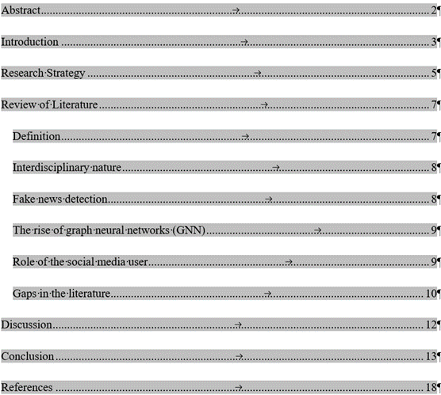
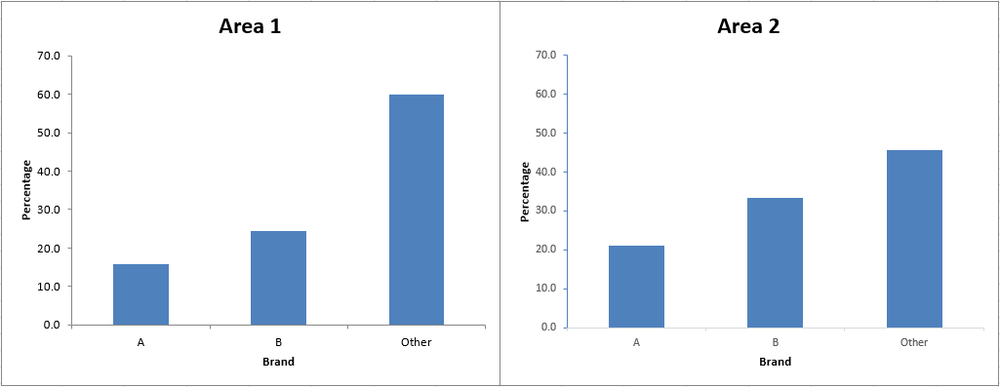
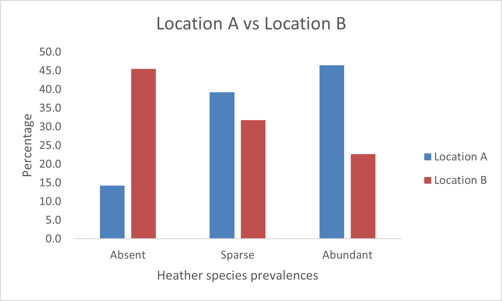
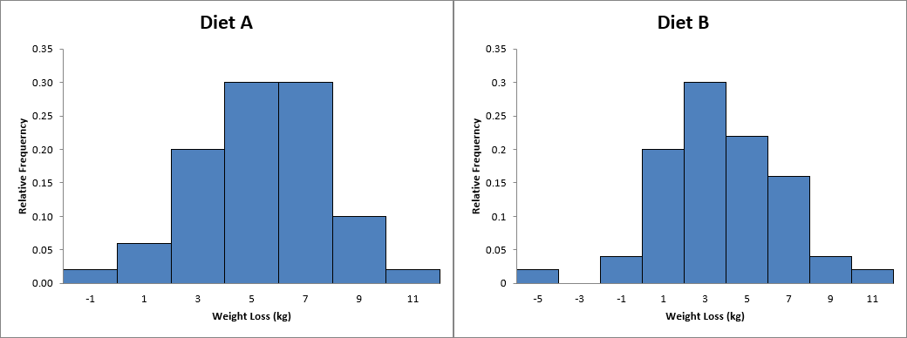
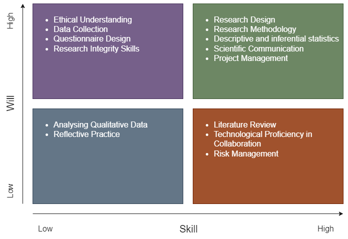

This e-portfolio serves as a comprehensive record of my work and the learning outcomes achieved throughout the Research Methods and Professional Practice module in November 2023 at the University of Essex. To facilitate navigation and provide an overview, the following table presents a list of all the requisite activities:

Component                                                            | Chapter
---------------------------------------------------------------------|--------------------------------------------------------------------------------------------------------------
Collaborative Discussion 1: Codes of Ethics and Professional Conduct | [Codes of Ethics and Professional Conduct](#codes-of-ethics-and-professional-conduct)
Reflective Activity - Ethics in Computing                            | [Reflective Activity - Ethics in Computing](#reflective-activity---ethics-in-computing)
Literature Review Outline                                            | [Literature Review Outline](#literature-review-outline)
Reflective Activity 2 - Inappropriate Use of Surveys                 | [Reflective Activity 2 - Inappropriate Use of Surveys](#reflective-activity-2---inappropriate-use-of-surveys)
Collaborative Discussion 2: Case Study: Accuracy of information      | [Case Study: Accuracy of information](#case-study-accuracy-of-information)
Research Proposal Outline                                            | [Research Proposal Outline](#research-proposal-outline)
Statistical Worksheet Submissions                                    | [Statistical Worksheet Submissions](#statistical-worksheet-submissions)
Reflective piece                                                     | [Reflective piece](#reflective-piece)

# Codes of Ethics and Professional Conduct

The "Malware Disruption" case, centred around Rogue Services, presents a multifaceted examination under the ACM Code of Ethics (Association for Computing Machinery, 2018) and the BCS Code of Conduct (British Computer Society, 2022), highlighting the ethical considerations in legal, social, and professional contexts. The case brings to the forefront the complexities of cyber law enforcement across various jurisdictions, particularly spotlighting Rogue's operation within a lenient legal framework for hosting harmful content. Such operations exploit gaps in international legal standards, posing significant jurisdictional challenges. Notably, the use of a worm to disrupt Rogue's activities, while ethically motivated, stands in stark contrast to legal norms, specifically breaching the EU Directive 2013/40/EU (2013), which categorically prohibits unauthorised access to information systems, underscoring the illegal nature of cyberattacks against IT infrastructure.

Socially, Rogue's disregard for the misuse of its services erodes public trust, a key concern aligned with the ACM Code's principles emphasising societal contribution and harm avoidance. The ethical dilemma oscillates between passive inaction and the active pursuit of a greater good despite potential unintended consequences that blur the lines between malicious and legitimate usage.

From a professional standpoint, the ACM and BCS codes advocate for integrity, professionalism, and avoiding harm, stressing the importance of adhering to legal responsibilities. The case also highlights the potential for consumer protection laws (Regulation 2017/2394/EU, 2017) to transcend borders, akin to the GDPR's approach, where regulations apply based on where personal data is processed rather than the geographical location of the processor.

In conclusion, the "Malware Disruption" case illuminates the ethical, legal, and social challenges inherent in computing practices. It demonstrates the critical need for ethical professionalism and a nuanced comprehension of the interplay between technology, law, and societal values. It advocates for a balanced approach that aligns ethical intentions with legal frameworks across borders.

**References:**

Association for Computing Machinery (2018) ACM Code of Ethics and Professional Conduct. Available from: https://www.acm.org/code-of-ethics [Accessed 10 February 2024].

British Computer Society (2022) Code of Conduct for BCS Members. Available from: https://www.bcs.org/media/2211/bcs-code-of-conduct.pdf [Accessed 10 February 2024].

Directive 2013/40/EU on attacks against information systems and replacing Council Framework Decision 2005/222/JHA (2013) Official Journal L 218, Available from: http://data.europa.eu/eli/dir/2013/40/oj [Accessed 10 February 2024].

Regulation 2017/2394/EU on cooperation between national authorities responsible for the enforcement of consumer protection laws and repealing Regulation (EC) No 2006/2004 (Text with EEA relevance) (2017) Official Journal L 345, Available from: https://eur-lex.europa.eu/eli/reg/2017/2394/oj [Accessed 15 February 2024].

# Reflective Activity - Ethics in Computing

In computing, ethical considerations form a crucial framework that guides the interaction between technology and society (Brey, 2017). Central to these considerations is the concept of privacy, reflecting the complex relationship between individual autonomy and technological advancement. Professionalism within the computing industry further underscores the importance of ethical conduct, emphasising the responsibility of professionals to adhere to ethical codes that protect privacy and promote harm prevention (Burmeister, 2008). The principles of autonomy and agency highlight the need for individuals to control their data and address the moral implications of artificial intelligence. Trust and consent are foundational in building confidence in technological systems, ensuring that personal data is handled responsibly (Stahl, 2016). These ethical aspects underscore the importance of a thoughtful and principled approach to developing and using computing technologies, setting the stage for discussing how these values are integrated into daily work and providing actionable advice to relevant stakeholders.

Ethical considerations permeate every aspect of professional work (Johnson & Miller, 2009), underscoring the importance of ethical conduct in interactions with a broad spectrum of stakeholders, including customers, partners, suppliers, employees at all levels, administrative bodies, society, and the environment. These considerations begin at the individual level and expand throughout the organisation, reaching the wider community and addressing environmental concerns.
The core of these ethical principles is the commitment to integrity, honesty, and transparency (Association for Computing Machinery, 2018). This foundation requires every individual within the organisation to act reliably, fulfil promises, and ensure that any promises made can indeed be kept. This fosters a culture of trust and dependability, where clear ethical standards guide actions and communications.
Personal responsibility is paramount in this ethical framework. It involves taking complete accountability for one's actions, diligently avoiding conflicts of interest between personal and business matters, and openly declaring any potential conflicts. Adherence to applicable laws, especially those ensuring equality and prohibiting harassment, discrimination, and any morally offensive behaviour, is non-negotiable. This extends to maintaining professional conduct at all times, which includes avoiding the influence of intoxicants that could impair work performance and security. Similar ethical commitments are also expected from business partners, demanding compliance with these principles.
The stance on bribery is unequivocal: no acceptance of payments, favours, or other benefits that fall outside the scope of agreed contractual services with business partners. This reflects a broader commitment to ethical business practices, including strict adherence to competition and antitrust laws. Such compliance involves avoiding price fixing, market sharing with competitors or any form of unjustified unequal treatment of customers.
Furthermore, respect and care for company property are emphasised, with a clear directive to use such resources solely for their intended purposes.

Data protection is critical in information management, embodying the ethical and legal commitment to safeguard personal and sensitive information. Treating secret, confidential, and non-public information with the utmost confidentiality and using data exclusively for its intended purpose ensures the trust and privacy of individuals and entities.
This commitment extends to controlled information sharing, wherein data is only passed on to third parties when contractual agreements explicitly allow it. Such a measure respects the privacy and autonomy of data subjects and upholds the integrity of professional relationships by adhering to agreed-upon boundaries.
Moreover, the ethical handling of data encompasses strict adherence to confidentiality obligations, reflecting a profound respect for the information entrusted to individuals and organisations. This approach is further reinforced by compliance with data protection regulations, notably the General Data Protection Regulation (GDPR) in the European Union. These regulations provide a comprehensive framework for the responsible processing of personal data, ensuring that individuals' rights to privacy are protected in an increasingly digital world.
Data protection expresses ethical responsibility in the digital age, embodying confidentiality, integrity, and legal compliance principles. By adhering to these principles, individuals and organisations fulfil their legal obligations and contribute to a culture of trust and respect in the management and use of information.

Transitioning from individual ethical considerations to corporate responsibilities, employers play a pivotal role in upholding the dignity and rights of their employees. Respect for employee privacy is at the forefront, a fundamental expectation in any professional setting. Employers are also tasked with ensuring financial security for their employees through pension provisions and providing comprehensive accident and illness cover, reflecting a commitment to the well-being of their workforce.

Moreover, adherence to labour laws and employee protection regulations is non-negotiable, establishing a baseline for fair treatment and safety in the workplace. Lastly, the formal registration of gainful employment signifies the employer's acknowledgement of their workforce's contributions and rights. These responsibilities underscore the ethical framework within which employers must operate, ensuring a respectful, secure, and legally compliant workplace.

In the realm of information technology, specialists are frequently so engrossed in the minutiae of their work that it becomes a challenge to maintain a broader perspective. This tunnel vision can lead to difficulties in fully addressing every ethical consideration, such as adhering to the Web Content Accessibility Guidelines (WCAG), especially when multiple teams collaborate on a single user interface. It is an intricate task, given the myriad components and stakeholders involved.
Moreover, it is relatively uncommon for individuals within these settings to anticipate or acknowledge their potential to cause harm or violate regulations. This oversight is not necessarily due to negligence but can stem from the complex nature of organisational structures and the technical ecosystems in which they operate. As highlighted by Decker and others and as illustrated through the Project Management Institute (PMI) examples, errors within such systems are rarely the result of a linear sequence of mistakes. Instead, they emerge from a dynamic interaction of various factors, often going unnoticed until it is too late. This phenomenon, described as "drifting into failure," underscores the complexity of modern systems and the challenges in foreseeing every potential pitfall.

Given this complexity, a more feasible approach is to set clear, achievable goals and engage in regular evaluations to ensure these objectives are being met, making adjustments where necessary. This method helps manage the intricate web of tasks and responsibilities inherent in IT projects and maintain an ethical compass in the face of technological and organisational challenges. By adopting such a proactive stance, IT professionals can better navigate their multifaceted landscape, ensuring both technical excellence and ethical integrity.

**References:**

Association for Computing Machinery (2018) ACM Code of Ethics and Professional Conduct. Available from: https://www.acm.org/code-of-ethics [Accessed 10 February 2024].

Brey, P., 2017. Ethics of Emerging Technologies. In S. O. Hansson (Ed.), The Ethics of Technology: Methods and Approaches (pp. 175-192). London: Rowman and Littlefield International.

British Computer Society (2022) Code of Conduct for BCS Members. Available from: https://www.bcs.org/media/2211/bcs-code-of-conduct.pdf [Accessed 10 February 2024].

Burmeister, O. K. (2008). Ethical Issues and Pervasive Computing. Risk Assessment and Management in Pervasive Computing: Operational, Legal, Ethical, and Financial Perspectives: Operational, Legal, Ethical, and Financial Perspectives, 263.

Johnson, D.G., Miller, K.W., 2009. Computer ethics: analyzing information technology, 4. ed. ed. Pearson Education Intern, Upper Saddle River, N.J.

Stahl, B., Timmermans, J. & Mittelstadt, B. (2016) The Ethics of Computing. ACM Computing Surveys 48(4):1-38. DOI: 10.1145/2871196

# Literature Review Outline

Due to professional commitments, I was unable to prepare and upload my literature review outline for Unit 4 on time. Fortunately, the Tutor graciously offered feedback during a one-on-one session on Monday, January 15, 2024. Although this was the deadline for the assessment submission, I seized the opportunity to refine my literature review based on the insights provided. Having previously composed literature reviews, I was well-acquainted with the process. Beyond the course materials, I also significantly incorporated the valuable insights from Lloyd (2017) into my work.

During the 30-minute session, the following questions were addressed:

**Question 1:** What style should I use in Zotero since "University of Essex | Online Harvard Referencing Guide" Style is not available?

Answer: The "Elsevier - Harvard (with titles)" style is recommended. It's crucial that references in the text are accurate, such as including page numbers for direct quotes.

**Question 2:** How is the word count determined, and what is included or excluded?

Answer:
  - In-text citations (e.g., Lewandowsky, Ecker, and Cook, 2017) are included in the word count.
  - Images and tables are not counted and should be inserted as images.
  - A margin of 10% above the word limit is permissible.
  - There is no written definition available according to the Tutor.

**Question 3:** What are the expectations for the E-Portfolio?

Answer: The focus should be specifically on developing the e-portfolio.

**Question 4:** What information should be included on the document for the literature review (e.g., student name)?

Answer: Omit the student name to avoid tutor bias, adhering to the UK education system's practices.

**Question 5:** Can we review the Table of Contents (TOC) to ensure my Literature Review isn't missing any critical sections?

Answer: Upon review, the Table of Contents shows that the Literature Review is complete without missing any essential parts.

Download:
* Final Literature Review: [20240115_LiteraturReview.pdf](20240115_LiteraturReview.pdf)

References:

Lloyd C. (2017) LITERATURE REVIEWS FOR SOCIOLOGY SENIOR THESES. Harvard Sociology Department Writing Fellow. Available from: 
https://socthesis.fas.harvard.edu/files/socseniorthesis/files/pres-litreview.pdf [Accessed 28 December 2023].

# Reflective Activity 2 - Inappropriate Use of Surveys
The Cambridge Analytica scandal serves as a pivotal example of how seemingly benign tools like surveys can be manipulated for purposes that raise significant ethical, social, legal, and professional concerns.

**How it Happened**

Cambridge Analytica, a political data analysis firm, managed to acquire data from approximately 87 million Facebook users without their explicit consent, as detailed by Hinds et al., 2020. The method employed involved a personality quiz app developed by Dr. Aleksandr Kogan, a researcher at Cambridge University (Hu, 2020). This app did more than just gather data from the users who participated in the quiz; it also extracted data from their friends' profiles. The harvested data was subsequently utilised to create detailed psychological profiles of American voters. These profiles were allegedly used to tailor political advertising with greater precision during significant political events, such as the 2016 U.S. Presidential election and the Brexit referendum, aiming to influence voter behaviour and preferences.

**Ethical, Social, Legal, and Professional Implications**

The Cambridge Analytica case brought several profound concerns spanning ethical, social, legal, and professional domains to the forefront. Ethically, it triggered alarms over consent and privacy issues, highlighting how users were left in the dark about their data being used for political profiling and targeting. Socially, the scandal eroded trust in digital platforms and social media, amplifying doubts regarding the safety of personal information online. Legally, it prompted investigations by regulatory bodies in the U.K. and the USA, casting doubt on the legality of such data harvesting practices under current data protection laws. Professionally, it raised questions about the responsibilities of tech companies and data analytics firms in safeguarding user data and the ethical implications of using this data for commercial or political ends.

**Additional Examples**

AccuWeather, a widely used app for providing weather updates, has been scrutinised for its practices for collecting detailed location data from its users (Whittaker, 2017). This concern arises from reports that, despite offering essential weather services, AccuWeather may have shared users' location data with advertisers or other third parties without obtaining explicit consent. Such practices raise significant ethical and legal questions, as they appear to breach user privacy. The implications of these actions are far-reaching, prompting increased regulatory scrutiny and eroding public trust in app developers and advertisers alike. The controversy highlights the delicate balance between offering personalised services and safeguarding user privacy, underscoring the importance of transparent and respectful data handling practices in maintaining user trust and compliance with privacy regulations.

Volkswagen found itself at the centre of a major scandal in 2015, known as "Dieselgate," when it was discovered that the company had deliberately installed software in its diesel vehicles to cheat on emissions tests (Jacobs & Kalbers, 2019). This software, specifically designed to recognise testing conditions, would temporarily lower the vehicle's emission levels to meet environmental standards. However, once on the road, these vehicles emit nitrogen oxides up to 40 times the legal limit, significantly harming the environment. This deliberate deception violated numerous environmental laws, betrayed customer trust and undermined the credibility of the automotive industry. The revelation of Volkswagen's actions led to widespread legal and financial repercussions for the company, including billions of dollars in fines and settlements. It highlighted the critical need for ethical conduct and transparency within the corporate sector.

**References**

Hinds, J., Williams, E.J. and Joinson, A.N., 2020. "It wouldn't happen to me": Privacy concerns and perspectives following the Cambridge Analytica scandal. International Journal of Human-Computer Studies, 143, p.102498.

Hu, M., 2020. Cambridge Analytica's black box. Big Data & Society, 7(2), p.2053951720938091.

Jacobs, D. and Kalbers, L.P., 2019. The Volkswagen diesel emissions scandal and accountability. The CPA Journal, 89(7), pp.16-21.

Whittaker, Z. 2017. AccuWeather caught sending user location data, even when location sharing is off. Available from: 
https://www.zdnet.com/article/accuweather-caught-sending-geo-location-data-even-when-denied-access/ [Accessed 23 January 2024]

# Case Study: Accuracy of information
In the scenario presented, Abi faces significant ethical dilemmas in his research, which include ensuring integrity in research (Booth et al., 2016), responsible data presentation, and understanding the impact of his actions on public health, trust in science, and his professional reputation (British Computer Society, 2022). These dilemmas are intertwined with ethical, legal, social, and professional considerations, highlighting the importance of honesty and integrity in research practices (Johnson & Miller, 2009). Abi's ethical obligations extend to presenting a balanced analysis of the product Whizzz, acknowledging its positive and negative aspects to facilitate informed decision-making among manufacturers, regulators, and consumers.

The potential legal and social repercussions (McGuire, 2023) of misleading or inaccurate data presentation are profound, encompassing consumer protection laws, public health implications, and the risk of damaging professional credibility. To navigate these complex issues, a multifaceted approach is proposed, including full disclosure of all findings, engagement with the product's manufacturer to emphasize the value of transparency, peer review to validate the ethical standards of the research, and the contemplation of public disclosure as a last resort if necessary to protect the public interest.
Feedback on these proposed courses of action underscores their importance in fostering an ethical research environment that values transparency, accountability, and societal benefit. Engaging with the manufacturer is highlighted as a critical step for achieving an ethical resolution, supported by the broader ethical mandate for researchers to contribute positively to society and avoid misleading stakeholders (Steneck, 2007). Furthermore, when internal efforts to address ethical concerns are unsuccessful, public disclosure is considered an ethical obligation, especially when public health could be at risk (Ethics Resource Center, 2014). This approach is deemed essential for maintaining high ethical standards in research, ensuring societal welfare, and upholding the integrity of scientific inquiry.

**References**

Booth, W.C., Colomb, G.G., Williams, J.M., Bizup, J., FitzGerald, W.T., 2016. The craft of research, Fourth edition. ed, Chicago guides to writing, editing, and publishing. The University of Chicago Press, Chicago.

British Computer Society (2022) Code of Conduct for BCS Members. Available from: https://www.bcs.org/media/2211/bcs-code-of-conduct.pdf [Accessed 10 February 2024].

Ethics Resource Center. (2014). National business ethics survey of the U.S. Workforce.Arlington, VA.

Johnson, D.G., Miller, K.W., 2009. Computer ethics: analyzing information technology, 4. ed. ed. Pearson Education Intern, Upper Saddle River, N.J.

McGuire, J. (2023) The Power of Transparency: Building Trust and accountability in business, LinkedIn. Available at: https://www.linkedin.com/pulse/power-transparency-building-trust-accountability-business-mcguire/ (Accessed: 17 February 2024).

Steneck, N.H. (2007) Ori introduction to the responsible conduct of Research. Philadelphia, PA: Clinical Research Resources.

# Research Proposal Outline

Given that the optional submission for feedback was scheduled just one week after the final literature review submission, and as I previously mentioned, my progress with the module content was significantly delayed due to work commitments, I opted to dedicate this week to catching up on the material. The requirements for the research proposal were quite straightforward. Consequently, I created a presentation based on the table of contents provided in Moodle later:

    - Project Title.
    - Significance/Contribution to the discipline/Research Problem.
    - Research Question.
    - Aims and Objectives.
    - Key literature related to the project.
    - Methodology/Development strategy/Research Design.
    - Ethical considerations and risk assessment (as part of your ethical approval application).
    - Description of artefact(s) that will be created (if applicable).
    - Timeline of proposed activities.

To streamline the process, I chose to center my research proposal around the same topic as my previously written literature review. 
Shortly before recording and uploading the final assessment, I discovered that the tutor had thoughtfully provided a valuable tip in the feedback form for my research proposal outline. I eagerly incorporated this advice into my presentation:

    You have not submitted anything for comment, so I cannot offer formative feedback.

    May I recommend you include all the points as listed in the research proposal presentation, due in week 10, also including a section where you explain how the project meets the requirement of your M.Sc major?

    This should come at the beginning, just after the significance section.

Download:
* Final Presentation: [ResearchProposal_Presentation.pptx](ResearchProposal_Presentation.pptx)
* Final Recording: [ResearchProposal_Recording.mp4](ResearchProposal_Recording.mp4)
* Final Transcript: [ResearchProposal_Transcript.docx](ResearchProposal_Transcript.docx)

# Statistical Worksheet Submissions

This chapter compiles all the Statistical Worksheet Submissions completed in Units 8 and 9. Each section includes the results, interpretations, and links for downloading the corresponding Excel files.

## Summary Measures

Descriptive statistics succinctly capture the essence of data. The mean calculates the average, while the median identifies the central point, and the standard deviation quantifies the extent of data dispersion around the mean. Quartiles segment the data to elucidate its distribution, with the interquartile range (IQR) gauging the spread of the central 50% of values, thus indicating the bulk's concentration.

To maintain accuracy regardless of data manipulation, such as sorting or filtering, formulas are designed with flexibility. For instance, `=AVERAGEIF(A:A, "A", B:B)` dynamically computes the average based on specified criteria, rather than a fixed range like `=AVERAGE(B2:B51)`.

**Example 8.1**

Diet | Name                      | Symbol    | Excel Formula               | Result
-----|---------------------------|-----------|-----------------------------|-------
A    | Sample Size               | $n$       | `=COUNTIF(A:A, "A")`        | 50.000
A    | Sample Mean               | $\bar{x}$ | `=AVERAGEIF(A:A, "A", B:B)` | 5.341
A    | Sample Standard Deviation | $s$       | `=STDEV(IF(A:A="A", B:B))`  | 2.536
B    | Sample Size               | $n$       | `=COUNTIF(A:A, "B")`        | 50.000
B    | Sample Mean               | $\bar{x}$ | `=AVERAGEIF(A:A, "B", B:B)` | 3.710
B    | Sample Standard Deviation | $s$       | `=STDEV(IF(A:A="B", B:B))`  | 2.769

The provided data indicates that Diet A yields a superior average weight reduction (5.341) relative to Diet B (3.70996), implying that Diet A is more effective on average for weight loss. Furthermore, the tighter clustering of outcomes around the mean for Diet A, as evidenced by its lower standard deviation (2.536 compared to Diet B's 2.769), points to more consistent weight loss results among its participants. Despite these findings, it is essential to consider the potential influence of outliers on the mean weight reduction. To conclusively assess the relative effectiveness of the diets and confirm if the observed differences are not due to random chance, it is necessary to conduct a statistical hypothesis test, such as a t-test. This test would determine the statistical significance of the difference in means between the two diets, providing a more rigorous evaluation of their performance.

Download:
* Excel File: [Exa_8.1B.xlsx](Exa_8.1B.xlsx)

**Example 8.2**

Diet | Name                       | Symbol      | Excel Formula                  | Result
-----|----------------------------|-------------|--------------------------------|-------
A    | Sample Median              | $\tilde{x}$ | `=MEDIAN(IF(A:A="A", B:B))`    | 5.642
A    | Sample First Quartile      | $Q1$        | `=QUARTILE(IF(A:A="A",B:B),1)` | 3.748
A    | Sample Third Quartile      | $Q3$        | `=QUARTILE(IF(A:A="A",B:B),3)` | 7.033
A    | Sample Interquartile Range | $IQR$       | `=F8-F7`                       | 3.285
B    | Sample Median              | $\tilde{x}$ | `=MEDIAN(IF(A:A="B", B:B))`    | 3.745
B    | Sample First Quartile      | $Q1$        | `=QUARTILE(IF(A:A="B",B:B),1)` | 1.953
B    | Sample Third Quartile      | $Q3$        | `=QUARTILE(IF(A:A="B",B:B),3)` | 5.404
B    | Sample Interquartile Range | $IQR$       | `=F16-F15`                     | 3.451

The proximity of the sample median to the sample mean for Diet A and Diet B suggests a symmetric distribution of data with minimal skewness, indicating a balanced distribution of weight loss among participants. The closeness of these two measures implies the absence of significant outliers, as outliers would typically distort the mean more than the median. For Diet A, a slight negative difference between the mean and median (mean - median = -0.301) hints at a marginal leftward skew, indicating that more participants experienced weight loss below the average.

Examining the quartiles for Diet A reveals that the middle 50% of participants experienced weight loss within the 3.748 to 7.033 unit range, whereas for Diet B, this range is between 1.953 and 5.404 units. The higher value of Q3 for Diet A suggests that individuals in the 75th percentile on this diet achieved more significant weight loss than their counterparts on Diet B.

Diet B's elevated interquartile range (IQR) indicates a broader dispersion among the central 50% of participants' weight loss results, implying a more varied response to the diet. This increased variation in Diet B could suggest that individual factors may have a more pronounced effect on the outcomes than Diet A, where the responses are more uniform.

Download:
* Excel File: [Exa_8.2B.xlsx](Exa_8.2B.xlsx)

**Example 8.3**

The following values were calculated for Area 1:

Brand | Area 1 (Absolute) | Excel Formula                       | Area 1 (Relative) | Excel Formula
------|-------------------|-------------------------------------|-------------------|---------------
A     | 11                | `=COUNTIFS(A:A, "1", B:B, "A")`     | 15.714            | `=100/$E$9*E6`
B     | 17                | `=COUNTIFS(A:A, "1", B:B, "B")`     | 24.286            | `=100/$E$9*E7`
Other | 42                | `=COUNTIFS(A:A, "1", B:B, "Other")` | 60                | `=100/$E$9*E8`
Total | 70                | `=COUNTIFS(A:A, "1")`               | 100               | `=100/$E$9*E9`

The following values were calculated for Area 2:

Brand | Area 2 (Absolute) | Excel Formula                       | Area 2 (Relative) | Excel Formula
------|-------------------|-------------------------------------|-------------------|---------------
A     | 19                | `=COUNTIFS(A:A, "2", B:B, "A")`     | 21.111            | `=100/$G$9*G6`
B     | 30                | `=COUNTIFS(A:A, "2", B:B, "B")`     | 33.333            | `=100/$G$9*G7`
Other | 41                | `=COUNTIFS(A:A, "2", B:B, "Other")` | 45.556            | `=100/$G$9*G8`
Total | 90                | `=COUNTIFS(A:A, "2")`               | 100               | `=100/$G$9*G9`

The data indicates a shift in brand preference between two areas: 'Other' brands' dominance in Area 1 is challenged by Brands A and B in Area 2, with Brand B showing the most significant gain. This suggests that Brand B's strategies are highly effective in Area 2. The competitive market in Area 2 is highlighted by the relative decline of 'Other' brands, signifying Brands A and B's growing appeal. Brand B, in particular, emerges as a strong competitor, suggesting successful engagement with Area 2's demographic.

Download:
* Excel File: [Exa_8.3B.xlsx](Exa_8.3B.xlsx)

## Hypothesis Testing

**Example 8.4**

$H_0$: There is no difference in the population mean impurity levels between the two filtration agents ($H_0 : \mu_{1} - \mu_{2} = 0$).

$H_1$: There is a difference in the population mean impurity levels between the two filtration agents ($H_1 : \mu_{1} - \mu_{2} \neq 0$).

The results of the Two-Tailed T-Test with a significance level of 5% is shown below:

Value Name                   | Variable 1  | Variable 2  | Calculations
-----------------------------|-------------|-------------|-------------
Mean                         | 8.25        | 8.683333333 |
Variance                     | 1.059090909 | 1.077878788 |
Observations                 | 12          | 12          |
Pearson Correlation          |             |             | 0.901055812
Hypothesized Mean Difference |             |             | 0
Degrees of Freedom           |             |             | 11
t Stat                       |             |             | -3.263938591
P(T<=t) one-tail             |             |             | 0.003772997
t Critical one-tail          |             |             | 1.795884819
P(T<=t) two-tail             |             |             | 0.007545995
t Critical two-tail          |             |             | 2.20098516
Difference in Means          |             |             | 0.433333333

The null hypothesis, positing no difference between the means, is rejected because the p-value (0.007546) is below the standard alpha threshold of 0.05. A robust Pearson Correlation coefficient of 0.901056 corroborates a strong positive relationship between the paired variables, a common expectation in paired t-tests where the same subjects are tested under two conditions. This significant statistical finding underscores a difference in the mean impurity levels between the two filtration agents, with Agent 2 having a higher mean level of impurities than Agent 1. Provided that the data distribution meets the necessary assumptions and no other assumptions are breached, it is statistically inferred that Agent 1 outperforms Agent 2 in reducing impurities. Hence, if the goal is to minimize impurity levels, Agent 1 is preferable over Agent 2.

Download:
* Excel File: [Exe_8.4G.xlsx](Exe_8.4G.xlsx)

**Example 8.5**

$H_0$: There is no difference in the effectiveness of the two filtration agents, or Filtration Agent 2 is at least as effective as Filtration Agent 1 in terms of impurity levels. ($H_0 : \mu_{1} \geq \mu_{2}$).

$H_1$: There is a difference in the population mean impurity levels between the two filtration agents ($H_1 : \mu_{1} \lt \mu_{2}$).

Building upon the results achieved in [Example 8.4](#example-8.4), the one-tailed p-value of 0.003772997 is significantly less than the alpha level of 0.05. Given that the t Stat is negative and the one-tailed p-value is less than the alpha threshold, we reject the null hypothesis $H_0$. Statistical evidence supports the claim that Filtration Agent 1 is more effective than Filtration Agent 2 at reducing impurity levels.

Download:
* Excel File: [Exe_8.4G.xlsx](Exe_8.4G.xlsx)

**Example 8.6**

**Task:** Conduct a statistical analysis to determine if there is a significant difference in the average income between males and females, specifically to test if the average income for males is higher than that for females.

**Given:**
- The dataset is appropriately distributed for statistical testing.
- Since men and women represent two distinct groups, a Two-Sample t-Test is the appropriate analysis method.

**Procedure:**
1. Begin with the "F-Test Two-Sample for Variances" to assess whether the two groups have a significant difference in income variance. This step determines the homogeneity of variances, which influences the choice of the subsequent t-test.
2. Based on the F-Test outcome:
    - If the variances are similar, proceed with the "t-Test: Two-Sample Assuming Equal Variances." This test assumes that the two groups have the same variance and is used to compare their means.
    - If the variances are significantly different, use the "t-Test: Two-Sample Assuming Unequal Variances" (Welch's t-test). This variant does not assume equal variances and adjusts the analysis accordingly.

This structured approach ensures the selection of the most appropriate statistical test based on the preliminary variance comparison, leading to more accurate and reliable conclusions regarding income disparities between males and females.

**Analysis**

**F-Test Two-Sample for Variances:**

$H_0$: The variances of the two populations are equal ($\sigma_{1}^{2} = \sigma_{2}^{2}$).

$H_1$: The variances of the two populations are not equal ($\sigma_{1}^{2} \neq \sigma_{2}^{2}$).

Value Name          | Men income  | Woman income
--------------------|-------------|-------------
Mean                | 52.91333333 | 44.23333333
Variance            | 233.1289718 | 190.1758192
Observations        | 60          | 60
df                  | 59          | 59
F                   | 1.225860221 |
P(F<=f) one-tail    | 0.21824624  |
F Critical one-tail | 1.539956607 |
P(F<=f) two-tail    | 0.43649248  |

The calculated F-test statistic stands at F = 1.226, with both groups (men and women) having 59 degrees of freedom. This yields a two-tailed p-value of 
$p=0.4365$. Given this p-value, the F ratio does not reach statistical significance. Such an outcome indicates consistency with the hypothesis that there is no significant difference in the population variances of income between men and women. Therefore, the equal variances version of the two-sample t-test for unrelated groups is the appropriate choice, as the data meet the assumption of variance homogeneity.

**t-Test: Two-Sample Assuming Equal Variances:**

$H_0$: The mean income of men is less than or equal to the mean income of women ($H_0 : \mu_{m} \leq \mu_{w}$).

$H_1$: The mean income of men is greater than the mean income of women ($H_1 : \mu_{m} \gt \mu_{w}$).

Value Name                   | Men income  | Woman income
-----------------------------|-------------|-------------
Mean                         | 52.91333333 | 44.23333333
Variance                     | 233.1289718 | 190.1758192
Observations                 | 60          | 60
Pooled Variance              | 211.6523955 |
Hypothesized Mean Difference | 0           |
df                           | 118         |
t Stat                       | 3.267900001 |
P(T<=t) one-tail             | 0.000709735 |
t Critical one-tail          | 1.657869522 |
P(T<=t) two-tail             | 0.00141947  |
t Critical two-tail          | 1.980272249 |
Difference in Means          | 8.68        |

Given the one-tailed p-value of $0.0007$, which is significantly lower than the standard threshold of $0.05$, there is strong statistical evidence to reject the null hypothesis that the mean income of men is less than or equal to the mean income of women. Instead, the data supports the alternative hypothesis that men have a higher mean income than women. The observed difference in mean incomes, alongside the statistical significance indicated by the t-statistic ($3.27$) being greater than the critical value ($1.6579$), confirms this conclusion. Therefore, based on this analysis, there is a statistically significant difference in mean incomes between men and women, with men earning more on average.

Download:
* Excel File: [Exe_8.6B.xlsx](Exe_8.6B.xlsx)
* Excel File: [Exe_8.6C.xlsx](Exe_8.6C.xlsx)

## Analysing Qualitative Data

**Example 9.1**

The findings in [Example 8.3](#example-83) remain valid. However, the bar charts serve as a clear visual reinforcement of the numerical data, making the shifts in brand preference more evident and accessible. They are particularly effective when presenting these findings to stakeholders who prefer visual representations of data over tables of numbers.

Download:
* Excel File: [Exe_9.1D.xlsx](Exe_9.1D.xlsx)

**Example 9.2**

Heather species are much more prevalent in Location A than in Location B. This could be due to a variety of environmental factors such as soil quality, climate, human impact, or other ecological factors that favor the growth of heather in Location A over Location B. The stark contrast in the 'Absent' category suggests that conditions in Location B are much less suitable for heather to grow, whether it be due to natural conditions or possibly due to human activities that might inhibit its growth. The 'Abundant' category in Location A indicates a healthy presence of heather species, which might contribute positively to biodiversity and the ecosystem there.

Download:
* Excel File: [Exe_9.2E.xlsx](Exe_9.2E.xlsx)

**Example 9.3**

The histograms validate the initial statistical analysis (see [Example 8.2](#example-82)), visually representing weight loss distribution across participants on each diet. For Diet A, the histogram displays a notable concentration of values in the middle range, with the tallest bar aligning with the median weight loss value, suggesting that most participants experienced moderate weight loss. In contrast, the histogram for Diet B depicts a more uniform spread across various weight loss outcomes, evidenced by multiple peaks, reflecting the greater variability inferred from the elevated interquartile range.
This broader distribution in Diet B's histogram accentuates the individual differences in response to the diet, a detail that might be understated by summary statistics alone. The histograms also provide an immediate visual indication of the distribution's shape and any potential skewness, details that are not as easily discerned from mean, median, and IQR values alone.
The histograms further illustrate the lack of extreme outliers in Diet A and Diet B. This point could remain obscured in tabular data presentations, especially if only a few participants recorded exceptionally high or low weight loss figures. It is important to note that while histograms are effective for revealing data distribution and variance, they are not designed to assess one diet's efficacy directly.

Download:
* Excel File: [Exe_9.3B.xlsx](Exe_9.3B.xlsx)

# Skill assessment

This chapter summarises the skills developed throughout this module, evaluating the competencies acquired in each unit through the lens of the Dreyfus (Dreyfus & Dreyfus, 1980) model. Below is a table that delineates the proficiency levels defined by the model:

Icon                         | Name                       | Description
-----------------------------|----------------------------|----------------------------------------------------------------------------------------------------
     | Level 5: Expert            | Experts intuitively grasp what to do without relying on rules, adapting flexibly to new situations.
 | Level 4: Proficient        | Practitioners intuitively understand situations and can self-correct.
  | Level 3: Competent         | Individuals plan and make decisions based on goals and experience.
   | Level 2: Advanced Beginner | Learners apply basic principles to tasks with some situational awareness.
     | Level 1: Novice            | Beginners follow strict rules and lack judgment.

Note: Levels 1 (Novice) and 5 (Expert) are not conferred. The rationale behind this decision is that employment at the university level inherently ensures attainment of at least the Advanced Beginner stage, even in the absence of practical experience. Conversely, the Expert level is reserved for those who have either pursued focused study in the field, such as through a PhD course, or have amassed several years of relevant practical experience.

Unit | Skill                                      | Learning Outcomes                                                                                                                                 | Rating
-----|--------------------------------------------|---------------------------------------------------------------------------------------------------------------------------------------------------|-----------------------------
1    | Research Methodology                       | Differentiate between inductive and deductive reasoning.                                                                                          | 
1    | Ethical Understanding                      | Understand why ethics are important and how they may relate to your area of research and your professional practice.                              | 
2    | Research Design                            | Examine the characteristics that make up a suitable research topic                                                                                | 
2    | Research Design                            | Explore rational and creative methods for formulating a research idea.                                                                            | 
2    | Research Design                            | Identify means of transforming research ideas into crafted research questions and proposal.                                                       | 
2    | Literature Review                          | Conduct a literature search, critique the literature and to present a literature review.                                                          | 
3    | Research Methodology                       | Understand the different research methods.                                                                                                        | 
3    | Research Methodology                       | Know which data collection methods are related to each method of research.                                                                        | 
3    | Research Methodology                       | Have some idea which of these would be suited to your area of research.                                                                           | 
4    | Data Collection                            | Understand how to carry out each of these data collection methods.                                                                                | 
4    | Data Collection                            | Know which method would be suitable, if any, for your investigation.                                                                              | 
4    | Data Collection                            | Consider the type of data you would obtain.                                                                                                       | 
5    | Data Collection                            | Understand how interviews and surveys fit into research and whether either or both of these might be useful for your investigation.               | 
5    | Data Collection                            | Understand how pre- and post-testing can be used in research.                                                                                     | 
6    | Questionnaire Design                       | Tell the difference between a good questionnaire and a poor one.                                                                                  | 
6    | Questionnaire Design                       | Design a questionnaire to obtain the responses you will need for your investigation.                                                              | 
6    | Questionnaire Design                       | Understand how the data obtained can be analysed.                                                                                                 | 
7    | Research Integrity Skills                  | Understand how the concepts of validity, generalisability and reliability affect your investigation and the design of your research method.       | 
7    | Research Integrity Skills                  | Consider how to analyse and present the results you obtain from your investigation and how they will enable you to answer your research question. | 
8    | Descriptive and inferential statistics     | Identify the different levels of measurement.                                                                                                     | 
8    | Descriptive and inferential statistics     | Produce measures of location and spread.                                                                                                          | 
8    | Descriptive and inferential statistics     | Perform appropriate hypothesis tests.                                                                                                             | 
9    | Analysing Qualitative Data                 | Understand the different types of analysis and how they may be useful for the data you have collected.                                            | 
9    | Analysing Qualitative Data                 | Understand the different charts available to present the different types of data you have obtained.                                               | 
10   | Scientific Communication                   | Understand how to structure a dissertation and how to prepare yourself for the writing.                                                           | 
11   | Reflective Practice                        | Provide necessary reflection for the completion your learning loop.                                                                               | 
11   | Reflective Practice                        | Complete the Professional Skills matrix and ensuing action plan.                                                                                  | 
12   | Project Management                         | Define and explain the concept of project management.                                                                                             | 
12   | Project Management                         | Demonstrate an appreciation of project life cycles and methodologies.                                                                             | 
12   | Technological Proficiency in Collaboration | Appreciate some of the technologies/software needed to support remote collaboration.                                                              | 
12   | Project Management                         | Understand and explain how projects can be impacted by risk and uncertainty.                                                                      | 
12   | Risk Management                            | Prepare a risk management plan.                                                                                                                   | 
12   | Project Management                         | Appreciate how to control risk and manage project change effectively.                                                                             | 

## Skill Will Matrix

Following the skill assessment, the ensuing Skill-Will Matrix has been developed:

## Action Plan

The forthcoming milestone in my academic journey is the successful completion of my Master of Science program. I am aiming to achieve a grade of 70% or higher in my Capstone Project.

In line with the Skill-Will Matrix, a strategic action plan will be devised to facilitate the attainment of this goal.

**High Skill - High Will:**

Skills: Research Design, Research Methodology, Descriptive and Inferential Statistics, Scientific Communication, Project Management

Description: Considering my expertise and keen interest, I view these skills as my foundational strengths, and I am eager to integrate them into my Capstone Project at the earliest opportunity.

Goals:

- I will complete the project-specific thesis documentation within the first 8 weeks of the capstone project, ensuring that each section is drafted according to the outlined requirements by allocating a minimum of 10 hours per week to this task. This approach will help me stay on track and prevent any delays in the overall project timeline, facilitating a systematic and timely progression through the project milestones.

**High Skill - Low Will:**

Skills: Literature Review, Technological Proficiency in Collaboration, Risk Management

Description: I take pleasure in the insights gained from scientific papers, yet the tedious systematics and documentation required for literature reviews strike me as overly pedantic. My extensive experience in IT has honed my ability to remain focused and avoid getting sidetracked. While risk management isn't a task I relish, I'm acutely aware of its significance.

Goals:

- I will define and understand the specific requirements for the literature review by consulting with my supervisor and reviewing guideline documents within the first week of the project initiation. This will ensure I have a clear framework and criteria to follow, preventing me from engaging in unnecessary detail and overcomplication. My aim is to identify the scope, methodology, and documentation standards required, dedicating 2 hours to this task to maintain focus and efficiency in my approach to the literature review.

**Low Skill - High Will:**

Skills: Ethical Understanding, Data Collection, Questionnaire Design, Research Integrity Skills

Description: While these skills are unfamiliar territory and my practical experience is limited, my motivation to enhance them is strong.

Goals:
- I will identify and adopt a suitable ethical framework for computing projects by conducting research over the next 4 weeks. This involves dedicating 4 hours per week to review academic literature, industry standards, and professional guidelines on ethical practices in computing. By the end of this period, I aim to have selected a comprehensive ethical framework that will guide my evaluations, ensuring they are structured and consistent rather than arbitrary. This will enhance my ethical understanding and ensure my decisions are grounded in recognized standards.
- Upon the next opportunity in my professional work, but no later than six months from now, I will apply the theories I've learned in qualitative data collection and questionnaire design. Within this timeframe, I will design a small-scale project or component of an existing project at work to apply these theories in practice, aiming to gather qualitative data through a well-structured questionnaire. This application will serve as a practical test of my newly acquired skills and understanding, with the goal of receiving feedback on the effectiveness of my approach from peers or supervisors.

**Low Skill - Low Will:**

Skills: Analyzing Qualitative Data, Reflective Practice

Description: As a person deeply focused on outcomes, I prioritize the practical applicability and cost-benefit ratio when evaluating new knowledge. Excessive self-reflection, in my view, not only demands a significant amount of time but also doesn't align with my preferred teaching methodology. Such tasks, often introspective, seem to lack a direct connection to tangible applications, and their repetitive nature further diminishes their appeal to me. Historically, my engagement with reflective tasks has been more out of obligation than personal choice. While my experience has predominantly involved working with qualitative data, I am open to exploring qualitative data analysis. However, I place a lower priority on this area, prioritizing activities and learnings with immediate, practical applications.

Goals:
- I will identify and analyze a real-world example of how individuals benefit from reflective work, specifically through the use of e-portfolios, within the next 8 weeks. This involves dedicating 2 hours each week to research case studies that showcase the positive impacts of reflective practices on learning and development. By the end of this period, I aim to synthesize the findings. The goal is to apply these insights to my own approach to learning and teaching, thereby enhancing the value I find in reflective tasks.

## References

Dreyfus, S.E. and Dreyfus, H.L., 1980. A five-stage model of the mental activities involved in directed skill acquisition.

# Learning Outcomes

This chapter outlines learning outcomes to capture and reflect the comprehension of the material presented through Moodle and the module's reading list.

## Interference
Deductive, inductive, and abductive reasoning were addressed in two modules of my BSc studies, the first and the last, necessitating only a refreshment of this knowledge. Understanding these reasoning methods is beneficial as it demonstrates how to substantiate arguments effectively and aids in avoiding reasoning errors.

**Deductive Reasoning**

Correct Deductive Reasoning Example:

    Premise 1: Every A is characterized by B.

    Premise 2: C is an instance of A.

    Conclusion: Therefore, C possesses characteristic B.

Illustration:

    Premise 1: All birds are characterized by having feathers.

    Premise 2: Penguins are classified as birds.

    Conclusion: Consequently, penguins are characterized by having feathers.

Example of Incorrect Reasoning:

    Premise 1: Individuals endeavoring to mitigate the spread of COVID-19 often maintain a distance of 6 feet from each other.

    Premise 2: Satanists also maintain a distance of 6 feet from each other in certain contexts.

    Erroneous Conclusion: Therefore, individuals practicing social distancing to combat COVID-19 are identified as Satanists.

This example of incorrect reasoning highlights a flawed logical leap, conflating unrelated practices based on a superficial similarity, which is a logical fallacy.

**Inductive Reasoning**

Correct Inductive Reasoning Example:

    Observation 1: Every observed instance of A has characteristic B.

    Observation 2: A significant number of instances of A have been observed.

    Generalization: It is probable that all instances of A possess characteristic B.

Illustration:

    Observation 1: Every swan we have observed is white.

    Observation 2: A large number of swans have been observed in various regions.

    Generalization: It is likely that all swans are white.

Example of Incorrect Use of Inductive Reasoning:

    Observation 1: Most individuals seen reading books in public are observed during the daytime.

    Observation 2: These observations are made over several days in multiple public locations.

    Erroneous Generalization: Therefore, people only read books during the daytime.

This incorrect generalization demonstrates a common pitfall in inductive reasoning: assuming a pattern based on limited observations without considering other possible variables or unseen instances, leading to potentially inaccurate conclusions.

**Abductive Reasoning**

Correct Abductive Reasoning Example:

    Observation: We observe a phenomenon A that requires explanation.

    Hypothesis: B is a plausible explanation for A because it aligns with known facts.

    Inference: Therefore, B is tentatively accepted as the most likely explanation for A until further evidence is presented.

Illustration:

    Observation: The sidewalk is wet.

    Hypothesis: It rained last night, which is a plausible explanation for the wet sidewalk, considering the weather forecast predicted rain.

    Inference: Consequently, we tentatively accept that it rained last night as the most likely explanation for the wet sidewalk, pending further evidence.

Example of Incorrect Use of Abductive Reasoning:

    Observation: There are scratch marks on the door.

    Hypothesis: A burglar attempted to break into the house, as scratch marks could indicate an attempt at forced entry.

    Erroneous Inference: Therefore, without considering alternative explanations such as a pet scratching the door, we prematurely conclude that a burglary attempt was made.

This incorrect use highlights a limitation of abductive reasoning: jumping to conclusions based on plausible but unverified hypotheses without thoroughly exploring other equally plausible explanations, which can lead to erroneous or biased conclusions.

## Defining research questions

A well-formulated research question stands as a pivotal element of high-quality research. To aid in crafting such questions, numerous frameworks have been developed, among which the FINER criteria, outlined by Cummings et al. (2013), is noteworthy:

Component   | Criteria B
------------|----------------------------------------------------------------------------------------------------------------------------------------------------------------------------------------------------------------------------------------------------------------------------------------------------------------------------------------------------------------------------------------------------------------------------------------------------------------------------------
Feasible    | <ul>   <li>Ensures adequacy of research design</li>   <li>Guarantees adequate funding</li>   <li>Recruits target population strategically</li>   <li>Aims an achievable sample size</li>   <li>Prioritises measurable outcomes</li>   <li>Optimises human and technical resources</li>   <li>Accounts for clinicians commitment</li>   <li>Procures high adherence to the treatment and low rate of dropouts</li>   <li>Opts for appropriate and affordable frame time</li> </ul>
Interesting | <ul>   <li>Engages the interest of principal investigators</li>   <li>Attracts the attention of readers</li>   <li>Presents a different perspective of the problem</li> </ul>
Novel       | <ul>   <li>Provides different findings</li>   <li>Generates new hypotheses</li>   <li>Improves methodological flaws of existing studies</li>   <li>Resolves a gap in the existing literature</li> </ul>
Ethical     | <ul>   <li>Complies with local ethical committees</li>   <li>Safeguards the main principles of ethical research</li>   <li>Guarantees safety and reversibility of side effects</li> </ul>
Relevant    | <ul>   <li>Generates new knowledge</li>   <li>Contributes to improve clinical practice</li>    <li>Stimulates further research</li>   <li>Provides an accurate answer to a specific research question</li> </ul>

An other framework which directly influences the formulation of a research question is PICO (Richardson et al., 1995):

  | Column B                     | Column C
--|------------------------------|-----------------------------------------------------------------
P | **P**opulation               | Any characteristic that define your patient or population group.
I | **I**ntervention             | What do you want to do with the patient or population?
C | **C**omparison (if relevant) | What are the alternatives to the main intervention?
O | **O**utcome                  | Any specific outcomes or effects of your intervention.

Example RQ based on Pico: In software development teams (Population), how does the implementation of agile methodologies (Intervention) compare to traditional waterfall methodologies (Comparison) in terms of improving project delivery times and software quality (Outcome) over the course of a year?

**References:**

Cummings, S.R., Browner, W.S., Newman, T.B., and Grady, D.G., 2013. Designing clinical research. Lippincott Williams & Wilkins.

Richardson, W.S., Wilson, M.C, Nishikawa, J. and Hayward, R.S.A. (1995) 'The well-built clinical question: a key to evidence-based decisions.' ACP Journal Club, 123(3) pp. A12

## Research Methods

The acceptance of new knowledge within the scientific community hinges on the adherence of research methods to established guidelines and procedures. Concepts that challenge the foundational assumptions of this community are often suppressed or rejected, particularly when these guidelines are overlooked. Thus, understanding the basic principles of research methods is crucial.

| Research Method          | Purpose                                                                               | Characteristics                                                              | Data Collection Techniques                                           |
|--------------------------|---------------------------------------------------------------------------------------|------------------------------------------------------------------------------|----------------------------------------------------------------------|
| Exploratory              | To explore a problem or situation not well understood                                 | Flexible, open-ended, allows for discovery                                   | Interviews, focus groups, literature review                          |
| Conclusive (Descriptive) | To describe characteristics of a population or phenomenon                             | Structured, aims for precision and quantification                            | Surveys, observations                                                |
| Qualitative              | To understand human behavior, beliefs, and opinions                                   | Subjective, deep insights into context and meaning                           | In-depth interviews, focus groups, document analysis                 |
| Quantitative             | To quantify the problem and understand how prevalent it is                            | Objective, statistical, seeks measurable and observable data                 | Surveys with closed-ended questions, experiments                     |
| Mixed Methods            | To leverage both qualitative and quantitative approaches for a comprehensive analysis | Integrative, uses both numeric data and text data for a fuller understanding | Combination of surveys, interviews, focus groups, and/or experiments |

## Data collection methods

Different data collection methods are suited to different types of questions and can significantly influence the interpretation and generalizability of results. Methods that align well with the research question and objectives ensure that data collected are relevant, accurate, and robust, facilitating deeper insights and more meaningful conclusions.

| Data Collection Method   | Purpose                                                                                            | Characteristics                                                                                               | Typical Contexts                                   |
|--------------------------|----------------------------------------------------------------------------------------------------|---------------------------------------------------------------------------------------------------------------|----------------------------------------------------|
| Case Studies             | To conduct an in-depth analysis of a particular case to explore or explain complex phenomena       | Detailed, contextual analysis of a single or small number of instances                                        | Business, psychology, social sciences              |
| Focus Groups             | To gather diverse perspectives and insights on a specific topic or product from a targeted group   | Interactive, discussion-based, qualitative insights from a group                                              | Market research, product feedback, social research |
| Quantitative Observation | To quantify attributes or behaviors and collect measurable data, allowing for statistical analysis | Structured, uses instruments or tools for precise measurement, seeks patterns in numerical data               | Scientific experiments, surveys, traffic counts    |
| Qualitative Observation  | To understand behaviors, intentions, or interactions in natural settings without quantification    | Unstructured or semi-structured, detailed descriptions of events or behaviors, emphasizes context and meaning | Ethnography, anthropology, behavioral studies      |

## Interviews vs surveys

Knowing the differences between interviews and surveys is crucial for selecting the most suitable method to accurately address specific research questions and achieve the desired depth and breadth of data.

| Feature          | Interviews                                                                             | Surveys                                                                                  |
|------------------|----------------------------------------------------------------------------------------|------------------------------------------------------------------------------------------|
| Nature           | Qualitative (can also be quantitative)                                                 | Primarily quantitative (can include qualitative elements)                                |
| Interaction      | Direct, one-on-one or small group conversations                                        | Indirect, through questionnaires or digital platforms                                    |
| Data Collection  | Open-ended questions, detailed responses                                               | Closed- and open ended questions with limited response options                           |
| Purpose          | To gain deep insights, understand motivations and feelings                             | To collect measurable data from a large group for statistical analysis                   |
| Flexibility      | High flexibility, questions can be adapted or followed up in-depth                     | Low flexibility, standardized questions with no room for follow-up                       |
| Time and Cost    | Time-consuming and often more expensive due to the depth of data and analysis required | Generally less time-consuming and more cost-effective, especially with large populations |
| Analysis         | Interpretive, thematic analysis of detailed narratives                                 | Statistical analysis of quantifiable responses                                           |
| Typical Contexts | Academic research, market research, user experience studies                            | Market analysis, public opinion polling, demographic studies                             |

Beyond merely gathering data, conducting pre and post tests is crucial as they facilitate the assessment of variations in participants' knowledge, attitudes, or behaviors attributable to an intervention, thereby substantiating the intervention's impact and effectiveness.

## Designing a questionnaire

The process of designing a questionnaire involves several key steps:

1. Identify the Information Needed: Determine the specific data you aim to collect.
2. Define Your Target Audience: Specify who will be answering your survey to ensure relevance and accuracy.
3. Select Distribution Methods: Choose how you will reach your intended respondents, considering accessibility and convenience.
4. Decide on Question Content: Outline the topics and areas your questions will cover.
5. Craft Question Wording: Develop clear, concise, and unbiased questions to elicit reliable responses.
6. Organize Questions Thoughtfully: Arrange questions in a logical sequence that flows naturally, enhancing respondent engagement.
7. Review Questionnaire Length: Ensure the survey is not too long to discourage participation, but comprehensive enough to gather all necessary information.
8. Conduct a Pre-test: Test the questionnaire with a small, representative group to identify any issues or misunderstandings.
9. Finalize the Survey Form: Make any needed adjustments based on pre-test feedback to prepare the final version of the questionnaire.

Regarding question types:

- **Closed Questions:** Ideal for collecting nominal (categorical) and ordinal (ordered) data.
- **Open Questions:** Best suited for gathering interval (with meaningful distances between responses) and ratio (with a true zero point) scaled data.

Ensure questions are succinct, straightforward, and easily understood. Additionally, conducting a pilot study can help verify that respondents interpret the questions as intended.

The table below presents the most commonly utilized survey elements, detailing their specific purposes.

| Survey Element        | Purpose                                                                | Ideal Contexts                                                                                    |
|-----------------------|------------------------------------------------------------------------|---------------------------------------------------------------------------------------------------|
| Multiple Choice       | To gather data on a specific question with predefined answers.         | When you have a clear set of responses to choose from and want to simplify data analysis.         |
| Text Response         | To collect open-ended responses for qualitative insights.              | When you need detailed feedback or explanations beyond predefined options.                        |
| Rating Scale (Likert) | To measure the intensity of feelings or perceptions on a linear scale. | For assessing attitudes, satisfaction, or frequency of behaviors.                                 |
| Ranking               | To determine the order of preference among a set of items.             | When you want to understand preferences or priorities among options.                              |
| Yes/No                | To obtain a definitive answer on a specific, binary question.          | For straightforward questions requiring a simple affirmative or negative response.                |
| Checkbox              | To allow respondents to select multiple options from a list.           | When multiple responses are applicable and you want to gauge all relevant interests or factors.   |
| Slider                | To capture the degree of sentiment about a question in a dynamic way.  | For nuanced feedback on a continuum, such as satisfaction or probability.                         |
| Demographic Questions | To collect background information about respondents.                   | For segmenting data or understanding the context of responses in relation to demographic factors. |

## Validity, reliability and generalisability

The principles validity, reliability and generalisability underpin the credibility and usefulness of research findings. They ensure that studies produce accurate, consistent, and applicable knowledge, which is essential for advancing scientific understanding, informing policy, guiding decision-making, and improving practices across various fields.

| Concept          | Description                                                                                       | Example                                                                                          | Violation Example                                                                                                                                                                                                  |
|------------------|---------------------------------------------------------------------------------------------------|--------------------------------------------------------------------------------------------------|--------------------------------------------------------------------------------------------------------------------------------------------------------------------------------------------------------------------|
| Validity         | The extent to which a research instrument measures what it is intended to measure.                | A test designed to measure depression accurately identifies the level of depression in patients. | If a thermometer gives varying readings under controlled conditions where the sample's temperature remains constant, it likely malfunctions, rendering its measurements invalid.                                   |
| Reliability      | The degree to which an assessment tool produces stable and consistent results.                    | A blood pressure monitor gives consistent readings across multiple tests.                        | When multiple doctors use the same symptom questionnaire on a patient but arrive at different diagnoses, it suggests the questionnaire's reliability in diagnosing the condition is low.period.                    |
| Generalizability | The extent to which research findings can be applied to larger populations or different contexts. | A study on stress management techniques in adults is applicable to a broad adult population.     | Surveying passersby at a high-end shopping street for insights into city-wide shopping habits might result in participants not representing the entire population, leading to findings that lack generalizability. |

# Reflective Piece

From a young age, my enthusiasm for science has been the guiding light, steering me towards a path of discovery and learning. This fervour only intensified as I commenced my academic education, a period marked by significant personal and professional growth.

Before my academic education, my understanding often skimmed the surface, leaving me unstable. However, my academic journey, culminating in the current module, has been transformative, endowing me with skills such as enhanced problem-solving abilities and evidence-based decision-making. These skills are not just academic accolades but vital tools with significant implications in the private sector.

Reflecting on this journey, I recognize the shift in my capabilities. No longer reliant on intuition or incomplete information, I am equipped to garner new insights through a structured approach, integrating them competently into my daily work.

**Statistical analysis skills**

Much like the broader curriculum of the degree program, the mathematical rigour of this module was notably less challenging than anticipated. This left me yearning for a deeper, more complex engagement with statistics. For this, I believe that I have fully achieved the learning objectives of this module. The standout was the book by Berenson et al. (2015), which proved to be an excellent resource. Its insights and practical approach have assured its place in my library.

**Professional and Ethical Issues**

The exploration of ethical issues in this module marked a significant and enlightening aspect of my studies, introducing me to the depth of ethical considerations in a way I had never experienced before. The module's emphasis on ethical awareness, rather than a dense theoretical framework, encouraged profound reflection on our moral responsibilities. Jonas's (1984, p. 11) maxim, *"Act so that the effects of your action are compatible with the permanence of genuine human life,"* resonated deeply with me, summarizing the ethical challenges presented in the course perfectly. This principle highlighted the importance of sustainable development and the interconnectedness of humanity with the Earth, pushing me to think critically about the rights and needs of future generations and our place within the natural world. Jonas's insights, extending beyond the course literature deeply influenced my understanding and perspective on these critical issues.

**Academic Investigation Principles**

Beyond reviewing and refreshing scientific methodologies, I dedicated myself to critically examining and enhancing my research practices, aiming to be thoroughly prepared for the capstone project.

It is imperative to approach research with a strategy that marries ambition with realism. Recognizing the vast expanse of knowledge that leaders in the field possess, one must temper expectations with the understanding that achieving such profundity in weeks is unfeasible. Instead, drawing clear boundaries around the research focus becomes crucial, honing in on what is genuinely significant to the project.

Central to this approach is the formulation of a research question, a beacon that illuminates the path forward while safeguarding against the allure of tangential explorations. This iterative process of refining the question ensures that the research remains aligned with its objectives, preventing the investigator from being ensnared by the seductive complexity of unrelated inquiries.

Honesty and self-awareness are the researcher's compass. Acknowledging areas of uncertainty not only grounds the research in integrity but also invites a critical examination of the applicability and logical coherence of the arguments presented. This introspection extends to recognizing personal biases, such as a predilection for specific technologies, which may not necessarily serve the research's best interests. For instance, a fondness for Graph Neural Networks (GNN) should not predetermine their selection as the optimal approach for fake news detection without rigorous evaluation.

Embarking on the research journey necessitates a foundational understanding of the topic. Systematic literature reviews and meta-analyses offer a structured overview, provided their assessment of the quality of the included studies is verified. This groundwork lays the platform upon which one can build by exploring recent developments, leveraging tools like Google Scholar to trace the citation trail of seminal works and grasp the field's evolutionary trajectory.

The credibility of sources is paramount. Peer-reviewed papers stand as the gold standard. However, the researcher must diligently verify the publication's reputation, consult resources like the Norwegian Scientific Index, or evaluate the journal's impact factor. While preprint servers offer a glimpse into the cutting edge of research, caution is advised due to their lack of formal peer review. Similarly, reports from non-profit organizations or corporations, despite their prevalence, warrant scrutiny for their review processes. Unlike other disciplines, in computer science, conference proceedings often embody the culmination of research efforts, containing insights of considerable value.

The integrity of the inquiry is compromised when one succumbs to the temptation of cherry-picking studies or data to support preconceived notions. A rigorous scholar always retains sight of the imperative to validate information at its source, transcending the convenience of secondary sources like Wikipedia to ensure the authenticity and reliability of their evidence base.

**Personal Learning Challenges and Preferences**

Due to professional commitments, the time I could dedicate to engaging with the module content was significantly constrained until the end of 2023. Under this time pressure, I realized my reading pace has consistently been slower than I'd prefer, a hurdle that becomes particularly pronounced under tight deadlines.

On a positive note, the absence of group work in this module was a relief. Given my time constraints and learning pace, working independently allowed me to navigate the course content at my rhythm without the added pressure of coordinating with peers.

**Conclusion**

Although the module did not introduce much new information, it served as a valuable exercise in refining my scientific approach to work, a skill crucial for my future endeavours. As I cast a broader look at my educational journey, spanning from the Swiss distance University of Applied Science for my BSc to the ongoing MSc at the University of Essex online, the contrasts and contributions of each experience stand out starkly.

The Swiss BSc program laid a robust foundation in theoretical knowledge and technical skills, preparing me for the complexities of the field. In contrast, despite its more superficial coverage, the MSc program emphasized cultivating a critical and analytical mindset. While initially unexpected, this difference proved enriching, offering a broader perspective on the application and impact of computing.

Reflecting on my education across these diverse settings, I appreciate the unique insights each has provided. The varied focus—from the technical depth of the Swiss program to the analytical breadth of the Essex curriculum—has broadened my understanding and appreciation for the multifaceted nature of computing.

**References**

Berenson, L., Levine, D. & Szabat, K. (2015) Basic Business Statistics: Concepts and Applications. 13th Ed. Pearson

Jonas, H., 1984. The imperative of responsibility: In search of an ethics for the technological age. University of Chicago press.